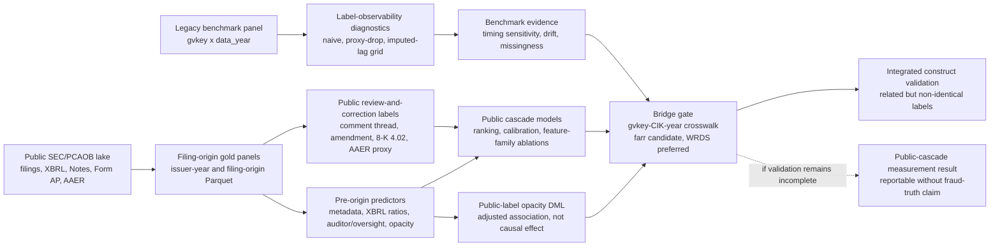

---
hide:
  - navigation
---

# Research Design

Working title:

**From Restatements to Public Review and Correction: Label Observability and the Public Reporting-Risk Cascade**

- **Research setting.** Traditional misstatement and restatement benchmarks label firm-years after misconduct is detected, disclosed, or made publicly visible.
- **Measurement problem.** These labels are useful, but they mix the underlying reporting problem with discovery probability, disclosure delay, and selective public observability.
- **Empirical object.** The paper studies a filing-native public reporting-risk cascade built from SEC and PCAOB data.
- **Primary target.** The cascade measures public review-and-correction outcomes from the filing origin, not latent fraud truth.

## Research Question and Contribution

- **Core question.** Can reporting-risk prediction be reframed from ex post detected misconduct to filing-origin public review-and-correction risk?
- **Timing contamination.** Static detected-misstatement labels mix occurrence, discovery, disclosure lag, and public visibility.
- **Main contribution.** The intended contribution is a measurement redesign, not a claim that one classifier dominates prior fraud-prediction work.
- **Filing-origin estimand.** The repo defines a filing-origin public reporting-risk estimand based only on information visible at or before `origin_date`.
- **Construct claim.** The public cascade is expected to be related to, but not identical with, legacy detected-misstatement labels.
- **Peer comparison boundary.** Peer models and metrics are used for compatibility checks; comparisons provide metric-compatible ranking evidence, not same-estimand superiority claims.
- **Peer-suite boundary.** PR1 is the legacy benchmark peer suite; PR2 is the public-label peer transfer. Mapping quality determines whether Dechow/Bao adapters can use stronger names or must be reported as mapped/inspired variants, and public peer transfer runs only in `full` mode so the default workflow stays bounded.
- **Evidence requirement.** Credible bridge-based overlap validation is required before any integrated old-benchmark/public-cascade claim.

### Design Overview



## Prior Literature and Positioning

- **Literature role.** Prior work supplies model families, performance metrics, and construct anchors.
- **Estimand shift.** Prior fraud and restatement studies often predict detected ex post misconduct labels; this paper predicts subsequent public review-and-correction events from a filing-origin information set.
- **Metric-compatible comparison.** Metric-compatible comparison is evidence about ranking behavior under a shared scoring language, not evidence that the tasks share the same estimand.

| Stream | Canonical anchors | Typical models and metrics | Role in this paper |
| --- | --- | --- | --- |
| Detected misstatement and fraud prediction | [Dechow, Ge, Larson, and Sloan (2011)](https://papers.ssrn.com/sol3/papers.cfm?abstract_id=997483); [Perols (2011)](https://doi.org/10.2308/ajpt-50009); [Bao, Ke, Li, Yu, and Zhang (2020)](https://papers.ssrn.com/sol3/papers.cfm?abstract_id=2670703); [Bertomeu, Cheynel, Floyd, and Pan (2021)](https://papers.ssrn.com/sol3/papers.cfm?abstract_id=3496297), "Using Machine Learning to Detect Misstatements" | Logistic/F-score models, SVM, decision trees, bagging, stacking, neural nets, and tree ensembles; AUC, classification rates, lift, variable importance, and top-fraction ranking metrics | Supplies the benchmark peer suite: Dechow-style scores, a Perols-style legacy model zoo, Bao-style top-fraction balanced accuracy and NDCG, and Bertomeu-style XGBoost feature importance. |
| Partial observability and hidden misconduct | [Barton, Burnett, Gunny, and Miller (2024)](https://pubsonline.informs.org/doi/10.1287/mnsc.2022.4627); [Dyck, Morse, and Zingales (2024)](https://link.springer.com/article/10.1007/s11142-022-09738-5) | Occurrence/detection separation, hidden misconduct estimation, likelihood and coefficient evidence | Motivates the estimand shift; these models are not PR-AUC comparators for the current pipeline. |
| SEC comment-letter and disclosure-review research | [Cassell, Cunningham, and Myers (2013)](https://papers.ssrn.com/sol3/papers.cfm?abstract_id=1951445); [Bozanic, Dietrich, and Johnson (2018)](https://papers.ssrn.com/sol3/papers.cfm?abstract_id=2989164); [Brown, Tian, and Tucker (2018)](https://papers.ssrn.com/sol3/papers.cfm?abstract_id=2551451); the [SEC filing review process](https://www.sec.gov/about/divisions-offices/division-corporation-finance/filing-review-process-corp-fin) | Regression-style evidence on comment receipt, remediation, and disclosure response | Establishes public comment-letter scrutiny as economically meaningful; this paper embeds it as one public-cascade outcome rather than the sole endpoint. This stream supplies regression-style evidence rather than direct ranking-score comparators. |
| Public regulatory and structured-data sources | [SEC Item 4.02 guidance](https://www.sec.gov/about/divisions-offices/division-corporation-finance/financial-reporting-manual/frm-topic-4); [SEC AAER pages](https://www.sec.gov/enforcement-litigation/accounting-auditing-enforcement-releases); [PCAOB Form AP](https://pcaobus.org/oversight/standards/implementation-resources-PCAOB-standards-rules/form-ap-auditor-reporting-certain-audit-participants); [SEC Inline eXtensible Business Reporting Language (XBRL)](https://www.sec.gov/data-research/structured-data/inline-xbrl) | Public filing events, audit-participant data, oversight data, and standardized financial facts | Supplies the filing-native public lake and reproducible feature construction. AAER is a severity-tail descriptor, not a complete enforcement universe. |

- **Positioning.** The paper aligns the prediction target to the observable public process.
- **Benchmark role.** The legacy benchmark remains a disciplined diagnostic for timing sensitivity, label observability, concept drift, and missingness.
- **Overlap role.** The bridge tests where the public cascade agrees or disagrees with detected-misstatement labels.

## Measurement Design

### Legacy Benchmark Labels

- **Unit.** The legacy benchmark panel uses `gvkey`, `data_year`, and `misstatement firm-year`.
- **Purpose.** It tests whether traditional restatement prediction is sensitive to timing, drift, and missingness.
- **Label modes.**
  - `naive`: the observed `misstatement firm-year` label without detection-timing adjustment.
  - `proxy_drop_observed`: a coverage stress test using sparse same-row `res_an*` timing proxies, excluding positives without usable timing evidence.
  - `proxy_imputed_lag`: a timing-assumption grid assigning unknown positives one-, two-, three-, or five-year detection lags.
  - `external_timing`: the paper-grade benchmark maturation target, available only if validated public restatement or detection dates are supplied.
- **Leakage rule.** `res_an0`, `res_an1`, `res_an2`, and `res_an3` are timing proxies only and never enter predictors.
- **Required reporting.** `timing_coverage.csv` must report same-row timing coverage, unknown positives, retained-positive share, and class-balance changes.

### Public Review-and-Correction Labels

- **Outcome design.** The public cascade is a multi-label outcome system, not a deterministic hierarchy.
- **Public labels.**
  - `label_comment_thread_365`: public comment-letter scrutiny, measured from the first public EDGAR date of the comment-thread sequence; source: [SEC filing review process](https://www.sec.gov/about/divisions-offices/division-corporation-finance/filing-review-process-corp-fin) and public EDGAR correspondence.
  - `label_amendment_365`: broad amendment/friction signal, including administrative amendments, filing friction, and potentially material corrections; source: [SEC EDGAR filing access](https://www.sec.gov/edgar/search-and-access) and amended filing form metadata.
  - `label_8k_402_365`: Item 4.02 non-reliance and material-correction proxy; source: [SEC Form 8-K](https://www.sec.gov/files/form8-k.pdf), Item 4.02.
  - `label_aaer_proxy_730`: rare AAER severity-tail descriptor, fit only as robustness when positives are sufficient; source: [SEC Accounting and Auditing Enforcement Releases](https://www.sec.gov/enforcement-litigation/accounting-auditing-enforcement-releases) and `farr::aaer_*` support data.
- **Co-occurrence rule.** A later-stage positive does not mechanically force an earlier-stage label.
- **Construct meaning.** These labels are not alternative names for fraud. They are public observability states: regulatory scrutiny (`comment_thread`), filing correction or friction (`amendment`), material non-reliance (`8k_402`), and rare public enforcement-tail evidence (`aaer_proxy`).
- **Target distinction.** The target is public review-and-correction risk rather than latent fraud truth.

### Timing and Censoring Rules

- **Origin date.** In the current v1 panel, `filing_origin_panel.origin_date = filing_date`, and `issuer_origin_panel.origin_date` is the selected annual filing date for the issuer-year.
- **No post-origin leakage.** No event released after `origin_date` may enter predictors.
- **Excluded coverage fields.** `source_available_*`, `public_date_*`, `vintage_*`, and `as_of_date` document source availability and public vintages but are excluded from default predictors.
- **Censoring.** 365-day outcomes use `censored_365`; AAER 730-day robustness uses `censored_730`.

### Claim Boundaries

> The public-cascade design supports evidence about a public reporting-risk state. It does not by itself establish latent fraud truth, causal identification, or a stable enforcement-prediction result.

> Comment letters are public scrutiny signals, not the full SEC review universe. AAER is a severity-tail descriptor, not a complete enforcement universe.

> Bridge validation is mandatory for an integrated claim that the public cascade and the old benchmark measure related but non-identical constructs. Without that validation, the public-cascade result remains a public-data measurement result rather than a validated fraud/restatement overlap paper.

## Data and Feature Construction

### Legacy Benchmark Panel

- **File.** `data/raw_dataset_misstatement.parquet`.
- **Grain.** `gvkey x data_year`.
- **Coverage.** 2001-2019.
- **Required fields.** `gvkey`, `data_year`, `misstatement firm-year`, `res_an0` to `res_an3`, `missing_*` flags, and accounting/audit/governance/market/industry predictors.
- **Limitation.** No CIK, ticker, PERMNO, restatement filing date, detector identity, or complete public filing history.

### Public SEC/PCAOB Lake

- **Storage design.** `data/public_lake/` is organized as bronze, silver, and gold.
- **Bronze.** Downloaded public files with source URL, timestamp, SHA256 hash, parser version, schema version, and as-of date.
- **Silver.** Normalized issuer, filing, XBRL, Notes, comment-thread, correction, Form AP, PCAOB inspection, and AAER proxy tables; large Silver tables are Parquet-first.
- **Gold.** `issuer_origin_panel.parquet` and `filing_origin_panel.parquet`.
- **DuckDB path.** The default DuckDB path uses SQL for XBRL core-tag pivoting, label-horizon joins, and Parquet output on the annual issuer-year modeling panel.
- **Filing-origin provenance.** The full filing-origin panel is retained as a lightweight, year-sharded provenance panel rather than a fully labeled 20M-row modeling table.
- **Required v1 sources.** SEC submissions, SEC Financial Statement Data Sets (FSDS), SEC `UPLOAD` and `CORRESP`, 10-K/A and 10-Q/A amendments, 8-K Item 4.02, PCAOB Form AP, PCAOB inspection datasets, and SEC AAER pages.
- **Main public sample.** Domestic U.S. GAAP issuer-years from 2011-2023, with `2026-04-23` as the current reproducibility as-of date.

### Bridge and External Validation Inputs

- **Bridge file.** `data/external/gvkey_cik_year.csv`.
- **Required fields.** `gvkey`, `issuer_cik`, a single year or start/end years, and provenance fields such as source, version, extraction date, match method, and match score.
- **WRDS-preferred route.**

```bash
set -a; source .env; set +a
uv run python scripts/prepare_gvkey_cik_crosswalk.py \
  --input path/to/wrds_cik_gvkey_link.csv \
  --out data/external/gvkey_cik_year.csv
```

- **Public candidate route while WRDS access is pending.**

```bash
bash scripts/prepare_farr_gvkey_cik_bridge.sh --install-missing
bash scripts/prepare_farr_support_data.sh --install-missing
```

- **Current candidate bridge.** `farr::gvkey_ciks` is the working high-coverage candidate bridge; it must be reported with coverage and multiplicity tables and should not be described as WRDS-verified.
- **AAER support.** `farr::aaer_firm_year` and `farr::aaer_dates` are external AAER validation anchors.
- **Metadata support.** `farr::state_hq` is a date-bounded headquarters-state metadata control.
- **Missing bridge behavior.** If no usable external crosswalk exists, the bridge probe must report `raw_identifier_blocker` rather than infer links from benchmark identifiers alone.

### Feature Families

- **Common sample rule.** Feature families use the same filtered issuer-year sample for fair ablations.
- **Missing-value rule.** Tree models with native missing-value handling retain numeric `np.nan`; non-tree adapters use fold-internal imputation only when required.
- **Excluded columns.** Label, censoring, identifier, source-availability, public-date, and vintage columns are excluded by default.
- **Metadata.** SIC, form, SEC submissions `entityType`, filing size, XBRL flags, prior filing count, days since prior filing, and headquarters-state controls when available.
- **Filing friction and public history.** Current-cycle NT status and amendment friction, plus strictly pre-origin rolling counts and recency for prior NT filings, comment threads, amendments, and 8-K instability items. Rolling public-history features must use only events with `event_date < origin_date`.
- **XBRL.** `xbrl_ratio_*` and `xbrl_coverage_*` features from controlled core tags, including size, leverage, profitability, working capital, receivables, inventory, cash, debt, operating cash flow, and year-over-year revenue/assets changes.
- **Auditor and oversight.** PCAOB Form AP fields, engagement-partner exposure, and PCAOB inspection features in their public source windows.
- **Note opacity.** Note count, note character count, note-tag coverage, and tag entropy as a disclosure breadth measure.
- **Deferred extensions.** Proxy-governance content, SEC insider-pressure features, macro-vintage controls, auditor-firm public-status fields, and broader security/attention layers are useful extensions, not required for the current v1 paper claim.

## Empirical Design

### Evaluation Metrics

- **Predictive metrics.** PR-AUC, ROC-AUC, Brier score, Brier Skill Score, expected calibration error, top-50/100/200 precision, and Bao-style top-fraction metrics.
- **Bao-style metrics.** Top-fraction precision, sensitivity, specificity, balanced accuracy, and binary-relevance NDCG@k.
- **Calibration.** Calibration metrics are diagnostic under class imbalance and resampling.
- **Prevalence.** `Prevalence` is the positive-class rate in the evaluated sample and the natural random-ranking baseline for PR-AUC.
- **PR-AUC interpretation.** When positives are rare, a numerically small PR-AUC can still represent meaningful lift over the base rate.
- **ROC-AUC contrast.** ROC-AUC has a fixed random baseline near 0.5 and can look much larger than PR-AUC in rare-event settings.
- **Split design.** Prediction experiments use annual out-of-time evaluation, not random cross-validation.
- **Training windows.** For a given test year, training uses earlier years only, with expanding or rolling 5-, 7-, and 10-year windows.
- **DML separation.** Cross-fitting appears separately in Double / Debiased Machine Learning (DML) opacity diagnostics; it is not the train/test split used for headline prediction tables.

### Experiment 1: Label Observability and Detection Timing

- **Purpose.** Quantify how sensitive traditional restatement evaluation is to timing coverage and unknown-positive assumptions.
- **Design.** Run annual out-of-time benchmark backtests across expanding, rolling 5-year, rolling 7-year, and rolling 10-year windows; compare `naive`, `proxy_drop_observed`, and `proxy_imputed_lag` labels.
- **Outputs.** `rolling_metrics.csv`, `rolling_predictions.parquet`, `timing_coverage.csv`, `timing_summary.json`, `timing_claim_status`, and window summaries.
- **Interpretation.** This is a benchmark-validity diagnostic; a decline under `proxy_drop_observed` is timing-observability sensitivity, not proof of look-ahead bias by itself.

### Experiment 2: Concept Drift and Model Shelf-Life

- **Purpose.** Estimate whether reporting-risk models trained in one regime remain useful in later regimes.
- **Design.** Compare rolling and expanding windows over test years; track feature-family importance; report pre/post diagnostics around major regulatory and data-regime breakpoints.
- **Outputs.** Annual metrics, window summaries, structural-break diagnostics, and feature-family importance.
- **Interpretation.** The experiment supports model shelf-life and retraining-window evidence; it does not establish structural causality from predictive drift alone.

### Experiment 3: Opacity and Public Review/Correction Risk

- **Purpose.** Test whether pre-origin opacity and missingness profiles predict later public scrutiny or correction.
- **Design.** Construct missingness-density and missing-profile indicators; estimate Double / Debiased Machine Learning (DML) partially linear regressions on public labels.
- **Primary outcomes.** `label_comment_thread_365`, `label_amendment_365`, and `label_8k_402_365`.
- **Treatment-like variable.** `D = missingness_density_score`.
- **Controls.** `X = pre-origin metadata, XBRL, filing-friction, public-history, auditor, oversight, note-opacity, and calendar controls`.
- **Outputs.** Missing-profile clusters, public-label PLR spec results, nuisance-model metadata, and diagnostic benchmark-side DML outputs.
- **Interpretation.** Coefficients are adjusted associations, not causal effects; the old `misstatement firm-year` outcome remains a legacy diagnostic only.

### Experiment 4: Public Cascade Construction

- **Purpose.** Demonstrate that public data can support a defensible review-and-correction cascade.
- **Design.** Build the public lake from SEC/PCAOB sources; construct labels from first public dates; report source coverage, event rates, censoring, and task readiness.
- **Outputs.** Source coverage tables, event-rate tables, censoring summaries, public-lake metadata, and task-positive counts.
- **Interpretation.** This experiment validates the measurement surface; AAER remains descriptive severity-tail evidence unless robust positive counts are available.

### Experiment 5: Public Cascade Prediction

- **Purpose.** Estimate the pre-disclosure public reporting-risk state from public features.
- **Design.** Use `issuer_origin_panel` to predict comment-thread scrutiny, broad amendment/friction, and 8-K Item 4.02 outcomes; run feature-family ablations over metadata, XBRL, auditor, oversight, and all-feature sets.
- **Skip rule.** Skip task/family/window fits with one-class train or test labels.
- **Outputs.** `public_cascade_metrics.csv`, `public_cascade_predictions.parquet`, `public_cascade_task_status.csv`, `public_cascade_summary.md`, and `public_opacity_dml.csv`.
- **Interpretation.** Full public-cascade claims require non-metadata features; `metadata_baseline` is a readiness state, `xbrl_ratio_baseline` is the first non-metadata empirical baseline, and sparse AAER folds are blockers rather than failed headline models.

### Experiment 6: Old Benchmark and Public Cascade Overlap

- **Purpose.** Test whether legacy detected-misstatement labels and public review-and-correction labels measure related but non-identical constructs.
- **Design.** Run the bridge probe, report coverage and multiplicity, then test event-time concentration and reciprocal risk-score alignment in the mapped sample.
- **Current bridge.** The current implementation uses farr `gvkey_ciks` as a high-coverage candidate bridge; WRDS remains the preferred final validation source.
- **Outputs.** `bridge_probe_summary.json`, `coverage_report.csv`, `multiplicity_report.csv`, `unmatched_raw_characteristics.csv`, `construct_overlap/label_contingency_lift.csv`, `construct_overlap/public_score_legacy_ranking.csv`, `construct_overlap/reciprocal_alignment.csv`, `construct_overlap/event_time_concentration.csv`, and AAER severity-tail support tables.
- **Interpretation.** This is the integrated-paper gate; the farr bridge supports candidate overlap validation, and WRDS remains preferred before final manuscript claims.

## Evidence Gates

| Component | Current status | Gate before paper claim |
| --- | --- | --- |
| Benchmark timing | implemented as observability sensitivity | report `timing_coverage.csv`, retained positives, and imputed-lag scenarios; external timing required for paper-grade maturation |
| Concept drift | implemented as rolling-window diagnostics | validate annual PR-AUC, Brier Skill Score, feature-importance drift, and breakpoint summaries |
| Opacity | public-label DML implemented; refresh summary is separate from construct overlap | public-label PLR results must use `label_comment_thread_365`, `label_amendment_365`, and `label_8k_402_365` as primary outcomes |
| Public lake | full public lake path implemented | refreshed source coverage, row counts, censoring, and reproducibility metadata |
| Public cascade | current full-run state is `xbrl_ratio_baseline` | non-degenerate comment-thread, amendment, and 8-K Item 4.02 tasks; AAER framed as severity-tail evidence |
| Bridge overlap | farr candidate overlap implemented | coverage, multiplicity, reciprocal alignment, no silent many-to-many joins, and WRDS-preferred validation before final integrated claims |

- **Data integrity gates.**
  - No post-`origin_date` event enters predictors.
  - No `res_an*` column enters benchmark predictors.
  - `source_available_*`, `public_date_*`, `vintage_*`, and `as_of_date` stay outside default predictors.
  - Censoring masks are horizon-specific.
  - Crosswalk coverage and multiplicity are reported before overlap validation.
  - Construct-overlap outputs carry `validation_tier = candidate_farr` until a verified WRDS bridge is supplied.
- **Empirical sufficiency gates.**
  - Benchmark outputs non-empty rolling metrics, timing coverage, and missingness diagnostics.
  - Public cascade covers fiscal years 2011-2023 in the full panel.
  - Comment-thread, amendment, and 8-K Item 4.02 tasks have nonzero positives.
  - `xbrl_ratio_*` and `xbrl_coverage_*` features are present for non-metadata public-cascade evidence.
  - Prediction metrics are read relative to each task's prevalence; there is no absolute PR-AUC leaderboard threshold.
  - Overlap evidence reports top-decile lift, reciprocal alignment, bridge tiers, and bridge coverage before integrated claims are made.
  - Zero-positive or sparse AAER robustness tasks are skipped and reported as severity-tail blockers.
- **Paper-readiness gates.**
  - Claims remain measurement and decision-useful prediction claims, not causal proof of fraud occurrence.
  - AAER is described as a severity-tail descriptive proxy.
  - Comment letters are described as public scrutiny, not complete SEC review.
  - Bridge validation is mandatory for the integrated old-benchmark/public-cascade paper claim.
  - Candidate farr overlap can support a related-but-non-identical construct argument, but not final WRDS-quality validation.

## Execution Contract

- **Operational source of truth.** The operational command surface lives in the repository home page and README so there is a single maintained entrypoint for users and coauthors.
- **Quality gate.**

```bash
just check
```

- **Paper-facing core run.**

```bash
just full full raw artifacts/full
```

- **Peer-compatible model-family transfer.**

```bash
just task study raw artifacts/full_with_peer \
  extra="--peer-comparison-mode full --peer-target both --parallel-jobs 4 --model-threads 2 --seed-policy task-isolated"
```

- **Command boundary.** `just check` is the local quality gate; `just full full raw artifacts/full` is the paper-facing core run for data engineering and core experiments; `full_with_peer` adds the legacy and public-label peer model-family transfer suites. Use `--peer-target public` when only the public-label peer transfer needs to be refreshed.
- **Detailed operations.** Component-level reruns and public-lake operational details are documented in [the repository home page](index.md), which includes the root `README.md`.
