---
hide:
  - navigation
---

# Paper Plan

Working title:

**From Restatements to Public Review and Correction: Label Observability and the Public Reporting-Risk Cascade**

## Introduction

### Overview and Why This Work

- **Research setting.** Traditional misstatement and restatement benchmarks label firm-years after misconduct is detected, disclosed, or made publicly visible.
- **Measurement problem.** These labels are useful, but they mix the underlying reporting problem with discovery probability, disclosure delay, and selective public observability.
- **Empirical object.** The paper studies a filing-native public reporting-risk cascade built from SEC and PCAOB data.
- **Primary target.** The cascade measures public review-and-correction outcomes from the filing origin, not unobserved fraud occurrence.
- **Why this work.** Users of reporting-risk models need signals that are aligned with the public information set available when a filing is made. A filing-origin design is closer to the decision problem than an ex post detected-misstatement label alone.

### Literature Review and Existing Results

- **Literature role.** Prior work supplies model families, performance metrics, and construct anchors.
- **Estimand shift.** Prior fraud and restatement studies often predict detected ex post misconduct labels; this paper predicts subsequent public review-and-correction events from a filing-origin information set.
- **Metric-compatible comparison.** Metric-compatible comparison is evidence about ranking behavior under a shared scoring language, not evidence that the tasks share the same estimand.

| Stream | Canonical anchors | Typical models and metrics | Role in this paper |
| --- | --- | --- | --- |
| Detected misstatement and fraud prediction | [Dechow, Ge, Larson, and Sloan (2011)](https://papers.ssrn.com/sol3/papers.cfm?abstract_id=997483); [Perols (2011)](https://doi.org/10.2308/ajpt-50009); [Bao, Ke, Li, Yu, and Zhang (2020)](https://papers.ssrn.com/sol3/papers.cfm?abstract_id=2670703); [Bertomeu, Cheynel, Floyd, and Pan (2021)](https://papers.ssrn.com/sol3/papers.cfm?abstract_id=3496297), "Using Machine Learning to Detect Misstatements" | Logistic/F-score models, SVM, decision trees, bagging, stacking, neural nets, and tree ensembles; AUC, classification rates, lift, variable importance, and top-fraction ranking metrics | Supplies the benchmark peer suite: Dechow-style scores, a Perols-style benchmark model zoo, Bao-style top-fraction balanced accuracy and NDCG, and Bertomeu-style XGBoost feature importance. |
| Partial observability and hidden misconduct | [Barton, Burnett, Gunny, and Miller (2024)](https://pubsonline.informs.org/doi/10.1287/mnsc.2022.4627); [Dyck, Morse, and Zingales (2024)](https://link.springer.com/article/10.1007/s11142-022-09738-5) | Occurrence/detection separation, hidden misconduct estimation, likelihood and coefficient evidence | Motivates the estimand shift; these models are not PR-AUC comparators for the current design. |
| SEC comment-letter and disclosure-review research | [Cassell, Cunningham, and Myers (2013)](https://papers.ssrn.com/sol3/papers.cfm?abstract_id=1951445); [Bozanic, Dietrich, and Johnson (2018)](https://papers.ssrn.com/sol3/papers.cfm?abstract_id=2989164); [Brown, Tian, and Tucker (2018)](https://papers.ssrn.com/sol3/papers.cfm?abstract_id=2551451); the [SEC filing review process](https://www.sec.gov/about/divisions-offices/division-corporation-finance/filing-review-process-corp-fin) | Regression-style evidence on comment receipt, remediation, and disclosure response | Establishes public comment-letter scrutiny as economically meaningful; this paper embeds it as one public-cascade outcome rather than the sole endpoint. This stream supplies regression-style evidence rather than direct ranking-score comparators. |
| Public regulatory and structured-data sources | [SEC Item 4.02 guidance](https://www.sec.gov/about/divisions-offices/division-corporation-finance/financial-reporting-manual/frm-topic-4); [PCAOB Form AP](https://pcaobus.org/oversight/standards/implementation-resources-PCAOB-standards-rules/form-ap-auditor-reporting-certain-audit-participants); [SEC Inline eXtensible Business Reporting Language (XBRL)](https://www.sec.gov/data-research/structured-data/inline-xbrl) | Public filing events, audit-participant data, inspection-archive provenance, and standardized financial facts | Supplies the filing-native public lake and reproducible feature construction. |

### Positioning Against Existing Results

- **Positioning.** The paper aligns the prediction target to the observable public process.
- **Benchmark role.** The detected-misstatement benchmark remains a disciplined diagnostic for timing sensitivity, label observability, concept drift, and missingness.
- **Overlap role.** The bridge tests where the public cascade agrees or disagrees with detected-misstatement labels.
- **What prior results can support.** The prior literature supports the model-family vocabulary, the importance of hidden detection, the economic relevance of SEC review, and the use of ranking/calibration metrics.
- **What prior results cannot support.** Prior results do not make public review-and-correction labels equivalent to fraud, and they do not make the public cascade a same-estimand benchmark against detected-misstatement classifiers.

### Research Gap

- **Gap 1: outcome observability.** Existing detected-misstatement and fraud-prediction studies typically evaluate labels observed after detection and disclosure. They do not isolate whether a filing-year model is predicting underlying misconduct, later discovery, public disclosure, or enforcement visibility.
- **Gap 2: public review process.** SEC comment-letter and disclosure-review studies establish that public scrutiny is economically meaningful, but they usually do not build a multi-outcome, filing-origin prediction cascade from public SEC/PCAOB data.
- **Gap 3: comparable but different targets.** Hidden-misconduct and partial-observability papers motivate separating occurrence and detection. They are construct anchors, not PR-AUC comparators for the public filing-origin target.
- **Gap 4: reproducible bridge evidence.** The detected-misstatement benchmark uses `gvkey x data_year`; the public cascade uses `issuer_cik x fiscal_year x origin_date`. An integrated claim requires a documented gvkey-CIK-year bridge with coverage, multiplicity, conflict, and overlap diagnostics.

### Research Question and Contribution

- **Core question.** Can reporting-risk prediction be reframed from ex post detected misconduct to filing-origin public review-and-correction risk?
- **Timing contamination.** Static detected-misstatement labels mix occurrence, discovery, disclosure lag, and public visibility.
- **Main contribution.** The intended contribution is a measurement redesign, not a claim that a new classifier performs better than prior fraud-prediction models.
- **Filing-origin estimand.** The repo defines a filing-origin public reporting-risk estimand based only on information visible at or before `origin_date`.
- **Construct claim.** The public cascade is expected to be related to, but not identical with, detected-misstatement benchmark labels.
- **Peer comparison boundary.** Peer models and metrics are used for compatibility checks; comparisons provide metric-compatible ranking evidence, not same-estimand performance rankings.
- **Model-family boundary.** The detected-misstatement peer benchmark and the public-label transfer suite use the same Dechow, Perols, Bao, and Bertomeu model-family vocabulary. Mapping quality determines whether Dechow/Bao adapters can use stronger names or must be reported as mapped or inspired variants. Public peer transfer runs only in `full` mode so the default workflow stays bounded.
- **Evidence requirement.** Credible bridge-based overlap validation is required before any integrated benchmark-to-public claim.

### Our Contribution and Claim Boundary

- **Contribution.** The paper develops a measurement-and-ranking framework for public reporting-risk states: a public, filing-origin outcome system and a transparent construct comparison with the detected-misstatement benchmark.
- **Excluded claims.** The design is not an unobserved-fraud detector, a causal enforcement model, or a same-estimand performance ranking against prior fraud-prediction papers.
- **Boundary for results.** Results should be interpreted as evidence about public review-and-correction risk rather than unobserved fraud occurrence, causal effects, or full SEC-review coverage.

## Materials and Methods

### Data and Market/Institutional Setting

- **Issuer setting.** The empirical setting is U.S. public-company reporting, where issuers release periodic filings into EDGAR and public downstream signals emerge through SEC review, amended filings, 8-K Item 4.02 non-reliance disclosures, and PCAOB Form AP auditor-participant records. PCAOB inspection archives are retained for provenance only.
- **Information set.** The public-cascade information set is filing-origin: predictors must be observable at or before `origin_date`.
- **Two data layers.** The detected-misstatement benchmark supplies the historical `gvkey x data_year` diagnostic layer; the SEC/PCAOB public lake supplies the filing-native `issuer_cik x fiscal_year` public review-and-correction layer.
- **Bridge layer.** A `gvkey-CIK-year` bridge is needed only for construct-overlap interpretation between the benchmark layer and the public layer.

### Reproduction Inputs

- **Operational inputs.** A reproducible run needs the detected-misstatement benchmark file, the public SEC/PCAOB lake configuration, and the WRDS bridge export:
    - `$DATA_DIR/raw/raw_dataset_misstatement.parquet` for the `gvkey x data_year` detected-misstatement benchmark.
    - `config/public_data.yaml` and `config/study.yaml` for public-source and study defaults.
    - `$DATA_DIR/linkage/raw_only/gvkey_cik_year.csv` for bridge validation, generated only from the raw CIK-GVKEY link table.
- **Public-data contract.** The paper-facing public lake uses `storage_format=parquet`, `notes_mode=summary`, DuckDB, and the pinned literal `as_of_date=2026-07-06`. The public modeling sample is restricted to fiscal years 2011-2024; source archives may extend beyond the sample window only to establish complete forward outcome horizons.
- **Peer and overlap run.** The peer-enabled study is a separate run so the default workflow stays bounded.

### Data Engineering and Preprocessing Overview

```mermaid
flowchart LR
    subgraph BENCHMARK["Detected-misstatement benchmark diagnostic: external benchmark, not SEC/PCAOB public lake"]
        L0["Input panel<br/>gvkey x data_year<br/>2001-2019<br/>accounting, audit, governance,<br/>market, and industry predictors"]
        L1["Benchmark X<br/>engineered benchmark predictors<br/>exclude ids, labels, res_an* timing proxies,<br/>and post-outcome fields"]
        L2["Benchmark Y<br/>detected misstatement firm-year<br/>naive, proxy_drop_observed,<br/>proxy_imputed_lag 1/2/3/5y<br/>external_timing only if validated dates exist"]
        L3["Benchmark prediction loops<br/>annual out-of-time test years<br/>rolling_5y, rolling_7y, rolling_10y, expanding<br/>core benchmark plus detected-misstatement peer suite<br/>Dechow / Perols / Bao / Bertomeu families"]
        L4["Benchmark metrics<br/>PR-AUC relative to prevalence, ROC-AUC,<br/>Brier/BSS, ECE, top-50/100/200 precision,<br/>Bao top-fraction precision, sensitivity, BAC, NDCG"]
        L5["Benchmark interpretation<br/>label observability, timing fragility,<br/>concept drift, missingness diagnostics<br/>not unobserved fraud occurrence"]
        L0 --> L1
        L0 --> L2
        L1 --> L3
        L2 --> L3
        L3 --> L4
        L4 --> L5
    end

    subgraph PUBLIC["Public filing-origin cascade: SEC/PCAOB public information set"]
        P0["Public inputs<br/>EDGAR filings, FSDS/XBRL, Notes summaries,<br/>comment letters, amendments, 8-K Item 4.02,<br/>PCAOB Form AP; inspection archives are Bronze provenance only<br/>public sample 2011-2024, as-of 2026-07-06"]
        P1["Parquet public lake<br/>Bronze source cache<br/>Silver normalized event and fact tables<br/>Gold filing_origin_panel and issuer_origin_panel"]
        P2["Public modeling grain<br/>issuer_cik x fiscal_year<br/>origin_date is selected annual filing date<br/>features visible at or before origin_date"]
        P3["Public X<br/>metadata, XBRL ratios, auditor, prior-filing history, all<br/>rolling public history requires event_date < origin_date<br/>exclude source_available_*, public_date_*, vintage_* fields"]
        P4["Public Y<br/>label_comment_thread_365: SEC comment-thread scrutiny<br/>label_amendment_365: amended filing or filing friction<br/>label_8k_402_365: Item 4.02 non-reliance"]
        P5["Public prediction loops<br/>annual out-of-time fiscal-year tests<br/>rolling/expanding windows from earlier years only<br/>core cascade model plus public-label peer suite<br/>same Dechow / Perols / Bao / Bertomeu families"]
        P6["Public metrics<br/>same metric vocabulary as benchmark where defined<br/>PR-AUC vs prevalence, ROC-AUC, Brier/BSS, ECE,<br/>top-50/100/200 precision, top-decile lift,<br/>Bao-style top-fraction metrics"]
        P7["Public interpretation<br/>filing-origin review-and-correction risk signal<br/>feature-family value and model-family transfer evidence<br/>not a performance ranking on the detected-misstatement benchmark estimand"]
        P8["Public-label opacity DML<br/>missingness_density_score to public labels<br/>cross-fitted nuisance models<br/>adjusted association, not causal effect"]
        P0 --> P1
        P1 --> P2
        P2 --> P3
        P2 --> P4
        P3 --> P5
        P4 --> P5
        P5 --> P6
        P6 --> P7
        P3 --> P8
    end

    subgraph VALIDATION["Bridge and interpretation layer"]
        V0["Bridge gate<br/>raw-only gvkey-CIK-year crosswalk<br/>confirmed WRDS SEC Analytics Suite CIK-GVKEY link table<br/>no external CIK supplement in the default bridge"]
        V1["Linkage QA<br/>coverage, multiplicity, unmatched rows,<br/>raw source composition,<br/>public_lake and public_lake_smoke overlap summaries<br/>before any construct-overlap claim"]
        V2["Construct-overlap checks<br/>matched 2011-2019 benchmark/public sample<br/>benchmark labels vs public labels<br/>public scores rank benchmark positives<br/>benchmark scores rank public labels<br/>event-time concentration"]
        V3["Final claim boundary<br/>public cascade is related to,<br/>but not identical with,<br/>detected-misstatement benchmark labels<br/>current bridge tier: wrds_validated"]
        V4["If bridge validation is incomplete<br/>report public-cascade measurement result<br/>without unobserved-fraud or same-estimand performance claim"]
        V0 --> V1
        V1 --> V2
        V2 --> V3
        V0 -.-> V4
    end

    L5 --> V0
    P7 --> V0
    P8 --> V0
```



### Detected-Misstatement Benchmark Panel

- **File.** `$DATA_DIR/raw/raw_dataset_misstatement.parquet`.
- **Grain.** `gvkey x data_year`.
- **Coverage.** 2001-2019.
- **Required fields.** `gvkey`, `data_year`, `misstatement firm-year`, `res_an0` to `res_an3`, `missing_*` flags, and accounting/audit/governance/market/industry predictors.
- **Predictor surface.** Benchmark predictors are the engineered columns already present in the raw benchmark panel. `gvkey`, `data_year`, target columns, timing proxy columns, missingness labels, and post-outcome fields are not treated as ordinary predictors.
- **Evaluation grain.** All benchmark prediction rows remain annual firm-year rows evaluated by out-of-time test year.
- **Limitation.** No CIK, ticker, PERMNO, restatement filing date, detector identity, or complete public filing history.

### Public SEC/PCAOB Lake

- **Storage design.** `$DATA_DIR/public_lake/` is organized as bronze, silver, and gold.
- **Bronze.** Downloaded public files with source URL, timestamp, SHA256 hash, parser version, schema version, and as-of date.
- **Silver.** Normalized issuer, filing, XBRL, Notes, comment-thread, correction, and Form AP tables; large Silver tables are Parquet-first.
- **Gold.** `issuer_origin_panel.parquet` and `filing_origin_panel.parquet`.
- **DuckDB path.** The default DuckDB path uses SQL for XBRL core-tag pivoting, label-horizon joins, and Parquet output on the annual issuer-year modeling panel.
- **Filing-origin provenance.** The full filing-origin panel is retained as a lightweight, year-sharded provenance panel rather than expanded into a fully labeled modeling table.
- **Required paper sources.** SEC submissions, [SEC Financial Statement Data Sets (FSDS)](https://www.sec.gov/data-research/sec-markets-data/financial-statement-data-sets), SEC `UPLOAD` and `CORRESP`, 10-K/A and 10-Q/A amendments, 8-K Item 4.02, PCAOB Form AP, and PCAOB inspection archives for Bronze provenance only. FSDS field definitions follow the official [Financial Statement Data Sets data dictionary](https://www.sec.gov/files/financial-statement-data-sets.pdf).
- **Main public sample.** The sample comprises selected 10-K/10-K/A issuer-years with no observed same-year 20-F/40-F/6-K proxy, from fiscal years 2011-2024. This selection validates neither FPI status, domicile, nor US GAAP. The current reproducibility as-of date is `2026-07-06`.
- **Form AP provenance.** The archive-first Form AP source contract makes `FirmFilings.zip` authoritative when present. The build first verifies its metadata sidecar and requires exactly one `FirmFilings.csv` member. It extracts that member to a temporary file on the same filesystem and atomically replaces the derived CSV before normalization. An invalid archive, missing verified metadata sidecar, or missing member fails the build and must not fall back to an older CSV. Only when the archive is absent may a standalone `FirmFilings.csv` serve as an explicit compatibility fallback.
- **Source-to-table mapping.**
    - SEC submissions and filing index data form `filing_dim.parquet`, `issuer_dim.parquet`, `filing_origin_panel.parquet`, and the annual `issuer_origin_panel.parquet`.
    - FSDS/XBRL `sub` and `num` files form `filing_xbrl_dim.parquet`, `xbrl_fact_summary.parquet`, `xbrl_core_fact/`, and the QA table `xbrl_context_conflicts.parquet`; `filing_xbrl_dim` also supplies the exact-accession fiscal-period fallback described below.
    - SEC Notes are normalized in summary mode into `notes_filing_dim.parquet` and `note_summary.parquet`; raw text blobs are not part of the default paper-facing run.
    - SEC `UPLOAD` and `CORRESP` produce `comment_thread.csv.gz` with first public correspondence dates.
    - 10-K/A and 10-Q/A filings, explanatory notes, and form-level filters produce `correction_event.csv.gz` and `amendment_annotation.csv.gz`.
    - 8-K Item 4.02 parsing produces `issuer_8k_item_event.csv.gz`.
    - PCAOB Form AP may supply auditor and engagement-partner features. PCAOB inspection archives are provenance/Bronze inputs only; current inspection events are not joined to Gold, and there are no inspection model features.

### Public Review-and-Correction Labels

- **Public-label grain.** Public labels are attached to the annual `issuer_cik x fiscal_year x origin_date` issuer-year row.
- **Outcome design.** The public cascade is a multi-label outcome system, not a deterministic hierarchy.
- **Public labels.**
    - `label_comment_thread_365`: public comment-letter scrutiny, measured from the first public EDGAR date of the comment-thread sequence; source: [SEC filing review process](https://www.sec.gov/about/divisions-offices/division-corporation-finance/filing-review-process-corp-fin) and public EDGAR correspondence.
    - `label_amendment_365`: broad amendment/friction signal, including administrative amendments, filing friction, and potentially material corrections; source: [SEC EDGAR filing access](https://www.sec.gov/edgar/search-and-access) and amended filing form metadata.
    - `label_8k_402_365`: Item 4.02 non-reliance and material-correction proxy; source: [SEC Form 8-K](https://www.sec.gov/files/form8-k.pdf), Item 4.02.
- **Forward horizons.**
    - `label_comment_thread_365 = 1` if a public SEC comment-letter thread is first observed after `origin_date` and within 365 days.
    - `label_amendment_365 = 1` if a qualifying amended-filing or correction/friction event appears after `origin_date` and within 365 days.
    - `label_8k_402_365 = 1` if an 8-K Item 4.02 non-reliance event appears after `origin_date` and within 365 days.
- **Co-occurrence rule.** A later-stage positive does not mechanically force an earlier-stage label.
- **Construct meaning.** These labels are not alternative names for fraud. They are public observability states: regulatory scrutiny (`comment_thread`), filing correction or friction (`amendment`), and material non-reliance (`8k_402`).
- **Target distinction.** The target is public review-and-correction risk rather than unobserved fraud occurrence.

### Bridge Validation Inputs

- **Bridge file.** `$DATA_DIR/linkage/raw_only/gvkey_cik_year.csv`.
- **Required fields.** `gvkey`, `issuer_cik`, a single year or start/end years, and provenance fields such as source, version, extraction date, match method, and match score.
- **Bridge grain.** Bridge validation maps detected-misstatement benchmark `gvkey x data_year` rows to public `issuer_cik x fiscal_year` rows. It must report coverage, multiplicity, high-confidence and ambiguous matches, and unmatched diagnostics before overlap evidence is interpreted.
- **Raw-only rule.** `raw/CIK-GVKEY Link Table.csv` is the default bridge source. External gvkey-CIK bridge rows are no longer used as a supplement for missing raw gvkey-years.
- **Current raw-only WRDS route.**

```bash
uv run python scripts/build_linkage_bridge.py
```

- **Alternative WRDS route for a new export.**

```bash
set -a; source .env; set +a
uv run python scripts/prepare_gvkey_cik_crosswalk.py \
  --input path/to/wrds_cik_gvkey_link.csv \
  --out "$DATA_DIR/linkage/wrds_candidate/gvkey_cik_year.csv" \
  --source wrds_compustat_cik_gvkey_link \
  --source-version "YYYY-MM-DD"

just task bridge raw artifacts/wrds_candidate_bridge_probe \
  extra="--crosswalk $DATA_DIR/linkage/wrds_candidate/gvkey_cik_year.csv"
uv run python scripts/run_construct_overlap.py \
  --study-dir artifacts/full_with_peer \
  --crosswalk "$DATA_DIR/linkage/wrds_candidate/gvkey_cik_year.csv"
```

- **Current WRDS bridge.** The raw-only bridge is the working WRDS bridge. The confirmed source is WRDS SEC Analytics Suite `CIK-GVKEY Link Table.csv`, received from the collaborator via Outlook. Its source field includes CRSP/Compustat Merged, Compustat Company, Compustat Security, and Capital IQ rows.
- **Validation tier.** Construct-overlap outputs infer `validation_tier` from normalized crosswalk provenance: the current raw-only WRDS bridge is `wrds_validated`.
- **Missing bridge behavior.** If no usable crosswalk exists, the bridge probe must report `raw_identifier_blocker` rather than infer links from benchmark identifiers alone.

### Preprocessing and Feature Construction

- **Pretreatment target.** All preprocessing is designed to preserve the filing-origin information set: transform raw public-source tables into issuer-year features without introducing any post-`origin_date` information.
- **Fiscal-period key resolution.** The raw SEC submissions `report_date` and `event_report_date` are retained unchanged. For normalized period forms, `fiscal_period_end` uses the submissions `report_date` when available and otherwise uses SEC FSDS `sub.period` only through an exact `filing_dim.accession = filing_xbrl_dim.adsh` match; identical FSDS accession-period rows deduplicate, while multiple distinct periods for one accession fail the build. The period is never inferred from `filing_date`, and `fiscal_year` is always the calendar year of the resolved `fiscal_period_end`. `fiscal_period_end_source` is one of `submissions_report_date`, `fsds_period`, `unresolved`, or `not_applicable`. Unresolved annual filings remain in `filing_origin_panel` for provenance but are excluded from `issuer_origin_panel`, whose `issuer_cik`, `fiscal_year`, and `origin_date` keys must all be nonmissing. The source indicator is provenance, not a model predictor.
- **Common sample rule.** Feature families use the same filtered issuer-year sample for fair ablations.
- **Missing-value rule.** The numeric columns are cast to float and retain NaN for XGBoost native missing-value handling; non-tree adapters use fold-internal imputation only when required.
- **Excluded columns.** Label, censoring, identifier, source-availability, public-date, and vintage columns are excluded by default.
- **Metadata.** SIC, form, SEC submissions `entityType`, filing size, XBRL flags, prior filing count, and days since prior filing.
- **Filing friction and public history.** Current-cycle NT status and amendment friction, plus strictly pre-origin rolling counts and recency for prior NT filings, comment threads, amendments, and 8-K instability items. Rolling public-history features must use only events with `event_date < origin_date`.
- **XBRL context normalization.** The compact FSDS `num` layer retains all units, `version` as `taxonomy_version`, `segments`, `coreg`, and the raw `value_text`. Its normalized full fact key is `(adsh, tag, taxonomy_version, fact_date, quarters, unit, segments, coreg)`, corresponding to the official SEC `num` key. Blank strings are normalized to null. Batch files are candidate shards only: reconciliation occurs once across all batches. `xbrl_fact_summary.parquet` is likewise computed by globally deduplicating those full-key candidates before aggregation, so its counts do not depend on the archive batch partition. Numeric identity uses the SEC `NUMERIC(28,4)` domain, so exact repeats such as `40.0` and `40.00` deduplicate without collapsing distinct large integers at floating-point precision boundaries. A full key carrying multiple distinct numeric values in any unit is excluded globally and produces one row in `xbrl_context_conflicts.parquet`; its row count becomes `xbrl_context_conflict_count` rather than being resolved by a value-magnitude rule. FSDS and Notes resume markers bind each ordered archive path to its actual SHA-256 and bind normalization settings such as notes mode; changes to those task signatures propagate to their downstream silver and gold outputs.
- **XBRL issuer-level selection.** After global reconciliation, issuer-level features admit only consolidated facts with null `segments` and null `coreg`, and only USD or null units. Candidate ranking is controlled-tag priority, quarters descending, fact date descending, then unit priority (USD before null), followed by taxonomy version, tag, and raw value text as deterministic ties. This rule prevents segment, co-registrant, lower-priority tag, or stale-period facts from replacing the intended consolidated issuer value merely because they carry a USD unit.
- **XBRL features.** `xbrl_ratio_*` and `xbrl_coverage_*` features from controlled core tags include size, leverage, profitability, working capital, receivables, inventory, cash, debt, operating cash flow, and year-over-year revenue/assets changes. Year-over-year values require both the current row and the selected prior row to be a normalized 10-K or 10-K/A, and the prior fiscal year must equal the current fiscal year minus one; quarterly current rows, quarterly fallback rows, and nonconsecutive annual observations receive no YoY value or coverage.
- **Auditor and prior-filing history.** PCAOB Form AP may supply auditor and engagement-partner features. `Prior-filing history (legacy artifact key: oversight)` means `prior_filing_count`, not PCAOB inspection. PCAOB inspection archives are provenance/Bronze inputs only; current inspection events are not joined to Gold, and there are no inspection model features.
- **Note opacity.** Note count, note character count, note-tag coverage, and tag entropy as a disclosure breadth measure.
- **Feature-family boundary.** The reported public families are metadata, XBRL, auditor, Prior-filing history (legacy artifact key: oversight), visibility/history, and all. The notes/disclosure-breadth variables enter `all`; there is no standalone text-family ablation.
- **Leakage exclusions.** `source_available_*`, `public_date_*`, `vintage_*`, `fiscal_period_end_source`, `as_of_date`, accession identifiers, CIK/GVKEY identifiers, labels, censoring flags, and direct event-date fields document provenance and timing but are not default predictors.
- **Fold-local transformations.** The categoricals are fitted on training years only, constant-imputed to `__MISSING__`, and one-hot encoded with unknown test categories ignored. Scaling and any adapter-specific preprocessing are likewise fit inside the training fold and then applied to the held-out fiscal year.
- **Deferred extensions.** Proxy-governance content, SEC insider-pressure features, macro-vintage controls, auditor-firm public-status fields, and broader security/attention layers are useful extensions, not required for the current v1 paper claim.

#### Visibility/History Baseline

- **Information set.** The `visibility_history` family is a compact visibility/history information set comprising filing size and type, XBRL flags, filing persistence, pre-origin filing friction, and one- and three-year histories of comment threads, amendments, and Items 3.01, 4.01, 4.02, and 5.02.
- **Exclusions.** It excludes financial-statement values and ratios, notes/disclosure breadth, Form AP variables, PCAOB inspection variables, labels, censoring fields, identifiers, public dates, availability fields, and vintage fields.
- **Interpretation.** Comparison with `all` asks whether broader public information adds ranking information beyond observable filing visibility and public-event history. It is an information-set comparison, not a causal selection correction, and makes no causal selection claim.

### Timing, Censoring, and Sample Rules

- **Origin date.** In the current panel, `filing_origin_panel.origin_date = filing_date`, and `issuer_origin_panel.origin_date` is the selected annual filing date for the issuer-year. Annual selection admits only normalized `10-K` and `10-K/A` forms with nonmissing `issuer_cik`, resolved `fiscal_year`, and `origin_date`, then orders candidates by form priority, origin date, acceptance datetime, normalized form, and accession, all ascending with missing non-key timestamps last. The final issuer panel is unique at `issuer_cik x fiscal_year` and serialized in `(issuer_cik, fiscal_year, accession)` order with a single-thread, order-preserving Parquet write.
- **No post-origin leakage.** No event released after `origin_date` may enter predictors.
- **Excluded coverage fields.** `source_available_*`, `public_date_*`, `vintage_*`, and `as_of_date` document source availability and public vintages but are excluded from default predictors.
- **Censoring.** Horizon-specific censoring flags remove issuer-years whose outcome window extends beyond the as-of date. Current public labels use 365-day censoring.
- **Split design.** Prediction experiments use annual out-of-time evaluation, not random cross-validation.
- **Training windows.** For a given test year, training uses earlier years only, with expanding and rolling 5-, 7-, and 10-year windows.
- **Sequential attrition.** Table 18 begins with source issuer-origin rows, then applies the fiscal years 2011-2024 restriction, the selected-form proxy (`is_domestic_us_gaap_proxy`: 10-K/10-K/A with no observed same-year 20-F/40-F/6-K), the observable 365-day horizon, and task-specific exclusions. The proxy validates neither FPI status, domicile, nor US GAAP. Each stage reports its parent-relative loss; task branches share the observable-horizon parent and are not subtracted sequentially from one another. Realized row counts belong in generated artifacts, not this design contract.

### Methods Including Models

#### Measurement Design

- **Detected-Misstatement Benchmark Labels.** The benchmark panel uses `gvkey`, `data_year`, and `misstatement firm-year`. It tests whether traditional restatement prediction is sensitive to timing, drift, and missingness.
- **Label modes.**
    - `naive`: the observed `misstatement firm-year` label without detection-timing adjustment.
    - `proxy_drop_observed`: a coverage stress test using sparse same-row `res_an*` timing proxies, excluding positives without usable timing evidence.
    - `proxy_imputed_lag`: a timing-assumption grid assigning unknown positives one-, two-, three-, or five-year detection lags.
    - `external_timing`: the paper-grade benchmark maturation target, available only if validated public restatement or detection dates are supplied.
- **Leakage rule.** `res_an0`, `res_an1`, `res_an2`, and `res_an3` are timing proxies only and never enter predictors.
- **Required reporting.** `timing_coverage.csv` must report same-row timing coverage, unknown positives, retained-positive share, and class-balance changes.

#### Model Families

| Component | Models | Inputs | Role |
| --- | --- | --- | --- |
| Detected-misstatement benchmark core | XGBoost classifier over engineered benchmark predictors | `raw_dataset_misstatement.parquet`, excluding ids, labels, `res_an*`, missingness labels, and post-outcome fields | Timing, drift, and missingness diagnostics on the detected-misstatement label. |
| Detected-misstatement peer benchmark | Dechow fixed and variable logit, Perols logit/tree/bagging/SVM/stacking/MLP, Bao-style or Bao-inspired ensemble, Bertomeu-style XGBoost | Same benchmark folds and repo-native variable mappings | Model-family transfer and metric-language compatibility, not original-paper numeric replication. |
| Public cascade core | XGBoost classifier over metadata, XBRL, auditor, Prior-filing history (legacy artifact key: oversight), visibility/history, and all feature sets; notes/disclosure-breadth variables enter `all` only | `issuer_origin_panel` rows with pre-origin public features | Main filing-origin public review-and-correction prediction task. |
| Public-label peer suite | Dechow variable/fixed mapped variants and Bao-inspired tree ensemble when mapping gates permit | Public issuer-origin feature families | Checks whether familiar model-family vocabularies transfer to the public-label task. |
| Public-label opacity DML | Double / Debiased Machine Learning (DML) partially linear regressions with cross-fitted nuisance models | `missingness_density_score` and pre-origin controls | Adjusted association between opacity/missingness and public labels, not a causal effect. |
| Construct-overlap layer | Contingency, top-decile lift, reciprocal ranking, and event-time concentration checks | Raw-only WRDS gvkey-CIK-year bridge, benchmark predictions, public predictions | Tests related but non-identical construct evidence. |

#### Model Selection and Skip Rules

- **Primary public analysis.** The revision-frozen `all + expanding` specification is the sole headline public analysis. Table 3 and Figure 1 report only its annual out-of-time task results; the feature-family and window grids remain sensitivity evidence rather than a search for the observed maximum.
- **Primary public model.** The public cascade reports XGBoost by feature family and training window because tree models handle nonlinear interactions and native missingness while keeping feature-family ablations interpretable. The revision-frozen primary specification is method-driven and must not be described as preregistered.
- **XGBoost specification.** `objective=binary:logistic`; `eval_metric=logloss`; `n_estimators=250`; `max_depth=4`; `learning_rate=0.05`; `subsample=0.8`; `colsample_bytree=0.8`; `min_child_weight=5.0`; `reg_lambda=1.0`; and `tree_method=hist`.
- **Weighting.** Within every task/fold, `scale_pos_weight=max(1, training negatives/training positives)` is computed from the training labels only.
- **Seeds and threads.** The model uses base seed=42 with task-isolated deterministic seeds. The configuration default `n_jobs=4` supports ordinary runs, while the canonical paper command overrides realized model threads to `2` and the run manifest must record `2`.
- **Operational preprocessing contract.** Numeric columns cast to float and retain NaN for XGBoost native missing handling; categoricals are fitted on training years only, constant-imputed to `__MISSING__`, then one-hot encoded with unknown test categories ignored.
- **Peer models.** Peer suites are included to place results in Dechow, Perols, Bao, and Bertomeu-style model-family language. They are not treated as exact replications unless the variable mapping and sample gates support that claim.
- **Public peer mapping.** Public peer transfer reuses Dechow/Perols/Bao/Bertomeu model-family language. Dechow and Bao labels are reported as fixed, mapped, or inspired variants according to mapping quality; public Bao transfer uses `public_issuer_origin` input and is therefore `bao_inspired_tree_ensemble`, not a Bao raw-accounting-number replication.
- **Skip rule.** Fits with one-class train or test task/folds are skipped and reported, never silently scored.

#### Construct-Alignment Specification

The two directions use exactly one revision-frozen primary key set each.

Public score to benchmark positives:

```yaml
model_id: public_cascade
task: 8k_402
feature_set: all
train_window: expanding
label_mode: benchmark_naive
score_aggregation: mean
bridge_tier: high_confidence
```

Benchmark score to public labels:

```yaml
model_id: benchmark_xgb
target_public_label: label_8k_402_365
feature_set: benchmark_all
train_window: expanding
label_mode: naive
score_aggregation: benchmark_score
bridge_tier: high_confidence
```

- **Selection contract.** A missing or duplicated primary row fails package generation. Table 9 and Figure 5 report these declared rows rather than an ex post maximum.
- **Intervals and exploratory scope.** Construct-alignment intervals use seed 42 and 1,000 bootstrap draws over row-level percentile resamples. The interval scope is the primary plus the top five exploratory rows in each direction; exploratory maxima are labeled as such and remain outside the primary claim.

### Performance Metrics and Selection Criteria

#### Metric Selection Criteria

- **Primary criterion.** PR-AUC relative to prevalence is the first-read metric because the labels are rare and ranking useful public review-and-correction cases is the main empirical task.
- **Discrimination criterion.** ROC-AUC is reported for compatibility with prior fraud-prediction studies, but it is not sufficient on its own in rare-event settings.
- **Calibration criterion.** Brier score, Brier Skill Score, and expected calibration error are reported because risk scores should be interpretable as probabilities, not only rankings.
- **Operational ranking criterion.** Top-50/100/200 precision and top-decile lift describe what a reviewer sees when inspecting the highest-risk issuer-years.
- **Literature-comparability criterion.** Bao-style top-fraction precision, sensitivity, specificity, balanced accuracy, and binary-relevance NDCG@k are retained for model-family comparability.

#### Metric Definitions and Interpretation

- **Predictive metrics.** PR-AUC, ROC-AUC, Brier score, Brier Skill Score, expected calibration error, top-50/100/200 precision, and Bao-style top-fraction metrics.
- **Bao-style metrics.** Top-fraction precision, sensitivity, specificity, balanced accuracy, and binary-relevance NDCG@k.
- **Calibration.** Brier score measures mean squared probability error; Brier Skill Score compares that error with the task-prevalence forecast; expected calibration error summarizes absolute bin-level probability miscalibration. These are calibration diagnostics, not substitutes for ranking evidence.
- **Prevalence.** `Prevalence` is the positive-class rate in the evaluated sample and the natural random-ranking baseline for PR-AUC.
- **PR-AUC interpretation.** When positives are rare, a numerically small PR-AUC can still represent meaningful lift over the base rate.
- **ROC-AUC contrast.** ROC-AUC has a fixed random baseline near 0.5 and can look much larger than PR-AUC in rare-event settings.
- **DML separation.** Cross-fitting appears separately in Double / Debiased Machine Learning (DML) opacity diagnostics; it is not the train/test split used for headline prediction tables.
- **Excluding-2020 sensitivity.** Table 3 reports an excluding-2020 PR-AUC sensitivity and its delta from the full evaluation-period PR-AUC because the 2020 test fold is a designated regime sensitivity, not a second primary estimate.
- **No absolute sufficiency threshold.** Prediction metrics are read relative to each task's prevalence; there is no absolute PR-AUC sufficiency threshold.

## Expected Experiments

### Experiment 1: Label Observability and Detection Timing

- **Purpose.** Quantify how sensitive traditional restatement evaluation is to timing coverage and unknown-positive assumptions.
- **Design.** Run annual out-of-time benchmark backtests across expanding, rolling 5-year, rolling 7-year, and rolling 10-year windows; compare `naive`, `proxy_drop_observed`, and `proxy_imputed_lag` labels.
- **Outputs.** `rolling_metrics.csv`, `rolling_predictions.parquet`, `timing_coverage.csv`, `timing_summary.json`, `timing_claim_status`, and window summaries.
- **Interpretation.** This is a benchmark-validity diagnostic; a decline under `proxy_drop_observed` is timing-observability sensitivity, not proof of look-ahead bias by itself.

### Experiment 2: Concept Drift and Model Shelf-Life

- **Purpose.** Estimate whether reporting-risk models trained in one regime remain useful in later regimes.
- **Design.** Compare rolling and expanding windows over test years; track feature-family importance; report pre/post diagnostics around major regulatory and data-regime breakpoints.
- **Outputs.** This dynamic-only experiment reports annual metrics, window summaries, structural-break diagnostics, and feature-importance drift. Experiment 2 owns no manuscript-package display; Tables 4 and 14 belong to Experiment 5.
- **Interpretation.** The experiment supports model shelf-life and retraining-window evidence; it does not establish structural causality from predictive drift alone.

### Experiment 3: Opacity and Public Review/Correction Risk

- **Purpose.** Test whether pre-origin opacity and missingness profiles predict later public scrutiny or correction.
- **Design.** Construct missingness-density and missing-profile indicators; estimate Double / Debiased Machine Learning (DML) partially linear regressions on public labels.
- **Primary outcomes.** `label_comment_thread_365`, `label_amendment_365`, and `label_8k_402_365`.
- **Treatment-like variable.** `D = missingness_density_score`.
- **Controls.** `X = pre-origin metadata, XBRL, filing-friction, public-history, auditor, prior-filing history, note-opacity, and calendar controls`.
- **Outputs.** Missing-profile clusters, public-label PLR spec results, nuisance-model metadata, and diagnostic benchmark-side DML outputs.
- **Interpretation.** Coefficients are adjusted associations, not causal effects. Opacity DML is diagnostic only when at least one required outcome is fitted; all-skipped or disabled required outcomes are deferred. The `misstatement firm-year` outcome remains a detected-misstatement benchmark diagnostic only.

### Experiment 4: Public Cascade Construction

- **Purpose.** Demonstrate that public data can support a defensible review-and-correction cascade.
- **Design.** Build the public lake from SEC/PCAOB sources; construct labels from first public dates; report source coverage, event rates, censoring, and task readiness.
- **Outputs.** Table 2 and Table 18, plus dynamic source and feature readiness, event rates, censoring summaries, and fit/skip counts.
- **Interpretation.** This experiment validates the measurement surface for observable public review and correction states.

### Experiment 5: Public Cascade Prediction

- **Purpose.** Estimate the pre-disclosure public reporting-risk state from public features.
- **Design.** Use `issuer_origin_panel` to predict comment-thread scrutiny, broad amendment/friction, and 8-K Item 4.02 outcomes. The headline uses the revision-frozen `all + expanding` specification; metadata, XBRL, auditor, Prior-filing history (legacy artifact key: oversight), visibility/history, all-feature, and training-window grids are sensitivities.
- **Skip rule.** Fits with one-class train or test labels are skipped and reported.
- **Outputs.** Table 3, Table 4, Table 7, Table 13, Table 14, Table 17, Figure 1, Figure 2, and Figure 4. Table 3 and Figure 1 own the primary `all + expanding` evidence; the other displays and dynamic per-task public-peer results are sensitivity evidence. `public_cascade_metrics.csv`, `public_cascade_predictions.parquet`, `public_cascade_task_status.csv`, and `public_cascade_summary.md` remain audit artifacts.
- **Interpretation.** The primary comparison is against task prevalence and the visibility/history information set. Alternative feature families and windows inform robustness, not headline selection.

### Experiment 6: Detected-Misstatement Benchmark and Public Cascade Overlap

- **Purpose.** Test whether detected-misstatement benchmark labels and public review-and-correction labels measure related but non-identical constructs.
- **Design.** Run the bridge probe, report coverage and multiplicity, then test event-time concentration and reciprocal risk-score alignment in the mapped sample.
- **Current bridge.** The current implementation uses the raw-only bridge at `$DATA_DIR/linkage/raw_only/gvkey_cik_year.csv`: raw `CIK-GVKEY Link Table.csv` links define the mapped `gvkey x data_year` rows. Farr `gvkey_ciks` no longer supplements missing raw years in the default workflow.
- **Outputs.** `bridge_probe_summary.json`, `coverage_report.csv`, `multiplicity_report.csv`, `unmatched_raw_characteristics.csv`, `construct_overlap/label_contingency_lift.csv`, `construct_overlap/public_score_benchmark_ranking.csv`, `construct_overlap/reciprocal_alignment.csv`, and `construct_overlap/event_time_concentration.csv`.
- **Interpretation.** This is the integrated-paper gate; the raw-only bridge now supports WRDS-validated overlap evidence while preserving the related-but-non-identical construct boundary.

### Expected Evidence Pattern and Reporting Plan

#### Expected Evidence Pattern

- **Benchmark expectation.** Detected-misstatement benchmark performance should be sensitive to timing assumptions, label observability, class balance, and retraining window.
- **Public-cascade expectation.** Public features should predict later public review-and-correction outcomes above each task's prevalence baseline, especially for comment-thread and amendment/friction labels.
- **Feature-family expectation.** The reported grid contains metadata, XBRL, auditor, Prior-filing history (legacy artifact key: oversight), visibility/history, and all; notes/disclosure-breadth variables enter `all` only, with no standalone text-family ablation.
- **Overlap expectation.** Detected-misstatement benchmark labels and public labels should show enrichment and reciprocal ranking alignment, but not one-to-one equivalence.
- **Reporting ownership.** The primary analysis maps to Table 3/Figure 1 only; Table 4/Table 14 grid sensitivities retain alternative feature families and windows; Table 18 attrition owns realized sample construction; the canonical manifest gate precedes the reviewer archive.

#### Connection to Results Snapshot

- **Source of realized estimates.** Empirical numbers and realized interpretations live in `docs/results_snapshot.md` and `artifacts/manuscript_package`. This plan is the design contract and should not freeze stale PR-AUC values.
- **Public sample.** Generated Table 18 is the sole paper-facing source for realized sample counts and task eligibility.
- **Detected-misstatement benchmark.** The generated snapshot reports whether rolling metrics, timing coverage, and missingness diagnostics satisfy their evidence gates.
- **Bridge overlap.** Construct-overlap interpretation requires `validation_tier = wrds_validated` in the canonical manifest; realized alignment estimates remain in generated Table 9 and Figure 5.

#### Artifact Map

| Evidence | Primary artifacts |
| --- | --- |
| Benchmark timing and drift | `artifacts/full_with_peer/benchmark/rolling_metrics.csv`, `timing_coverage.csv`, `timing_summary.json` |
| Public cascade prediction | `artifacts/full_with_peer/public_cascade/public_cascade_metrics.csv`, `public_cascade_predictions.parquet`, `public_cascade_task_status.csv` |
| Public opacity DML | `artifacts/full_with_peer/public_cascade/public_opacity_dml.csv`, `public_opacity_dml_meta.json` |
| Bridge probe | `artifacts/full_with_peer/bridge_probe/bridge_probe_summary.json`, `coverage_report.csv`, `multiplicity_report.csv` |
| Construct overlap | `artifacts/full_with_peer/construct_overlap/public_score_benchmark_ranking.csv`, `construct_overlap/reciprocal_alignment.csv`, `event_time_concentration.csv` |
| Paper-facing summary | `docs/results_snapshot.md`, `artifacts/manuscript_package` |

### Claim Boundaries for the Expected Experiments

#### Claim Boundaries

> The public-cascade design supports evidence about a public reporting-risk state. It does not by itself identify unobserved fraud occurrence, causal effects, or a stable enforcement-prediction result.

> Comment letters are public scrutiny signals, not the full SEC review universe.

> Bridge validation is mandatory for an integrated claim that the public cascade and the detected-misstatement benchmark measure related but non-identical constructs. Without that validation, the public-cascade result remains a public-data measurement result rather than a validated fraud/restatement overlap paper.

- `Prior-filing history (legacy artifact key: oversight)` means `prior_filing_count`, not PCAOB inspection.
- `is_domestic_us_gaap_proxy` selects 10-K/10-K/A issuer-years with no observed same-year 20-F/40-F/6-K proxy and validates neither FPI status, domicile, nor US GAAP.
- PCAOB inspection archives are provenance/Bronze inputs only; current inspection events are not joined to Gold, and there are no inspection model features. PCAOB Form AP may supply auditor and engagement-partner features.
- Opacity DML is an adjusted-association diagnostic only when at least one required outcome is fitted; all-skipped or disabled required outcomes are deferred.
- Partner nonadministrative-amendment facts use the `post-year-proxy uncensored public-model panel` and report counts, range, constant-zero status, and equality to Item 4.02.

#### Evidence Gates

| Component | Gate before paper claim |
| --- | --- |
| Benchmark timing | Report `timing_coverage.csv`, retained positives, and imputed-lag scenarios; validated external timing is required for paper-grade maturation. |
| Concept drift | Validate annual PR-AUC, Brier Skill Score, feature-importance drift, and breakpoint summaries. |
| Opacity | The public-label PLR spec must use `label_comment_thread_365`, `label_amendment_365`, and `label_8k_402_365` as primary outcomes and retain an adjusted-association interpretation. |
| Public lake | Verify source hashes, Form AP archive provenance, the pinned vintage, censoring, and Table 18 against the clean run. |
| Public cascade | Require the frozen primary rows, task eligibility, excluding-2020 sensitivity, and reported one-class skips. |
| Bridge overlap | Require coverage, multiplicity, reciprocal alignment, declared primary counts, and no silent many-to-many joins. |
| Reporting and archive | Pass the canonical manifest gate before manuscript finalization, then build and inspect the anonymized reviewer archive. |

- **Data integrity gates.**
    - No post-`origin_date` event enters predictors.
    - No `res_an*` column enters benchmark predictors.
    - `source_available_*`, `public_date_*`, `vintage_*`, and `as_of_date` stay outside default predictors.
    - Censoring masks are horizon-specific.
    - Crosswalk coverage and multiplicity are reported before overlap validation.
- **Empirical sufficiency gates.**
    - Benchmark outputs non-empty rolling metrics, timing coverage, and missingness diagnostics.
    - Public cascade covers fiscal years 2011-2024 in the full panel.
    - Comment-thread, amendment, and 8-K Item 4.02 tasks have nonzero positives.
    - `xbrl_ratio_*` and `xbrl_coverage_*` features are present for non-metadata public-cascade evidence.
    - Prediction metrics are read relative to each task's prevalence; there is no absolute PR-AUC sufficiency threshold.
    - Overlap evidence reports top-decile lift, reciprocal alignment, bridge tiers, and bridge coverage before integrated claims are made.
- **Paper-readiness gates.**
    - Claims remain measurement and decision-useful prediction claims, not causal proof of fraud occurrence.
    - Comment letters are described as public scrutiny, not complete SEC review.
    - Bridge validation is mandatory for the integrated old-benchmark/public-cascade paper claim.
    - WRDS-validated raw-only overlap can support a related-but-non-identical construct argument, but not causal fraud-occurrence claims.
    - Table 3/Figure 1 remain primary; Table 4/Table 14 are grid sensitivities; Table 18 owns realized attrition; and the reviewer archive is released only after the canonical manifest gate passes.

## Reproducibility and Execution Contract

### Core Commands

- **Operational reference.** The operational command surface lives in the repository home page and README so there is a single maintained entrypoint for users and coauthors.
- **Quality gate.**

```bash
just check
```

- **Canonical paper run.** Rebuild the data layer once from cached inputs, then execute one peer-enabled study. This nonduplicating sequence avoids running the core study before the peer study.

```bash
just data full fresh
just task study raw artifacts/full_with_peer \
  extra="--peer-comparison-mode full --peer-target both --parallel-jobs 4 --model-threads 2 --seed-policy task-isolated"
just snapshot study_dir=artifacts/full_with_peer
just verify-canonical study_dir=artifacts/full_with_peer package_dir=artifacts/manuscript_package
just reviewer-package study_dir=artifacts/full_with_peer package_dir=artifacts/manuscript_package
```

### Command Boundary

- **Command boundary.** `just check` is the local quality gate. `just data full fresh` plus the single peer-enabled `just task study` invocation is the canonical paper run. `just snapshot` first builds the manuscript package from `artifacts/full_with_peer`, then refreshes the artifact-backed results page and runs the quality gate. `just verify-canonical` checks the manifest and generated reporting contract before `just reviewer-package` creates the anonymized reviewer archive. `just full mode=full dataset=raw` remains a convenience workflow, not the canonical paper run. Use `--peer-target public` only for a bounded public-label peer refresh, not for the canonical both-target study.
- **Detailed operations.** Component-level reruns and public-lake operational details are documented in [the repository home page](index.md), which includes the root `README.md`.
