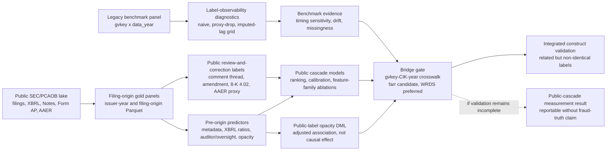

# Research Design

Working title:

**From Restatements to Public Review and Correction: Label Observability and the Public Reporting-Risk Cascade**

This paper studies how reporting-risk prediction changes when the outcome is aligned with what is observable at a filing origin. Traditional firm-year misstatement benchmarks are useful, but their labels are detected after the fact and often combine reporting risk with discovery, disclosure delay, and selective public visibility. The project therefore treats the legacy `gvkey x data_year` panel as a diagnostic benchmark rather than as the sole research object.

The main empirical object is a filing-native public reporting-risk cascade built from SEC and PCAOB public data. The estimand is the risk, measured at the filing origin, that an issuer subsequently enters a public review-and-correction process: comment-letter scrutiny, amended filings, Item 4.02 non-reliance disclosures, and rare severity-tail [Accounting and Auditing Enforcement Releases (AAER)](https://www.sec.gov/enforcement-litigation/accounting-auditing-enforcement-releases) matches. The design is public-data-first, reproducible, and explicit about the bridge required to compare this public cascade with legacy detected-misstatement labels.

## Research Question and Contribution

The paper asks whether a filing-origin, **pre-disclosure reporting-risk state** can be measured more transparently than a static detected-restatement label. The benchmark layer tests how sensitive traditional prediction is to label observability and detection timing. The public cascade layer tests whether public accounting, disclosure, auditor, and oversight features predict later public scrutiny and correction.

The intended contribution is a measurement redesign, not a claim that one classifier dominates prior fraud-prediction work.

- Static detected-misstatement labels are timing-contaminated: they mix occurrence, discovery, and public reporting lag.
- The repo defines a filing-origin public reporting-risk estimand based only on information visible at or before `origin_date`.
- The public cascade is expected to be related to, but not identical with, legacy detected-misstatement labels.
- Peer models and metrics are used for compatibility checks; comparisons provide metric-compatible ranking evidence, not same-estimand leaderboard claims.
- Credible bridge-based overlap validation is required before any integrated old-benchmark/public-cascade claim.

### Design Overview



## Prior Literature and Positioning

The closest literature provides model families, metrics, and construct anchors. It does not provide a one-to-one leaderboard because the target differs: prior fraud and restatement studies often predict detected ex post misconduct labels, while this paper predicts subsequent public review-and-correction events from a filing-origin information set.

| Stream | Canonical anchors | Typical models and metrics | Role in this paper |
| --- | --- | --- | --- |
| Detected misstatement and fraud prediction | [Dechow, Ge, Larson, and Sloan (2011)](https://papers.ssrn.com/sol3/papers.cfm?abstract_id=997483); [Perols (2011)](https://doi.org/10.2308/ajpt-50009); [Bao, Ke, Li, Yu, and Zhang (2020)](https://papers.ssrn.com/sol3/papers.cfm?abstract_id=2670703); [Bertomeu, Cheynel, Floyd, and Pan (2021)](https://papers.ssrn.com/sol3/papers.cfm?abstract_id=3496297), "Using Machine Learning to Detect Misstatements" | Logistic/F-score models, SVM, decision trees, bagging, stacking, neural nets, and tree ensembles; AUC, classification rates, lift, variable importance, and top-fraction ranking metrics | Supplies the benchmark peer suite: Dechow-style scores, a Perols-style legacy model zoo, Bao-style top-fraction balanced accuracy and NDCG, and Bertomeu-style XGBoost feature importance. |
| Partial observability and hidden misconduct | [Barton, Burnett, Gunny, and Miller (2024)](https://pubsonline.informs.org/doi/10.1287/mnsc.2022.4627); [Dyck, Morse, and Zingales (2024)](https://link.springer.com/article/10.1007/s11142-022-09738-5) | Occurrence/detection separation, hidden misconduct estimation, likelihood and coefficient evidence | Motivates the estimand shift; these models are not PR-AUC comparators for the current pipeline. |
| SEC comment-letter and disclosure-review research | [Cassell, Cunningham, and Myers (2013)](https://papers.ssrn.com/sol3/papers.cfm?abstract_id=1951445); [Bozanic, Dietrich, and Johnson (2018)](https://papers.ssrn.com/sol3/papers.cfm?abstract_id=2989164); [Brown, Tian, and Tucker (2018)](https://papers.ssrn.com/sol3/papers.cfm?abstract_id=2551451); the [SEC filing review process](https://www.sec.gov/about/divisions-offices/division-corporation-finance/filing-review-process-corp-fin) | Regression-style evidence on comment receipt, remediation, and disclosure response | Establishes public comment-letter scrutiny as economically meaningful; this paper embeds it as one public-cascade outcome rather than the sole endpoint. This stream supplies regression-style evidence rather than direct ranking-score comparators. |
| Public regulatory and structured-data sources | [SEC Item 4.02 guidance](https://www.sec.gov/about/divisions-offices/division-corporation-finance/financial-reporting-manual/frm-topic-4); [SEC AAER pages](https://www.sec.gov/enforcement-litigation/accounting-auditing-enforcement-releases); [PCAOB Form AP](https://pcaobus.org/oversight/standards/implementation-resources-PCAOB-standards-rules/form-ap-auditor-reporting-certain-audit-participants); [SEC Inline eXtensible Business Reporting Language (XBRL)](https://www.sec.gov/data-research/structured-data/inline-xbrl) | Public filing events, audit-participant data, oversight data, and standardized financial facts | Supplies the filing-native public lake and reproducible feature construction. AAER is a severity-tail descriptor, not a complete enforcement universe. |

The comparison boundary is central. The paper does not claim same-estimand superiority over prior fraud-prediction studies. It transfers peer model families and scoring language into the repo-native benchmark layer, reports Bao-compatible top-fraction metrics, and uses the bridge to test construct overlap when a credible `gvkey-CIK-year` mapping is available. Metric-compatible comparison is therefore evidence about ranking behavior under a shared scoring language, not evidence that the tasks share the same estimand.

The intended contribution is therefore empirical and conceptual: align the prediction target to the observable public process, retain the legacy benchmark as a disciplined diagnostic, and report where the public cascade agrees or disagrees with detected-misstatement labels.

## Measurement Design

### Legacy Benchmark Labels

The legacy benchmark panel uses `gvkey`, `data_year`, and `misstatement firm-year`. It remains the appropriate place to test whether traditional restatement prediction is sensitive to timing, drift, and missingness.

Benchmark label modes:

- `naive`: the observed `misstatement firm-year` label without detection-timing adjustment.
- `proxy_drop_observed`: a stress test that uses sparse same-row `res_an*` timing proxies and excludes positives without usable timing evidence.
- `proxy_imputed_lag`: a timing-assumption grid that assigns unknown positives documented one-, two-, three-, or five-year detection lags.
- `external_timing`: the paper-grade benchmark maturation target, available only if validated public restatement or detection dates are supplied.

The benchmark claim is deliberately limited. `res_an0`, `res_an1`, `res_an2`, and `res_an3` are timing proxies only and never enter predictors. `proxy_drop_observed` is a coverage stress test, not proof that excluded positives are false negatives. The output `timing_coverage.csv` must report same-row timing coverage, unknown positives, retained-positive share, and class-balance changes.

### Public Review-and-Correction Labels

The public cascade is a multi-label outcome system, not a deterministic hierarchy.

- `label_comment_thread_365`: public comment-letter scrutiny, measured from the first public EDGAR date of the comment-thread sequence.
- `label_amendment_365`: broad amendment/friction signal, including administrative amendments, filing friction, and potentially material corrections.
- `label_8k_402_365`: Item 4.02 non-reliance and material-correction proxy.
- `label_aaer_proxy_730`: rare AAER severity-tail descriptor, fit only as robustness when positives are sufficient.

A later-stage positive does not mechanically force an earlier-stage label. Comment letters, amendments, 8-K Item 4.02 events, and AAER matches remain separate binary fields; co-occurrence and conditional rates are descriptive outputs.

### Timing and Censoring Rules

All public labels are anchored on first public dates. In the current v1 panel, `filing_origin_panel.origin_date = filing_date`, and `issuer_origin_panel.origin_date` is the selected annual filing date for the issuer-year. No event released after `origin_date` may enter predictors.

Coverage-state fields document source availability and public vintages:

- `source_available_*`
- `public_date_*`
- `vintage_*`
- `as_of_date`

These fields are excluded from default predictors. Censoring is horizon-specific: 365-day outcomes use `censored_365`, and AAER 730-day robustness uses `censored_730`.

### Claim Boundaries

The public-cascade design supports evidence about a public reporting-risk state. It does not by itself establish latent fraud truth, causal identification, or a stable enforcement-prediction result. Comment letters are public scrutiny signals, not the full SEC review universe. AAER pages are severity-tail public releases, not the complete enforcement population.

Bridge validation is mandatory for an integrated claim that the public cascade and the old benchmark measure related but non-identical constructs. Without that validation, the public-cascade result remains a public-data measurement result rather than a validated fraud/restatement overlap paper.

## Data and Feature Construction

### Legacy Benchmark Panel

`data/raw_dataset_misstatement.parquet` is the old benchmark layer.

- Grain: `gvkey x data_year`.
- Coverage: 2001-2019.
- Required fields: `gvkey`, `data_year`, `misstatement firm-year`, `res_an0` to `res_an3`, `missing_*` flags, and accounting/audit/governance/market/industry predictors.
- Limitation: no CIK, ticker, PERMNO, restatement filing date, detector identity, or complete public filing history.

### Public SEC/PCAOB Lake

`data/public_lake/` is organized as bronze, silver, and gold.

- Bronze stores downloaded public files with source URL, timestamp, SHA256 hash, parser version, schema version, and as-of date.
- Silver normalizes issuer, filing, XBRL, Notes, comment-thread, correction, Form AP, PCAOB inspection, and AAER proxy tables. Large Silver tables are Parquet-first.
- Gold writes `issuer_origin_panel.parquet` and `filing_origin_panel.parquet`. The default path uses DuckDB SQL for XBRL core-tag pivoting, label-horizon joins, and Parquet output.

Required v1 sources are SEC submissions, SEC Financial Statement Data Sets (FSDS), SEC `UPLOAD` and `CORRESP`, 10-K/A and 10-Q/A amendments, 8-K Item 4.02, PCAOB Form AP, PCAOB inspection datasets, and SEC AAER pages. The main public sample is domestic U.S. GAAP issuer-years from 2011-2023, with `2026-04-23` as the current reproducibility as-of date.

### Bridge and External Validation Inputs

The integration bridge is `data/external/gvkey_cik_year.csv`. Required fields are `gvkey`, `issuer_cik`, a single year or start/end years, and provenance fields such as source, version, extraction date, match method, and match score.

Preparation commands:

```bash
set -a; source .env; set +a
uv run python scripts/prepare_gvkey_cik_crosswalk.py \
  --input path/to/wrds_cik_gvkey_link.csv \
  --out data/external/gvkey_cik_year.csv
```

Public candidate route while WRDS access is pending:

```bash
bash scripts/prepare_farr_gvkey_cik_bridge.sh --install-missing
bash scripts/prepare_farr_support_data.sh --install-missing
```

`farr::gvkey_ciks` is now the working high-coverage candidate bridge. It must be reported with coverage and multiplicity tables and should not be described as WRDS-verified. `farr::aaer_firm_year` and `farr::aaer_dates` are external AAER validation anchors; `farr::state_hq` is a date-bounded headquarters-state metadata control.

If no usable external crosswalk exists, the bridge probe must report `raw_identifier_blocker` rather than infer links from benchmark identifiers alone.

### Feature Families

Feature families use the same filtered issuer-year sample for fair ablations. Tree models with native missing-value handling retain numeric `np.nan`; non-tree adapters use fold-internal imputation only when required. Label, censoring, identifier, source-availability, public-date, and vintage columns are excluded by default.

Core feature groups:

- Metadata: SIC, form, entity type, filing size, XBRL flags, prior filing count, days since prior filing, and headquarters-state controls when available.
- Filing friction and public history: current-cycle NT status and amendment friction, plus strictly pre-origin rolling counts and recency for prior NT filings, comment threads, amendments, and 8-K instability items.
- XBRL: `xbrl_ratio_*` and `xbrl_coverage_*` features from controlled core tags, including size, leverage, profitability, working capital, receivables, inventory, cash, debt, operating cash flow, and year-over-year revenue/assets changes.
- Auditor and oversight: PCAOB Form AP fields, engagement-partner exposure, and PCAOB inspection features in their public source windows.
- Note opacity: note count, note character count, note-tag coverage, and tag entropy as a disclosure breadth measure.

P1/P2 extensions include proxy-governance content, SEC insider-pressure features, macro-vintage controls, auditor-firm public-status fields, and broader security/attention layers. They are useful extensions, not required for the current v1 paper claim.

## Empirical Design

### Evaluation Metrics

Predictive tables report PR-AUC, ROC-AUC, Brier score, Brier Skill Score, expected calibration error, top-50/100/200 precision, and Bao-style top-fraction metrics. Bao-style metrics follow the inspection-budget logic used in Bao, Ke, Li, Yu, and Zhang: top-fraction precision, sensitivity, specificity, balanced accuracy, and binary-relevance NDCG@k. Calibration metrics are diagnostic under class imbalance and resampling.

### Experiment 1: Label Observability and Detection Timing

**Purpose.** Quantify how sensitive traditional restatement evaluation is to timing coverage and unknown-positive assumptions.

**Design.** Run annual out-of-time benchmark backtests across expanding, rolling 5-year, rolling 7-year, and rolling 10-year windows. Compare `naive`, `proxy_drop_observed`, and `proxy_imputed_lag` labels.

**Outputs.** `rolling_metrics.csv`, `rolling_predictions.parquet`, `timing_coverage.csv`, `timing_summary.json`, `timing_claim_status`, and window summaries.

**Interpretation.** This is a benchmark-validity diagnostic. A decline under `proxy_drop_observed` should be interpreted as timing-observability sensitivity, not as proof of look-ahead bias by itself.

### Experiment 2: Concept Drift and Model Shelf-Life

**Purpose.** Estimate whether reporting-risk models trained in one regime remain useful in later regimes.

**Design.** Compare rolling and expanding windows over test years; track feature-family importance; report pre/post diagnostics around major regulatory and data-regime breakpoints.

**Outputs.** Annual metrics, window summaries, structural-break diagnostics, and feature-family importance.

**Interpretation.** The experiment supports model shelf-life and retraining-window evidence. It does not establish structural causality from predictive drift alone.

### Experiment 3: Opacity and Public Review/Correction Risk

**Purpose.** Test whether pre-origin opacity and missingness profiles predict later public scrutiny or correction.

**Design.** Construct missingness-density and missing-profile indicators; estimate DML-style partially linear regressions on public labels:

```text
Primary Y:
  label_comment_thread_365
  label_amendment_365
  label_8k_402_365

D = missingness_density_score
X = pre-origin metadata, XBRL, filing-friction, public-history, auditor, oversight,
    note-opacity, and calendar controls
```

The old `misstatement firm-year` outcome remains a legacy diagnostic only.

**Outputs.** Missing-profile clusters, public-label PLR spec results, nuisance-model metadata, and diagnostic benchmark-side DML outputs.

**Interpretation.** Coefficients are adjusted associations, not causal effects. Disagreement between public-cascade outcomes and legacy misstatement outcomes is evidence about observability and detection, not automatic evidence that either construct is wrong.

### Experiment 4: Public Cascade Construction

**Purpose.** Demonstrate that public data can support a defensible review-and-correction cascade.

**Design.** Build the public lake from SEC/PCAOB sources; construct labels from first public dates; report source coverage, event rates, censoring, and task readiness.

**Outputs.** Source coverage tables, event-rate tables, censoring summaries, public-lake metadata, and task-positive counts.

**Interpretation.** This experiment validates the measurement surface. AAER remains descriptive severity-tail evidence unless robust positive counts are available.

### Experiment 5: Public Cascade Prediction

**Purpose.** Estimate the pre-disclosure public reporting-risk state from public features.

**Design.** Use `issuer_origin_panel` to predict comment-thread scrutiny, broad amendment/friction, and 8-K Item 4.02 outcomes. Run feature-family ablations over metadata, XBRL, auditor, oversight, and all-feature sets. Skip task/family/window fits with one-class train or test labels.

**Outputs.** `public_cascade_metrics.csv`, `public_cascade_predictions.parquet`, `public_cascade_task_status.csv`, `public_cascade_summary.md`, and `public_opacity_dml.csv`.

**Interpretation.** Full public-cascade claims require non-metadata features. `metadata_baseline` is a readiness state; `xbrl_ratio_baseline` is the first non-metadata empirical baseline. Sparse AAER folds are blockers, not failed headline models.

### Experiment 6: Old Benchmark and Public Cascade Overlap

**Purpose.** Test whether legacy detected-misstatement labels and public review-and-correction labels measure related but non-identical constructs.

**Design.** Run the bridge probe, report coverage and multiplicity, then test event-time concentration and risk-score alignment in the mapped sample.

**Outputs.** `bridge_probe_summary.json`, `coverage_report.csv`, `multiplicity_report.csv`, `unmatched_raw_characteristics.csv`, overlap panels, ranking alignment tables, and event-time figures.

**Interpretation.** This is the integrated-paper gate. A farr bridge can support candidate overlap analysis; WRDS remains preferred before final manuscript claims.

## Evidence Gates

| Component | Current status | Gate before paper claim |
| --- | --- | --- |
| Benchmark timing | implemented as observability sensitivity | report `timing_coverage.csv`, retained positives, and imputed-lag scenarios; external timing required for paper-grade maturation |
| Concept drift | implemented as rolling-window diagnostics | validate annual PR-AUC, Brier Skill Score, feature-importance drift, and breakpoint summaries |
| Opacity | public-label DML implemented | public-label PLR results must use `label_comment_thread_365`, `label_amendment_365`, and `label_8k_402_365` as primary outcomes |
| Public lake | full public lake path implemented | refreshed source coverage, row counts, censoring, and reproducibility metadata |
| Public cascade | current full-run state is `xbrl_ratio_baseline` | non-degenerate comment-thread, amendment, and 8-K Item 4.02 tasks; AAER framed as severity-tail evidence |
| Bridge overlap | farr `gvkey_ciks` is a high-coverage candidate | coverage, multiplicity, no silent many-to-many joins, and WRDS-preferred validation before final integrated claims |

Data integrity gates:

- No post-`origin_date` event enters predictors.
- No `res_an*` column enters benchmark predictors.
- `source_available_*`, `public_date_*`, `vintage_*`, and `as_of_date` stay outside default predictors.
- Censoring masks are horizon-specific.
- Crosswalk coverage and multiplicity are reported before overlap validation.

Empirical sufficiency gates:

- Benchmark outputs non-empty rolling metrics, timing coverage, and missingness diagnostics.
- Public cascade covers fiscal years 2011-2023 in the full panel.
- Comment-thread, amendment, and 8-K Item 4.02 tasks have nonzero positives.
- `xbrl_ratio_*` and `xbrl_coverage_*` features are present for non-metadata public-cascade evidence.
- zero-positive or sparse AAER robustness tasks are skipped and reported as severity-tail blockers.

Paper-readiness gates:

- Claims remain measurement and decision-useful prediction claims, not causal proof of fraud occurrence.
- AAER is described as a severity-tail descriptive proxy.
- Comment letters are described as public scrutiny, not complete SEC review.
- Bridge validation is mandatory for the integrated old-benchmark/public-cascade paper claim.

## Execution Contract

Use `just` as the stable command surface.

```bash
just check
just full full raw artifacts/full
```

`just check` is the data-free local quality gate: tests, lint, and strict docs build. `just full full raw artifacts/full` is the paper-facing clean run; it runs the test and lint gate before public-lake and model stages.

If the public-lake build has already completed Silver normalization and failed
only while writing Gold panels, resume from the DAG markers without a fresh
build:

```bash
just full mode=full dataset=raw out_dir=artifacts/full resume=1
```

Component reruns:

```bash
just task benchmark raw artifacts/benchmark
just task cascade raw artifacts/public_cascade
just task bridge raw artifacts/bridge_probe
just task study raw artifacts/study
```

Public-lake operations:

```bash
bash scripts/run_public_lake_full.sh --dry-run
bash scripts/run_public_lake_full.sh --mode smoke --storage-format parquet --notes-mode summary --fresh-build
```

The repo-local contract is intentionally narrow: `status` is read-only, `setup` syncs the external uv environment, `check` owns tests/lint/docs, and data-producing `task` recipes do not rerun lint implicitly.
