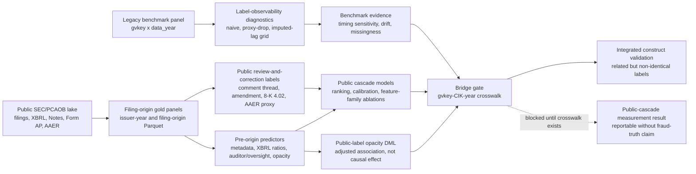

# Research Design

Working title:

**From Restatements to Public Review and Correction: Label Observability and the Public Reporting-Risk Cascade**

!!! abstract "How to use this page"
    This page defines the paper's research design, implementation contract, and
    evidence gates for treating the public-cascade result as manuscript evidence.

[Jump to the readiness matrix](#readiness-matrix){ .md-button .md-button--primary }
[Open deferred future work](future_work.md){ .md-button }

<div class="grid cards" markdown>

-   :material-scale-balance: __Measurement redesign__

    ---

    The contribution is to redesign the outcome and timing problem, not to rank
    classifiers on a different estimand.

-   :material-timetable: __Benchmark discipline__

    ---

    The old `gvkey x data_year` panel is kept as a benchmark layer, but it must
    respect label observability, time ordering, drift, and missingness diagnostics.

-   :material-file-search-outline: __Public cascade__

    ---

    The main paper moves to first-public-date SEC and PCAOB signals: comment
    scrutiny, amendment, and 8-K Item 4.02 correction. Matched
    [Accounting and Auditing Enforcement Releases (AAER)](https://www.sec.gov/enforcement-litigation/accounting-auditing-enforcement-releases)
    events are a severity-tail proxy, not a core prediction endpoint.

-   :material-bridge: __Overlap validation__

    ---

    The bridge is the gate for any integrated old-benchmark/public-cascade claim.
    It blocks Experiment 6 and construct validation, not the runnable public-data
    measurement pipeline.

</div>

=== "This paper is"

    - A timing-aware benchmark paper about why naive restatement prediction can mislead.
    - A public-data measurement paper about the reporting-risk public review-and-correction cascade.
    - A reproducible empirical study with explicit readiness gates and blocker states.

=== "This paper is not"

    - Not a generic fraud-detector leaderboard.
    - Not a claim that AAER pages define the full enforcement universe.
    - Not an AAER or enforcement-prediction paper in the current v1 evidence state.
    - Not a causal paper about why firms misstate.

## Abstract Spine

This paper asks how accounting reporting risk should be measured when the
observable labels are delayed public outcomes rather than contemporaneous states.
Existing benchmarks often score models against ex post restatement or enforcement
indicators, which can mix underlying reporting risk with discovery, reporting lag,
and selective public visibility. We therefore reframe the task as estimating a
filing-origin, **pre-disclosure reporting-risk state**: the risk that a filing
will subsequently enter an observable public review-and-correction cascade.

- **Problem.** Detected restatements and fraud outcomes are delayed, selective, and
  unevenly matured, so naive firm-year labels can make predictive performance look
  stronger or more stable than the measurement process warrants.
- **Measurement redesign.** The legacy `gvkey x data_year` restatement benchmark is
  retained as a diagnostic layer, but timing coverage, missingness regimes, concept
  drift, and label-maturation limits are made explicit rather than hidden behind a
  single static outcome.
- **Public-data estimand.** The main object is a filing-native SEC/PCAOB cascade
  built from comment-letter scrutiny, amended filings, Item 4.02 non-reliance
  disclosures, and AAER severity-tail descriptors, using only information visible
  at the filing origin.
- **Empirical contribution.** The public lake and cascade models test whether
  public accounting, disclosure, auditor, and oversight signals, including
  [eXtensible Business Reporting Language (XBRL)](https://www.sec.gov/data-research/structured-data/inline-xbrl)
  ratios, predict later public scrutiny and correction events.
- **Comparison boundary.** We do not claim leaderboard superiority over prior
  fraud-prediction papers, because the estimand differs. Instead, the paper
  provides metric-compatible ranking evidence and transfers peer model families
  into the repo-native benchmark layer first. Transfer to the filing-origin
  public-cascade task is a staged follow-on analysis. Once the bridge is available,
  bridge-based overlap validation tests whether the public cascade is related to,
  but not identical with, legacy detected-misstatement labels.
- **Boundary.** The design can support evidence for a public reporting-risk signal.
  It does not by itself establish fraud truth, causal identification, stable AAER
  severity-tail modeling, or completed validation against the legacy benchmark until the
  `gvkey-CIK-year` bridge is available.



## Research Positioning

Operationally, the paper combines two evidence layers:

- **Benchmark layer:** the old `gvkey x data_year` restatement dataset, used to show
  that traditional pooled and naive-label evaluation is unstable.
- **Public cascade layer:** SEC and PCAOB public data, used to construct a filing-native
  public review and correction process.

The old benchmark panel is retained. It is stored as Parquet after local CSV conversion
and used as a benchmark and validation layer.
The public lake is the paper's main measurement innovation.

## Evidence State and Decision Gate

The project is deliberately staged into three evidence states.

1. **Benchmark evidence available**

- The raw `gvkey x data_year` benchmark panel supports benchmark prediction, drift diagnostics, and
  missingness analysis.
- Because the raw benchmark panel has no public restatement filing dates and `res_an*` is sparse on
  same-row positives, the benchmark can show timing fragility but cannot claim paper-grade
  label maturation in the current raw benchmark layer.

2. **Public cascade evidence available**

- The current full-run public gold panel exists and supports public event labels plus
  non-metadata feature families.
- The current readiness level is `xbrl_ratio_baseline`: core
  [eXtensible Business Reporting Language (XBRL)](https://www.sec.gov/data-research/structured-data/inline-xbrl)
  ratio features are present and built only from facts visible at the filing origin.
- Metadata-only cascade results remain useful baselines, but they are no longer the only
  public-cascade evidence in the current snapshot.

3. **Integration evidence pending gate**

- The old benchmark and public cascade become one integrated paper only if the bridge probe
  yields interpretable overlap coverage and the XBRL cascade produces non-metadata signal.
- This integration gate is the `gvkey-CIK-year` evidence gate.
- If the bridge cannot support credible overlap validation, the project should split into a
  benchmark critique paper and a public cascade measurement paper.

## Prior Literature and Intended Contribution

### Closest Literature

This project builds on adjacent literatures rather than claiming that every component
event is new. The gap is that the closest studies are usually organized around one
outcome family at a time, while this paper treats scrutiny and correction as a
filing-origin public reporting-risk cascade, with AAER matches retained only as a
severity-tail descriptor.

1. Detected misstatement and fraud prediction benchmarks.

- [Dechow, Ge, Larson, and Sloan (2011, *Contemporary Accounting Research*)](https://papers.ssrn.com/sol3/papers.cfm?abstract_id=997483),
  "Predicting Material Accounting Misstatements," is the canonical F-score benchmark
  that turns alleged SEC misstatements into a firm-year prediction problem.
- [Perols (2011, *AUDITING: A Journal of Practice & Theory*)](https://doi.org/10.2308/ajpt-50009),
  "Financial Statement Fraud Detection: An Analysis of Statistical and Machine Learning
  Algorithms," compares statistical and machine-learning classifiers for financial
  statement fraud detection.
- [Bao, Ke, Li, Yu, and Zhang (2020, *Journal of Accounting Research*)](https://papers.ssrn.com/sol3/papers.cfm?abstract_id=2670703),
  "Detecting Accounting Fraud in Publicly Traded U.S. Firms Using a Machine Learning
  Approach," shows that ensemble learning on theory-motivated raw accounting numbers can
  outperform older fraud-prediction benchmarks.
- [Bertomeu, Cheynel, Floyd, and Pan (2021, *Review of Accounting Studies*)](https://papers.ssrn.com/sol3/papers.cfm?abstract_id=3496297),
  "Using Machine Learning to Detect Misstatements," shows that machine learning can use
  accounting, audit, market, and governance variables to detect and interpret patterns
  associated with ongoing misstatements.

These papers are the benchmark peer group. Their strength is predictive modeling; the
limitation this paper emphasizes is not that their models are uninteresting, but that a
detected restatement or fraud label mixes reporting risk with discovery, disclosure lag,
and selective public visibility.

2. Partial observability and hidden misconduct.

- [Barton, Burnett, Gunny, and Miller (2024, *Management Science*)](https://pubsonline.informs.org/doi/10.1287/mnsc.2022.4627),
  "The Importance of Separating the Probability of Committing and Detecting Misstatements
  in the Restatement Setting," argues that observed restatements combine occurrence and
  detection, so traditional restatement models are clouded by partial observability.
- [Dyck, Morse, and Zingales (2024, *Review of Accounting Studies*)](https://link.springer.com/article/10.1007/s11142-022-09738-5),
  "How Pervasive Is Corporate Fraud?", estimates a hidden component of corporate fraud and
  reinforces the point that detected events are not the same object as underlying misconduct.

This strand motivates the paper's measurement redesign: the target should be aligned to
what is observable at a defined forecast origin, rather than silently treating later
detection as a contemporaneous state.

3. SEC comment-letter and disclosure-review studies.

- [Cassell, Cunningham, and Myers (2013, *The Accounting Review*)](https://papers.ssrn.com/sol3/papers.cfm?abstract_id=1951445),
  "Reviewing the SEC's Review Process: 10-K Comment Letters and the Cost of Remediation,"
  studies which firms receive SEC 10-K comment letters, the extent of comments, and
  remediation costs.
- [Bozanic, Dietrich, and Johnson (2018, *Journal of Financial Economics*)](https://papers.ssrn.com/sol3/papers.cfm?abstract_id=2989164),
  "SEC Comment Letters and Firm Disclosure," studies disclosure consequences of the SEC
  comment-letter process.
- [Brown, Tian, and Tucker (2018, *Contemporary Accounting Research*)](https://papers.ssrn.com/sol3/papers.cfm?abstract_id=2551451),
  "The Spillover Effect of SEC Comment Letters on Qualitative Corporate Disclosure," shows
  that SEC review can affect disclosure behavior even among firms not directly receiving
  a comment letter.
- The [SEC filing review process](https://www.sec.gov/about/divisions-offices/division-corporation-finance/filing-review-process-corp-fin)
  makes comment letters and company responses public through EDGAR after review completion,
  which creates a public-date scrutiny signal but not a complete record of all private SEC
  review activity.

This literature establishes that comment letters are economically meaningful public
scrutiny signals. The present paper differs by using comment-thread scrutiny as one stage
in a broader ex ante cascade rather than as the only object of interest.

4. Public disclosure and regulatory-process measurement.

- [SEC Financial Reporting Manual Topic 4](https://www.sec.gov/about/divisions-offices/division-corporation-finance/financial-reporting-manual/frm-topic-4)
  describes Item 4.02 Form 8-K non-reliance disclosures, which are used here as a public
  correction signal.
- [SEC Accounting and Auditing Enforcement Releases (AAER)](https://www.sec.gov/enforcement-litigation/accounting-auditing-enforcement-releases)
  pages provide a public severity-tail proxy, not the full latent enforcement
  universe.
- [PCAOB Form AP and AuditorSearch](https://pcaobus.org/oversight/standards/implementation-resources-PCAOB-standards-rules/form-ap-auditor-reporting-certain-audit-participants)
  provide public audit-participant information, while PCAOB inspection data add public
  oversight history.
- [SEC structured data / XBRL](https://www.sec.gov/spotlight/xbrl.shtml) makes standardized
  filing facts usable for reproducible financial-ratio features.

These sources supply the observable public signals. The paper's cascade is therefore an
empirical measurement design, not a claim that any single public signal is a complete
misconduct label or that sparse AAER matches can support an enforcement-prediction claim.

### Peer-Comparable Boundary

The closest peers either predict detected fraud or misstatement labels, study SEC
comment-letter scrutiny, study restatement and 8-K correction events, or analyze
enforcement and oversight outcomes after the fact. The intended contribution is to connect
the review and correction pieces at the filing origin: given only information visible when
a filing enters the public record, estimate whether it later enters a public scrutiny or
correction process, and separately describe whether rare severity-tail AAER matches occur.

The cascade should be described as a risk-exposure funnel, not as a deterministic hierarchy.
Comment threads are relatively frequent public scrutiny signals; amendments are broad
filing-friction signals that include administrative amendments as well as possible
corrections; Item 4.02 non-reliance filings are rarer, higher-severity material-correction
signals; AAER matches are severity-tail descriptors. The empirical tasks remain separate
binary outcomes, so a later-stage positive does not mechanically force an earlier-stage label.

### Peer Models and Metric Comparability

Peer comparison should separate three objects: the label being predicted, the model family,
and the scoring rule. Matching a scoring rule is not the same as claiming the same estimand.

| Literature stream | Typical outcome | Typical models | Reported performance language | Repo comparison status |
| --- | --- | --- | --- | --- |
| Dechow, Ge, Larson, and Sloan F-score | Detected material misstatement firm-years | Logistic models that convert accounting and market variables into an F-score | Score/lift-style fraud-risk sorting and classification comparisons | The benchmark peer suite implements a fixed-coefficient Dechow F-score baseline only when mappings pass the full-quality gate, plus a separately named fold-local `dechow_variable_logit`; current outputs are peer-compatible, not original-sample replication. |
| Perols fraud-detection model comparison | Detected fraud or non-fraud firm-years | Statistical and machine-learning classifiers, including logistic-style and tree/neural/SVM-style models | Classification accuracy, sensitivity, specificity, error tradeoffs, and AUC-style discrimination | The benchmark peer suite now includes a legacy model zoo with logit, entropy tree, bagging, linear SVM, stacking, and MLP variants; full mode uses equal undersampling for Perols-style models and reports calibration warnings. |
| Bao, Ke, Li, Yu, and Zhang ensemble-learning fraud prediction | Detected accounting fraud labels | Ensemble machine learning on theory-motivated raw accounting numbers | AUC plus top-N-percent ranking metrics: precision, sensitivity, specificity, balanced accuracy, and NDCG@k | Bao-style ranking metrics are implemented and tested for benchmark and public-cascade outputs. They are metric-comparable, not outcome-equivalent. The legacy benchmark defaults to `bao_inspired_tree_ensemble`; `bao_style_ensemble` is used only when raw-number input compatibility and mapping quality pass explicit gates. |
| Bertomeu, Cheynel, Floyd, and Pan misstatement detection | Ongoing or detected misstatement states | Interpretable machine-learning classifiers using accounting, audit, market, and governance variables | Predictive discrimination plus variable-importance and economic interpretation | The benchmark peer suite includes `bertomeu_style_xgb` with grouped feature-importance outputs, but not a full original-covariate replication. |
| Barton, Burnett, Gunny, and Miller partial-observability restatement design | Separate occurrence and detection components | Partial-observability / structural-style restatement models | Identification, likelihood, and coefficient interpretation rather than a PR-AUC horse race | partial-observability models are not a PR-AUC comparator for the current pipeline; they motivate the measurement redesign. |
| SEC comment-letter papers | Comment-letter receipt, comment intensity, remediation, or disclosure response | Determinants and consequence regressions, often logit/OLS-style designs with controls and fixed effects | Coefficients, odds ratios or marginal effects, significance, and fit diagnostics | Comment-letter papers are regression evidence. The repo can add analogous public-scrutiny regressions, but PR-AUC is not their native metric. |

The comparison plan is therefore tiered. First, keep Bao-compatible ranking metrics in every
predictive table because those metrics are reproducible from public code and useful for rare
event ranking. Second, use the implemented benchmark peer suite as a legacy-model appendix
with Dechow-style logistic scores and a small model zoo on the old benchmark labels. Third,
transfer selected peer families to public-cascade tasks only after the current benchmark-only
PR1 evidence is stable. Fourth, use comment-letter and partial-observability papers as
construct and research-design comparators unless a separate regression or structural module is
explicitly added.

### Intended Contribution

The intended contribution is not another horse race claiming that one classifier beats
another. The contribution is a measurement redesign.

- We move from a static detected-restatement classifier to a lag-aware benchmark that
  makes label-observability and detection-timing assumptions explicit.
- We move from a single ex post outcome to a filing-native public review-and-correction
  cascade with distinct outcomes for scrutiny, amendment, and non-reliance; AAER matches
  are retained as severity-tail descriptive evidence.
- We move from pooled prediction to shelf-life analysis through rolling windows, feature
  drift, and regime diagnostics.
- For comparability with Bao, Ke, Li, Yu, and Zhang (2020), model outputs report
  top-1% through top-5% ranking metrics matching their public `evaluate.m` logic:
  `k = round(n * topN)`, top-k precision, top-k sensitivity, top-k specificity,
  Bao-style top-fraction balanced accuracy, and binary-relevance NDCG@k. This is a
  ranking metric at fixed inspection budgets, not a default 0.5 probability-threshold
  balanced-accuracy claim.
- We move from treating missingness as pure nuisance to testing whether opacity regimes are
  economically informative.
- We separate what is publicly observable and reproducible from what remains latent or only
  partially observed.

### Expected Evidence and Contribution Boundaries

If the empirical results support the design, the paper's expected contribution
boundaries are:

- naive restatement prediction likely overstates or distorts performance once
  label-observability and detection-timing assumptions are made explicit
- public scrutiny and correction events are related to old restatement labels but are not the
  same construct
- shorter rolling windows may outperform expanding windows, implying that reporting-risk
  models have limited shelf-life
- missingness density and missingness regimes may remain associated with risk after
  high-dimensional adjustment
- a public-data-only pipeline can produce a more transparent, reproducible, and regulator-
  facing reporting-risk measure than a static detected-restatement label alone

These are empirical possibilities, not guaranteed outcomes. The implementation and reporting
must remain diagnostic rather than target-seeking.

## Execution Invariants

These rules are binding implementation constraints, not narrative preferences.

- All public cascade labels use the **first public date** observable in EDGAR, PCAOB, or
  the relevant public source.
- In v1, `filing_origin_panel.origin_date = filing_date`; `issuer_origin_panel.origin_date`
  is the selected annual filing date for the issuer-year origin.
- No event released after `origin_date` may enter predictors.
- `source_available_*`, `public_date_*`, `vintage_*`, and `as_of_date` are coverage state
  fields. They are not default predictors.
- `missing_*` and `raw_missing_*` are ordinary missingness signals and may enter
  Experiment 3.
- `res_an0` to `res_an3` are timing proxies only. They never enter benchmark predictors.
- Censoring is horizon-specific: 365-day tasks use `censored_365`; 730-day tasks use
  `censored_730`.
- SEC EDGAR access must respect the current 10 requests/second limit and use retry/backoff
  for network failures.

Official source constraints used by this plan:

- SEC FSDS currently spans January 2009 through March 2026 and notes a December 2024
  reprocessing, so bronze manifests must retain download timestamp, SHA256, parser version,
  schema version, and as-of date:
  <https://www.sec.gov/data-research/sec-markets-data/financial-statement-data-sets>
- SEC EDGAR fair-access guidance states the 10 requests/second ceiling:
  <https://www.sec.gov/search-filings/edgar-search-assistance/accessing-edgar-data>
- SEC AAER pages are severity-tail proxies, not a complete enforcement universe:
  <https://www.sec.gov/enforcement-litigation/accounting-auditing-enforcement-releases>
- PCAOB downloadable inspection datasets begin with annually inspected firms in 2018 and
  triennially inspected firms in 2019, so inspection features are a later-window ablation:
  <https://pcaobus.org/news-events/news-releases/news-release-detail/pcaob-makes-available-new-downloadable-datasets-featuring-pcaob-inspection-findings-from-audit-firm-inspection-reports>
- SEC ticker/CIK files are useful candidate mappings but are not guaranteed for accuracy or
  scope:
  <https://www.sec.gov/about/webmaster-frequently-asked-questions>

## Research Questions

1. How much do naive pooled restatement models overstate or distort predictive
   performance once label observability, detection-timing assumptions, and time ordering
   are made explicit?
2. Does misstatement-risk prediction decay over regulatory regimes and calendar time?
3. Do pre-origin opacity and missingness regimes predict later public scrutiny or
   correction, rather than only legacy detected-restatement labels?
4. Can public SEC/PCAOB data identify a pre-disclosure reporting-risk state before
   comment letters, amendments, or 8-K Item 4.02 disclosures?
5. How do old restatement labels align with the public review-and-correction cascade in
   the overlapping sample?

## Data Architecture

### Legacy Benchmark Panel

`data/raw_dataset_misstatement.parquet`

- Grain: `gvkey x data_year`
- Coverage: 2001-2019
- Role: benchmark layer for traditional restatement prediction
- Known limitation: no `CIK`, `ticker`, `PERMNO`, restatement filing date, detector
  identity, or full public filing history

Required columns:

- identifiers: `gvkey`, `data_year`
- outcome: `misstatement firm-year`
- timing proxies: `res_an0`, `res_an1`, `res_an2`, `res_an3`
- missingness flags: all `missing_*` fields
- feature blocks: accounting, audit, governance, market, and industry variables

### Public Data Lake

`data/public_lake/`

- Bronze: raw downloaded files plus source URL, download timestamp, SHA256 hash, parser
  version, schema version, and as-of date.
- Silver: normalized filing, issuer, XBRL, note, comment-thread, filing-friction,
  correction-event, amendment-annotation, proxy-governance, Form AP, PCAOB inspection,
  auditor-status, and AAER proxy tables. Large Silver tables are Parquet-first to avoid
  repeated gzip CSV decompression and dtype inference.
- Gold: model-ready `issuer_origin_panel.parquet` and `filing_origin_panel.parquet`;
  DuckDB builds the default Gold path in SQL, including XBRL core-tag feature
  pivoting and label-horizon joins, then writes Parquet directly. Small
  diagnostics remain CSV/JSON/Markdown.

Required public sources for v1:

- SEC `submissions.zip` for issuer and filing history.
- SEC FSDS 2011-2023 for compact XBRL numeric features.
- SEC `UPLOAD` and `CORRESP` filings for public comment-letter scrutiny.
- SEC `10-K/A` and `10-Q/A` for amendment labels.
- SEC 8-K Item 4.02 for non-reliance correction labels.
- PCAOB Form AP for auditor, firm, and partner monitoring features.
- SEC AAER pages for severity-tail descriptive proxy events only.

Public-free source priority for the current paper:

- P0 CIK-spine sources with no security bridge: SEC submissions and filing history,
  `NT 10-K`/`NT 10-Q`, 8-K Items 3.01, 4.01, 4.02, and 5.02, `DEF 14A`/proxy timing,
  comment-thread depth, SEC XBRL/Notes, PCAOB Form AP, and PCAOB inspection datasets.
- P1 paper-compatible extensions after P0 is stable: proxy content fields for
  governance, audit-fee, ownership, and related-party snapshots; PCAOB RASR/Form 2/Form 3
  and public enforcement status; issuer-CIK aggregates from SEC Insider Transactions; and
  ALFRED/FRED real-time macro-vintage regime controls.
- Deferred main-paper sources: 13F, FTD, individual-security market-structure data, broad
  EDGAR-log attention layers, SCAC, and GDELT. These are useful extensions, but they add
  security bridges, attention/media estimands, source gaps, or parsing scope that can
  dilute the filing-native reporting-risk cascade.

Public sample:

- Main years: 2011-2023
- Issuers: domestic U.S. GAAP issuers
- Exclusions: FPI/IFRS main sample excluded in v1
- As-of date for current reproducibility: 2026-04-23
- Current full-gold state: `issuer_origin_rows = 205,832`; 2011-2023 domestic main sample
  has about 90,451 issuer-year rows.
- Current caution: `label_aaer_proxy_730` has only 20 positives in the domestic
  2011-2023 main sample. AAER is therefore a feasibility/severity-tail signal, not a
  stable performance claim.

### Bridge Plan

`data/external/gvkey_cik_year.csv`

Required fields:

- `gvkey`
- `issuer_cik`
- `start_year` and `end_year`, or a single `data_year`/`fiscal_year`
- provenance fields such as source, version, extraction date, match method, and match score

Preparation command:

```bash
set -a; source .env; set +a
uv run python scripts/prepare_gvkey_cik_crosswalk.py \
  --input path/to/wrds_cik_gvkey_link.csv \
  --out data/external/gvkey_cik_year.csv
```

Default v1 bridge route:

- Run a public-only bridge probe first; it is a coverage feasibility audit, not an
  authoritative historical crosswalk.
- With the current raw benchmark panel, the expected first output is `raw_identifier_blocker` because
  the raw benchmark has no CIK, ticker, company name, CUSIP, or PERMNO columns.
- If raw-side company identifiers are added later, use public SEC ticker/CIK/company-name
  data to construct a provenance-tagged candidate bridge.
- Do not treat public ticker/CIK files as authoritative; SEC states they are not guaranteed
  for accuracy or scope.
- Emit `bridge_probe_summary.json`, `coverage_report.csv`, `multiplicity_report.csv`, and
  `unmatched_raw_characteristics.csv` before any overlap validation.
- Fail loudly on silent many-to-many joins. Ambiguous mappings remain reported blockers or
  multiplicity rows, not guessed links.
- No overlap model is allowed unless a non-empty, provenance-tagged candidate or external
  crosswalk exists.
- The bridge does not block running or reporting the public review-and-correction
  measurement result, but it is a P0 integrated-paper blocker for old-benchmark overlap,
  construct-validation, and any claim that the public cascade has been validated against
  legacy fraud/restatement labels.

## Label Ontology

### Old Benchmark Labels

- `naive`: observed `misstatement firm-year` without correcting for detection timing.
- `proxy_drop_observed`: a coverage stress test using only observable `res_an*` proxy flags
  and excluding positive rows without any usable timing proxy. This is not evidence that
  the excluded positives are false negatives.
- `proxy_imputed_lag`: a timing-assumption sensitivity grid that assigns unknown positive
  rows a detection year using scenario lags such as 1, 2, 3, and 5 years, plus an empirical
  lag distribution from the sparse `res_an*`-visible positives.
- `external_timing`: paper-grade maturation only if external restatement filing or public
  detection dates are supplied and validated.

### Benchmark Timing-Sensitivity Algorithm

`res_an0` to `res_an3` are not treated as a verified label-maturation system. The raw
panel shape shows that most positive firm-years do not have same-row `res_an*` timing
flags, so this path is a codebook-dependent sensitivity proxy. The drop-observed variant
is deliberately labeled a stress test because deleting most positives changes class balance
and may introduce sample-selection bias.

```text
For each benchmark row:
  label_naive = misstatement firm-year

  if misstatement firm-year == 1 and an external public detection year is available:
    timing_claim_status = external_timing
    detection_year = external_detection_year

  else if misstatement firm-year == 1 and a usable res_an* proxy is present:
    timing_claim_status = proxy_drop_observed or proxy_imputed_lag
    detection_year_proxy = data_year + proxy_lag

  else if misstatement firm-year == 1 and no timing evidence is available
       and label_mode == proxy_drop_observed:
    exclude the positive row from proxy-visible training labels,
    count it in timing_coverage.csv,
    and report retained-positive share and resulting class balance

  else if misstatement firm-year == 1 and no timing evidence is available
       and label_mode == proxy_imputed_lag:
    assign detection_year_proxy under a documented lag scenario
    and report the scenario separately

  proxy-visible training positive:
    1 only when detection_year_proxy <= train_origin_year
    where train_origin_year = test_year - 1
```

Benchmark outputs must include `timing_coverage.csv` and a summary field
`timing_claim_status` with allowed values `external_timing`, `proxy_drop_observed`,
`proxy_imputed_lag`, or `blocked`. The main benchmark claim is therefore: traditional
restatement benchmarks are under-identified without public detection timing, and reported
performance is sensitive to timing and observability assumptions. It is not that label
maturation has been fully solved in the raw benchmark panel, and a metric collapse under
`proxy_drop_observed` must not be described as proof of look-ahead bias by itself.

### Public Cascade Labels

Stage 0: source availability state.

- `source_available_*`
- `public_date_*`
- `vintage_*`
- `as_of_date`

These fields document what could have been known; they are coverage metadata, not default
predictive features.

Stage 1: pre-disclosure reporting-risk state.

- This is the latent risk score estimated from pre-origin public features.
- It is not claimed to be true latent fraud occurrence.

Stage 2: public comment-letter scrutiny.

- label: `label_comment_thread_365`
- timing: first public EDGAR date of the comment-letter thread
- caveat: public comment letters are not the full SEC review universe

Stage 3: public correction ladder.

- label: `label_amendment_365`
- label: `label_8k_402_365`
- amendment and non-reliance are separate outcomes
- `label_amendment_365` is a broad amendment/friction signal. The baseline definition
  includes administrative amendments such as delayed Part III proxy inclusions or exhibit
  updates, as well as potentially material corrections.
- Amendment annotations are reproducible diagnostics, not silent relabeling. Candidate
  fields include `amendment_admin_part_iii`, `amendment_nonadmin_financial`,
  `amendment_mixed_content`, and `amendment_annotation_note`.
- Classification priority is conservative: if a single `10-K/A` or `10-Q/A` triggers both
  administrative Part III/proxy conditions and non-administrative financial-correction
  conditions, classify it as non-admin and set
  `amendment_annotation_note = mixed_content_classified_as_nonadmin`.
- `label_8k_402_365` is the core non-reliance/material-correction proxy.
- revision-only restatements are not forced into 8-K Item 4.02

Stage 4: AAER severity-tail descriptor.

- label: `label_aaer_proxy_730`
- caveat: AAER pages are severity-tail proxies, not a complete enforcement universe
- AAER is descriptive/robustness evidence in v1, not a headline prediction task
- if positives are too sparse for stable folds, skip model fitting and report the blocker;
  consider 1095-day and 1825-day descriptive robustness only after a nonzero public proxy
  table is available

### Outcome Semantics

The public cascade is a multi-label setting:

- Comment thread, amendment, 8-K Item 4.02, and AAER proxy are independent binary fields.
- A single issuer-year may be positive in multiple tasks.
- A Stage 3 positive does not force `label_comment_thread_365 = 1`; no artificial label
  completion is allowed.
- Co-occurrence, conditional event rates, and calibration by task are reported separately.
  AAER enters the main text as severity-tail description unless sparse-positive robustness
  checks become stable enough to report.

## Public Cascade Feature Contract

Feature families must use the same filtered issuer-year sample for fair ablations. For
tree models with native missing-value handling, numeric missing values are preserved as
`np.nan` so missingness can remain predictive. Explicit `missing_*`, `raw_missing_*`, and
`xbrl_coverage_*` fields remain ordinary predictors when pre-origin. Categorical missing
values are encoded as an explicit missing category when one-hot encoding is required.
Fold-internal imputation is used only for model classes or encoders that require complete
inputs; rows are not dropped family-by-family unless the task horizon is censored.

Metadata family:

- `sic`, `form`, `entity_type`
- filing size and XBRL flags available at the origin filing
- prior filing count and days since previous filing
- fiscal-year and issuer-history descriptors that are observable at `origin_date`

Filing-friction family:

- Current reporting-cycle filing friction includes `NT 10-K`/`NT 10-Q` status, NT reason
  codes when available, delay days from the applicable filing deadline, after-hours
  acceptance, date-of-change indicators, document/exhibit counts, and same-cycle amendment
  churn visible by `origin_date`.
- This family stores level features for the current origin/reporting cycle. Rolling counts
  of prior NT filings and other prior events belong to the public-history family.

Public-history family:

- Rolling windows are anchored on `origin_date`, not fiscal-year end. Use 365, 1,095, and
  1,825 calendar-day lookbacks with the right endpoint strictly before `origin_date`, unless
  the feature is part of the origin filing metadata visible at acceptance.
- Include rolling counts and recency for prior NT filings, comment threads, amendments,
  8-K Item 4.02 disclosures, and 8-K instability items 3.01, 4.01, and 5.02.
- Comment-thread depth is part of this family: compute `thread_rounds`, `upload_count`,
  `corresp_count`, `filing_count`, and multi-round-review indicators from public
  `UPLOAD`/`CORRESP` sequences.

XBRL family:

- v1 must include core ratio features prefixed `xbrl_ratio_` and coverage fields prefixed
  `xbrl_coverage_`.
- Minimum ratio families: size, leverage, profitability, working-capital intensity,
  receivables intensity, inventory intensity, cash intensity, debt intensity,
  operating-cash-flow intensity, and year-over-year revenue/assets change when lagged facts
  are available.
- Supporting aggregates such as `xbrl_fact_count`, `xbrl_unique_tags`, and
  `xbrl_unique_units` remain useful but are not enough for a submission-ready feature-family
  ablation.
- Standard tags must come from a controlled list in code or config; ad hoc tag mining is not
  allowed in model code.
- Do not use financial-statement facts filed after `origin_date`.

Public cascade readiness levels:

- `metadata_baseline`: only metadata and issuer-history features are non-empty; this is a
  smoke/readiness result, not feature-family evidence.
- `xbrl_ratio_baseline` or XBRL ratio baseline: at least one `xbrl_ratio_*` feature is
  present and visible at origin; this establishes the first non-metadata empirical baseline.
- `auditor_form_ap_ablation`: Form AP fields are non-empty in the applicable post-2017
  source window.
- `oversight_pcaob_later_window_ablation`: PCAOB inspection fields are non-empty in the
  2018/2019+ later window.
- `filing_history_enriched`: filing-friction and public-history families contain nonzero
  pre-origin NT, comment-depth, amendment-history, and 8-K instability features.
- P1 families such as proxy content, auditor-firm public status, insider pressure, and
  macro-vintage context are reported as incremental extensions, not required P0 evidence.

Auditor family:

- Form AP fields available by source vintage: form filing count, unique partners, average
  participant count, and partner/firm identifiers only when public by `origin_date`.
- 2011-2016 auditor-family ablations must explicitly report Form AP unavailability rather
  than treating unavailable source state as ordinary missingness.
- Partner-level prior correction exposure is a P0 auditor feature when engagement partner
  IDs are public by `origin_date`: for each current issuer-partner engagement, count prior
  public 8-K Item 4.02 and non-admin amendment events among the same partner's other
  issuers, excluding the current issuer and any event released on or after `origin_date`.
  The paper may connect this to auditor-contagion literature, but the implemented feature is
  a lagged public exposure measure, not a causal contagion claim.

Oversight family:

- PCAOB inspection features are a later-window ablation because downloadable inspection
  datasets begin in 2018/2019.
- Prior filing-count style variables may remain in oversight only if they describe
  pre-origin monitoring exposure rather than source availability.
- PCAOB RASR/Form 2/Form 3 and public enforcement status are P1 auditor-firm public-status
  features. They may enter only after firm identifiers, report public dates, and Form AP
  joins are validated.

Proxy-governance family:

- `DEF 14A`, `DEFA14A`, and related proxy filings use their own EDGAR public dates. They
  cannot be backfilled into an earlier annual-filing `origin_date`.
- P0 features are filing-native proxy timing and Part III incorporation indicators. P1
  features parse public proxy content into governance, audit-fee, ownership, and
  related-party snapshots.

Note-opacity family:

- Note count, note character count, unique note-tag count, and year-over-year note
  coverage/length changes are P0 summary features.
- Tag entropy is defined as
  `tag_entropy = -sum_i(p_i * log(p_i))`, where
  `p_i = count(tag_i) / sum_j count(tag_j)` over note-section tags present for the
  issuer-period in the Notes data.
- Higher tag entropy means disclosure is spread across more note-tag categories. It is a
  breadth/dispersion measure, not mechanically "more opaque"; the paper interprets its sign
  empirically alongside note absence, coverage gaps, and abnormal year-over-year changes.

Insider-pressure family:

- SEC Insider Transactions are P1 because they are issuer-CIK structured data, but they are
  not a headline task family. Candidate features are 90-day and 365-day pre-origin
  transaction counts, net-sale intensity, Form 4 amendment density, C-suite/director/10%
  holder activity, and Rule 10b5-1 flags when present in the source vintage.
- Insider features use filing/public dates from the SEC source and never trade dates alone
  when the filing date is later.

Macro-vintage context family:

- ALFRED/FRED macro controls are P1 regime features for concept-drift interpretation. Values
  must be the vintage observable as of `origin_date`; revised current values are forbidden.
- Use a small fixed list, such as recession indicator, VIX, BBB OAS, industrial production,
  unemployment, and short-rate/term-spread controls, to avoid turning Experiment 2 into a
  macro-forecasting exercise.

Excluded by default:

- `source_available_*`, `public_date_*`, `vintage_*`, `items`, raw descriptions, identifiers,
  and all label/censor columns.

## Empirical Design

### Experiment 1: Label Observability and Detection-Timing Sensitivity

Goal:

- quantify how sensitive traditional restatement evaluation is to detection-timing
  observability and unknown-positive timing assumptions.

Design:

- dataset: old benchmark panel, stored as Parquet after local CSV conversion
- models: XGBoost classifier with controlled hyperparameters
- train windows: expanding, rolling 5-year, rolling 7-year, rolling 10-year
- test slices: annual out-of-time slices
- labels: naive, `proxy_drop_observed`, and `proxy_imputed_lag`
- required timing coverage report: positive total, same-row `res_an*` coverage, unknown-timing
  positives, retained-positive share, class-balance change, `res_an0` to `res_an3`
  cross-tab, and `timing_claim_status`
- imputed-lag scenarios: fixed 1-year, 2-year, 3-year, and 5-year lags, plus the empirical
  lag distribution implied by the sparse `res_an*`-visible positives

Metrics:

- PR-AUC
- ROC-AUC
- Brier score
- prior-baseline Brier score and Brier Skill Score,
  `BSS = 1 - Brier_model / Brier_prior`
- expected calibration error
- Top-50, Top-100, Top-200, and Top-500 precision
- retained and dropped positive counts for each training split
- positive-rate change under each timing scenario

Diagnostic interpretation:

- compare naive, drop-observed, and imputed-lag metrics to quantify label-observability
  sensitivity; do not frame a drop-observed performance decline as proof of look-ahead bias
  because deleting most positives changes the estimand and can induce sample-selection
  bias.
- paper-grade label maturation requires external public detection dates. Until then,
  Experiment 1 is a benchmark-validity diagnostic, not a corrected fraud-prediction result.

### Experiment 2: Concept Drift and Model Shelf-Life

Goal:

- estimate whether a model trained in one regime remains useful in later regimes.

Design:

- compare expanding and rolling-window performance over test years
- track feature-family importance over time
- run pre/post breakpoint diagnostics around 2005, 2010, and 2017

Structural-break specification:

- primary objects: annual PR-AUC, Brier Skill Score, and feature-family importance shares
- v1 statistic: pre/post mean shift and trend-interaction diagnostics by breakpoint
- no Andrews sup-Wald or formal coefficient-stability claim unless implemented and tested

Outputs:

- rolling metrics by test year
- window-summary table
- structural-break diagnostics table
- feature-family importance table

Diagnostic interpretation:

- use the diagnostics to identify model shelf-life and retraining-window sensitivity; do not
  infer structural causality from predictive drift alone.

### Experiment 3: Opacity and Public Review/Correction Risk

Goal:

- test whether pre-origin opacity and missingness profiles predict later public scrutiny
  and correction events.

Design:

- build Missing Profile Vectors from `missing_*` flags and high-missing raw variables
- fit candidate cluster counts
- compare opacity regimes by public cascade event rates and missingness intensity
- estimate DML-style high-dimensional adjustment on the public issuer-origin panel
- retain old-benchmark `misstatement firm-year` analysis as a legacy diagnostic only, not
  the main test of strategic silence

DML PLR specification:

```text
D = missingness_density_score
  = mean(pre-origin missingness and opacity indicators available at filing origin)

Primary Y choices:
  Y = label_comment_thread_365
  Y = label_amendment_365   # broad amendment/friction outcome
  Y = label_8k_402_365      # material non-reliance correction proxy

Legacy diagnostic Y:
  Y = misstatement firm-year

X = all pre-origin metadata, XBRL, filing-friction, public-history, proxy, auditor,
    oversight, note-opacity, and calendar controls
    excluding D, missingness flags used to build D, labels, censoring fields,
    public_date_*, source_available_*, vintage_*, identifiers, and origin/date keys

Partially linear regression:
  Y = theta * D + g(X) + epsilon
  D = m(X) + nu

Nuisance functions:
  tree-based learners with cross-fitting; LightGBM is preferred when available,
  HistGradientBoosting is the CPU-safe fallback.
```

Interpretation rule:

- describe `theta` as adjusted association or high-dimensional adjustment evidence, not a
  causal effect, unless a stronger disclosure shock is added later.
- if public-cascade outcomes and legacy misstatement outcomes disagree, treat the conflict
  as evidence about occurrence/detection observability rather than as a failure of the
  public-cascade estimand.

### Experiment 4: Public Cascade Construction

Goal:

- demonstrate that public data can support a defensible public review-and-correction
  cascade.

Design:

- build the public lake from SEC/PCAOB sources
- construct event labels using first public dates only
- report coverage by fiscal year and source family
- keep comment letters, amendments, 8-K Item 4.02, and AAER severity-tail matches separate;
  AAER is descriptive evidence, not a core prediction endpoint

Outputs:

- source coverage table
- public cascade event-rate table
- censoring table
- event timing summaries
- task readiness table, including zero-positive blockers

### Experiment 5: Public Cascade Prediction

Goal:

- estimate the pre-disclosure reporting-risk state from public data.

Design:

- dataset: `issuer_origin_panel`
- headline tasks: comment thread, broad amendment/friction, and 8-K 4.02
- amendment is reported as a broad filing-friction outcome; 8-K Item 4.02 is the core
  material-correction proxy
- severity-tail descriptor: AAER proxy; fit only as robustness if positives are sufficient
  across train/test folds
- feature families: metadata, XBRL, filing-friction, public-history, proxy-governance,
  auditor, oversight, note-opacity, macro-vintage context, insider-pressure, all
- train windows: expanding, rolling 5-year, rolling 7-year, rolling 10-year
- skip task-family-window fits when training or test labels have fewer than two classes
- metadata-only outputs must report `metadata_baseline` readiness and cannot be cited as
  XBRL/auditor/oversight feature-family evidence
- the current full-run public-cascade snapshot reports nonzero `xbrl_ratio_*` feature
  counts and should be treated as the first `xbrl_ratio_baseline` evidence state

Metrics:

- PR-AUC
- ROC-AUC
- Brier score
- prior-baseline Brier score and Brier Skill Score,
  `BSS = 1 - Brier_model / Brier_prior`
- task-level positive rates
- feature-family ablations
- co-occurrence and calibration summaries across task labels

Diagnostic interpretation:

- compare feature families across headline tasks only for non-degenerate task folds; if
  AAER proxy is sparse or zero-positive in a split, report it as a severity-tail blocker
  rather than a failed model.

### Experiment 6: Old Benchmark and Public Cascade Overlap

Goal:

- show whether the old restatement benchmark and the public cascade measure related but
  non-identical constructs.
- treat this as the integrated-paper blocker: without a credible `gvkey-CIK-year` bridge,
  the paper cannot claim validated overlap between legacy misstatement labels and the
  public review-and-correction estimand.

Design:

- first run the public-only bridge probe
- if the raw benchmark panel lacks CIK/ticker/name/CUSIP, emit `raw_identifier_blocker` and stop
- if candidate identifiers exist, build a provenance-tagged candidate bridge and report
  coverage and join multiplicity before modeling
- test whether old positives are followed by public cascade events
- test whether benchmark risk scores predict public cascade labels
- test whether public cascade risk scores predict old restatement labels
- build event-time plots around old restatement firm-years

Outputs:

- crosswalk coverage table
- multiplicity and ambiguous-match blocker reports
- `bridge_probe_summary.json`
- `coverage_report.csv`
- `multiplicity_report.csv`
- `unmatched_raw_characteristics.csv`
- overlap panel
- risk-score alignment table
- event-time distribution figure

## Tables and Figures

Main tables:

- Table 1: sample construction, source coverage, and public-lake availability.
- Table 2: label-observability and detection-timing sensitivity evaluation.
- Table 3: concept-drift and retraining-window comparison.
- Table 4: opacity regimes and public review/correction risk.
- Table 5: public cascade event rates, censoring, and task readiness.
- Table 6: public-cascade prediction by task and feature family.
- Table 7: old-label/public-cascade overlap validation.

Main figures:

- Figure 1: old misstatement positive-rate collapse and public cascade event rates.
- Figure 2: model shelf-life and rolling PR-AUC decay.
- Figure 3: public review-and-correction cascade with AAER severity-tail overlay.
- Figure 4: feature-family importance drift.
- Figure 5: missingness-regime risk profile.
- Figure 6: event-time distribution around old restatement firm-years.

## Implementation Architecture

Production modules:

- `src/benchmark.py`: old benchmark model, timing-sensitivity diagnostics, drift,
  missingness diagnostics, and legacy timing-observability stress tests.
- `src/public_lake.py`: public bronze/silver/gold data lake and cascade labels.
- `src/public_cascade.py`: public review/correction prediction and feature-family ablations.
- `src/bridge.py`: public-only bridge feasibility probe, coverage reports, and multiplicity
  diagnostics.

Production scripts:

- `scripts/run_benchmark.py`: run only the old benchmark component.
- `scripts/run_public_cascade.py`: run only the public cascade component.
- `scripts/run_bridge_probe.py`: run only the public bridge coverage probe.
- `scripts/run_study.py`: run the combined paper workflow.
- `scripts/run_public_lake_full.sh`: staged full public-lake download/build job.
- `scripts/monitor_public_lake.py`: disk, manifest, row-count, and memory monitoring.

Current combined workflow:

```bash
just status
just full full raw artifacts/full
```

`just full` runs the test gate before the data/model stages. Component recipes such as
`just task benchmark raw artifacts/benchmark`, `just task bridge raw artifacts/bridge_probe`,
and `just task study raw artifacts/study` are follow-up rerun/debug entries, not the
paper-facing clean-run default.

Planned modules:

- `src/study.py`: final table and figure input assembly.
- `src/features.py`: optional future home for expanded XBRL tag and ratio definitions.

Workflow follow-up:

- `just status` is read-only and must not run `uv sync`.
- `just setup` is the environment-sync entrypoint.
- Public-lake v1.1 should retain bronze manifests, support resume/idempotent rebuilds, and
  use DuckDB or Polars for large FSDS/Notes parsing to avoid full pandas materialization.

## Readiness Matrix

| Component | Current status | Gate before paper claim |
| --- | --- | --- |
| Experiment 1 benchmark | benchmark evidence available; current timing claim is observability sensitivity only; code now emits `proxy_drop_observed` and `proxy_imputed_lag` grid rows | `timing_coverage.csv`, retained-positive share, imputed-lag grid, and external timing required for paper-grade maturation |
| Experiment 2 drift | preliminary diagnostics | validated breakpoint diagnostics over annual PR-AUC/Brier Skill Score and feature-family shares |
| Experiment 3 opacity | benchmark-side DML remains legacy diagnostic; public-label DML is implemented on the issuer-origin panel | public-label PLR spec for `label_comment_thread_365`, `label_amendment_365`, and `label_8k_402_365` |
| Experiment 4 public lake | full-run gold snapshot available | source coverage, task positives, censoring, and reproducibility manifest refreshed for manuscript tables |
| Experiment 5 public cascade | current full-run snapshot is `xbrl_ratio_baseline`; AAER remains sparse | `xbrl_ratio_*` and `xbrl_coverage_*` columns present with tag coverage, non-degenerate core tasks, and AAER framed as feasibility only |
| Experiment 6 bridge overlap | P0 integrated-paper blocker | authoritative `gvkey-CIK-year` crosswalk, overlap coverage, multiplicity reports, and no silent joins |

## Acceptance Criteria

Data integrity:

- no `res_an*` field enters benchmark predictors
- timing-sensitivity labels never use detection information after `train_origin_year`
- unknown-timing positives are counted in `timing_coverage.csv`; if excluded under
  `proxy_drop_observed`, retained-positive share and class-balance change are reported
- imputed-lag sensitivity scenarios are labeled as assumptions, not recovered truth
- no event released after `origin_date` enters public cascade predictors
- rolling public-history features use `origin_date`, not fiscal-year end, as the right
  endpoint and exclude same-day future events unless the value is origin-filing metadata
  visible at acceptance
- mixed-content amendments that trigger both Part III/proxy and financial-correction rules
  are classified as non-admin and record `mixed_content_classified_as_nonadmin`
- censoring masks are applied per horizon
- source availability is recorded as state, not treated as ordinary missingness
- crosswalk coverage is reported before overlap validation
- current raw benchmark bridge probe reports `raw_identifier_blocker` until raw-side company
  identifiers are supplied

Empirical sufficiency:

- benchmark produces non-empty rolling metrics and missingness-regime outputs
- benchmark summary reports `timing_claim_status`
- opacity analysis reports public-cascade outcomes as the main `Y`; legacy misstatement
  `Y` is appendix/diagnostic only
- public cascade full panel covers fiscal years 2011-2023
- comment-thread, amendment, and 8-K Item 4.02 labels have nonzero positives
- filing-friction and public-history families are non-overlapping: current-cycle NT/header
  level features stay in filing-friction, while rolling counts and recency of prior
  NT/comment/amendment/8-K events stay in public-history
- zero-positive or sparse AAER robustness tasks are skipped and reported as severity-tail
  blockers, not failed headline models
- feature-family ablations are not metadata-only in the full public run; `xbrl_ratio_*`
  features establish the first non-metadata baseline
- overlap validation reports both alignment and non-equivalence between old labels and public
  cascade labels before any integrated-paper construct claim

Paper-readiness:

- claims are framed as measurement and decision-useful prediction, not causal proof of fraud
  occurrence
- AAER is described as a severity-tail descriptive proxy only
- public comment letters are described as public scrutiny only, not full SEC review
- bridge validation is treated as mandatory for the integrated old-benchmark/public-cascade
  paper, even though it is not mandatory for running the public-data measurement pipeline
- Future-work extensions are kept out of the main contribution unless the base paper is stable
