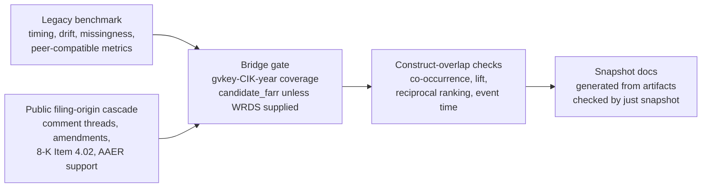

---
hide:
  - navigation
---

# Results Snapshot

_Generated by `just snapshot` from `artifacts/full_with_peer` at `2026-05-11T05:44:55+00:00`._

## Discussion

- **Research question.** Can filing-origin public SEC/PCAOB information predict whether an issuer later enters observable public review-and-correction channels, and how does this public reporting-risk construct relate to, but differ from, legacy detected-misstatement benchmarks?

- **Data.** The workflow combines the legacy `gvkey x data_year` detected-misstatement benchmark, the public SEC/PCAOB lake, the gold `issuer_origin_panel` and `filing_origin_panel`, and an external `gvkey-CIK-year` bridge for overlap validation.

- **Models.** The core public cascade uses XGBoost over metadata, XBRL, text/notes, auditor, oversight, and all-feature sets. Peer-compatible Dechow, Perols, Bao, and Bertomeu-style suites are included when the peer-enabled study directory is present.

- **Metrics.** The common metric vocabulary is PR-AUC relative to prevalence, ROC-AUC, Brier, Brier Skill Score, ECE, top-k precision, top-decile lift, and Bao-style top-fraction precision, sensitivity, specificity, BAC, and NDCG.

- **Sellable claim.** The strongest current framing is a measurement-and-ranking paper on filing-origin public reporting-risk states. It does not support causal claims, unobserved true-fraud occurrence claims, or same-estimand performance rankings over prior fraud-prediction papers.

- **Current best public-cascade specification.** `all + rolling_7y` with reported mean PR-AUC `0.2430`.

- **Bridge boundary.** Construct overlap is `candidate_farr`; WRDS or equivalent institutional bridge evidence remains preferred for final manuscript-grade integrated claims.

## Run Metadata

| Field | Value |
| --- | --- |
| Study directory | `artifacts/full_with_peer` |
| Snapshot mode | `full` |
| Study manifest timestamp | `2026-05-11T04:56:56+00:00` |
| Public-lake report timestamp | `2026-05-11T03:51:32+00:00` |
| Peer comparison mode | `full` |
| Bridge status | `external_crosswalk_available` |
| Construct-overlap validation tier | `candidate_farr` |
| Raw benchmark input | `/Volumes/ExternalSSD/data/reporting-risk-cascade/raw_dataset_misstatement.parquet` |
| Public issuer panel | `/Volumes/ExternalSSD/data/reporting-risk-cascade/public_lake/gold/issuer_origin_panel.parquet` |
| Bridge crosswalk | `/Volumes/ExternalSSD/data/reporting-risk-cascade/external/gvkey_cik_year.csv` |

## Component Status

| Component | Status | Tier | Output |
| --- | --- | --- | --- |
| benchmark | `complete` |  | artifacts/full_with_peer/benchmark |
| public_cascade | `complete` |  | artifacts/full_with_peer/public_cascade |
| bridge_probe | `external_crosswalk_available` |  | artifacts/full_with_peer/bridge_probe |
| peer_comparison | `complete` |  | artifacts/full_with_peer/peer_comparison |
| public_peer_comparison | `complete` |  | artifacts/full_with_peer/public_peer_comparison |
| construct_overlap | `complete` | `candidate_farr` | artifacts/full_with_peer/construct_overlap |

## Evidence Map

## Public Lake and Gold Panel Scale

| Layer | Artifact | Rows | Notes |
| --- | --- | --- | --- |
| Silver | `filing_dim` | 21,786,118 | normalized public filing index |
| Silver | `issuer_dim` | 968,124 | normalized issuer dimension |
| Silver | `xbrl_core_fact` | 18,010,256 | controlled XBRL core facts |
| Silver | `xbrl_fact_summary` | 362,013 | accession-level fact coverage |
| Silver | `note_summary` | 345,490 | Notes summary mode |
| Silver | `comment_thread` | 125,381 | SEC comment-thread signal |
| Silver | `correction_event` | 90,117 | amended-filing/correction signal |
| Gold | `issuer_origin_panel` | 205,719 | annual issuer-year modeling table |
| Gold | `filing_origin_panel` | 21,786,118 | filing-origin provenance table |

## Public Cascade Readiness

| Field | Value |
| --- | --- |
| Main sample rows | 90,342 |
| Fiscal-year span | 2011-2023 |
| Domestic US GAAP only | `True` |
| Task positive counts | `{"8k_402": 2008, "aaer_proxy": 19, "amendment": 17241, "comment_thread": 24840}` |
| Zero-positive tasks | `none` |
| Task status counts | `{"fit": 520, "skipped_one_class_train": 120}` |
| Readiness level | `xbrl_ratio_baseline` |
| Best reported feature set | `all` |
| Best reported train window | `rolling_7y` |
| Best reported mean PR-AUC | 0.2430 |

### Public Task Metrics

| Task | Positives | Mean prevalence | Mean PR-AUC | Mean ROC-AUC | Rows |
| --- | --- | --- | --- | --- | --- |
| `comment_thread` | 24,840 | 0.2615 | 0.3654 | 0.6327 | 160 |
| `amendment` | 17,241 | 0.1552 | 0.2530 | 0.6271 | 160 |
| `8k_402` | 2,008 | 0.0221 | 0.0506 | 0.6544 | 160 |
| `aaer_proxy` | 19 | 0.0012 | 0.0490 | 0.6503 | 40 |

### Public Feature-Family Metrics

| Feature set | Features | XBRL ratios | XBRL coverage | Mean PR-AUC | Mean ROC-AUC | Rows |
| --- | --- | --- | --- | --- | --- | --- |
| `all` | 79 | 11 | 15 | 0.2730 | 0.7382 | 104 |
| `metadata` | 28 | 0 | 0 | 0.2578 | 0.7156 | 104 |
| `xbrl` | 42 | 11 | 15 | 0.2001 | 0.6371 | 104 |
| `auditor` | 6 | 0 | 0 | 0.1673 | 0.5527 | 104 |
| `oversight` | 1 | 0 | 0 | 0.1499 | 0.5514 | 104 |

## Legacy Benchmark Timing Diagnostics

| Field | Value |
| --- | --- |
| Rows | 82,908 |
| Firms | 9,156 |
| Years | 2001-2019 |
| Positive rate | 0.0297 |
| Positive rows without timing proxy | 2,309 |
| Timing claim status | `proxy_imputed_lag` |

| Label mode | Best window | Mean PR-AUC | Mean ROC-AUC | Top-100 precision | Retained positive share |
| --- | --- | --- | --- | --- | --- |
| `naive` | `rolling_5y` | 0.0729 | 0.7301 | 0.0879 | 1.0000 |
| `proxy_imputed_lag_1y` | `rolling_5y` | 0.0451 | 0.6576 | 0.0621 | 0.8232 |
| `proxy_imputed_lag_2y` | `expanding` | 0.0394 | 0.6666 | 0.0543 | 0.9037 |
| `proxy_imputed_lag_3y` | `expanding` | 0.0340 | 0.6532 | 0.0471 | 0.8423 |
| `proxy_imputed_lag_5y` | `expanding` | 0.0322 | 0.6320 | 0.0379 | 0.6874 |
| `proxy_drop_observed` | `rolling_7y` | 0.0229 | 0.5549 | 0.0243 | 0.0604 |

## Peer-Compatible Literature Benchmarks

These rows are present only when the peer-enabled study has run. They are model-family transfer and metric-language alignment, not exact replications of the original-paper samples.

| Model | Rows | Mean PR-AUC | Mean ROC-AUC | Max PR-AUC | Mean Brier |
| --- | --- | --- | --- | --- | --- |
| `bertomeu_style_xgb` | 336 | 0.0427 | 0.6601 | 0.1710 | 0.0162 |
| `perols_logit` | 336 | 0.0315 | 0.6156 | 0.0759 | 0.1775 |
| `perols_bagged` | 336 | 0.0311 | 0.6271 | 0.0868 | 0.1809 |
| `perols_linear_svm` | 336 | 0.0306 | 0.6131 | 0.0745 | 0.1862 |
| `perols_stacking` | 336 | 0.0302 | 0.6075 | 0.0708 | 0.1967 |
| `perols_mlp` | 336 | 0.0297 | 0.5888 | 0.0716 | 0.2022 |
| `bao_inspired_tree_ensemble` | 336 | 0.0283 | 0.6251 | 0.0628 | 0.0165 |
| `dechow_variable_logit` | 336 | 0.0235 | 0.5225 | 0.0672 | 0.2466 |
| `perols_entropy_tree` | 336 | 0.0227 | 0.5810 | 0.0444 | 0.2245 |

## Public-Label Peer Transfer

| Model | Rows | Mean PR-AUC | Mean ROC-AUC | Max PR-AUC | Mean Brier |
| --- | --- | --- | --- | --- | --- |
| `bertomeu_style_xgb` | 480 | 0.2247 | 0.6453 | 0.5082 | 0.1124 |
| `bao_inspired_tree_ensemble` | 480 | 0.2245 | 0.6449 | 0.5063 | 0.1124 |
| `perols_bagged` | 480 | 0.2119 | 0.6319 | 0.4561 | 0.2238 |
| `perols_stacking` | 480 | 0.2074 | 0.6184 | 0.4454 | 0.2224 |
| `perols_linear_svm` | 480 | 0.2056 | 0.6166 | 0.6283 | 0.2242 |
| `perols_logit` | 480 | 0.2056 | 0.6217 | 0.5472 | 0.2252 |
| `perols_mlp` | 480 | 0.2002 | 0.6070 | 0.4413 | 0.2324 |
| `perols_entropy_tree` | 480 | 0.1997 | 0.6125 | 0.4264 | 0.2287 |
| `dechow_variable_logit` | 480 | 0.1584 | 0.5348 | 0.3084 | 0.2500 |

### Public Peer Task Summary

| Task | Rows | Mean prevalence | Mean PR-AUC | Mean ROC-AUC | Max PR-AUC |
| --- | --- | --- | --- | --- | --- |
| `comment_thread` | 1,440 | 0.2615 | 0.3284 | 0.5915 | 0.5082 |
| `amendment` | 1,440 | 0.1552 | 0.2326 | 0.6097 | 0.3854 |
| `8k_402` | 1,440 | 0.0221 | 0.0516 | 0.6432 | 0.6283 |

## Bridge and Construct-Overlap Validation

| Metric | Value |
| --- | --- |
| raw_rows | 82,908 |
| raw_firms | 9,156 |
| matched_raw_rows | 81,218 |
| matched_raw_firms | 9,075 |
| row_coverage_rate | 0.9796 |
| firm_coverage_rate | 0.9912 |
| raw_positive_rows | 2,460 |
| matched_positive_rows | 2,433 |

| Direction | Model | Target | PR-AUC | ROC-AUC | Top-decile lift |
| --- | --- | --- | --- | --- | --- |
| Public cascade score -> legacy positives | `public_cascade` | `8k_402` | 0.0326 | 0.6828 | 2.9462 |
| Legacy/peer score -> public labels | `bertomeu_style_xgb` | `label_8k_402_365` | 0.0436 | 0.7033 | 3.0477 |

Key readings:

- Public labels and legacy detected-misstatement labels are related but non-identical constructs.
- Public-cascade scores can rank legacy positives in the matched overlap; legacy/peer scores can also rank severe public correction labels.
- `candidate_farr` bridge evidence is useful for internal validation, but should be labeled clearly until a WRDS-grade bridge is available.

## Selected Artifact Index

This index lists high-signal artifacts referenced by this generated snapshot.

- `artifacts/full_with_peer/study_summary.md` (present)
- `artifacts/full_with_peer/study_run_manifest.json` (present)
- `artifacts/full_with_peer/benchmark/benchmark_summary.md` (present)
- `artifacts/full_with_peer/benchmark/rolling_metrics.csv` (present)
- `artifacts/full_with_peer/public_cascade/public_cascade_summary.md` (present)
- `artifacts/full_with_peer/public_cascade/public_cascade_metrics.csv` (present)
- `artifacts/full_with_peer/peer_comparison/peer_comparison_summary.md` (present)
- `artifacts/full_with_peer/peer_comparison/legacy_model_family_metrics.csv` (present)
- `artifacts/full_with_peer/public_peer_comparison/public_model_family_summary.md` (present)
- `artifacts/full_with_peer/public_peer_comparison/public_model_family_metrics.csv` (present)
- `artifacts/full_with_peer/bridge_probe/bridge_probe_summary.json` (present)
- `artifacts/full_with_peer/bridge_probe/coverage_report.csv` (present)
- `artifacts/full_with_peer/construct_overlap/construct_overlap_summary.md` (present)
- `artifacts/full_with_peer/construct_overlap/public_score_legacy_ranking.csv` (present)
- `artifacts/full_with_peer/construct_overlap/reciprocal_alignment.csv` (present)
- `artifacts/full_with_peer/opacity_validation_refresh/opacity_diagnostics_summary.csv` (present)
