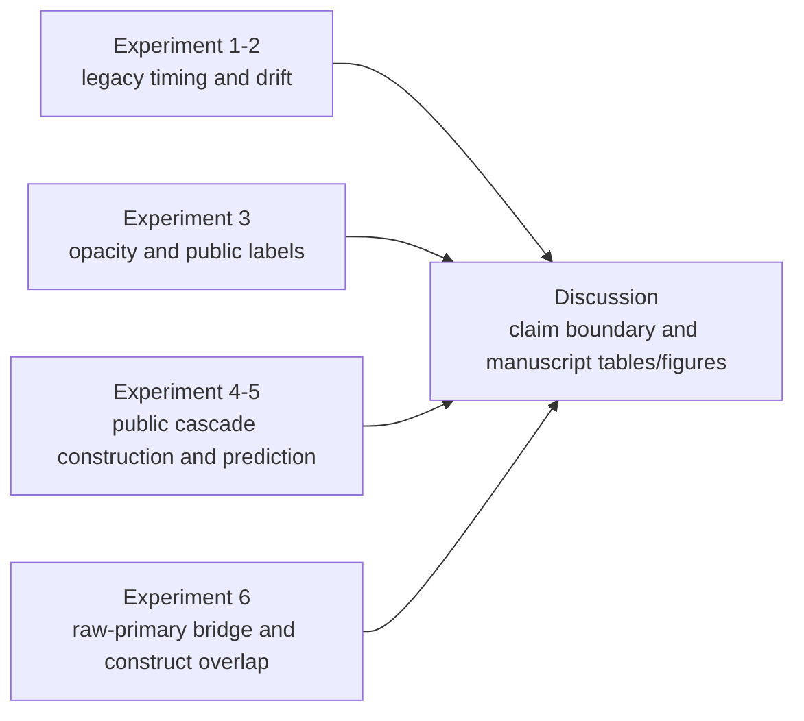

---
hide:
  - navigation
---

# Results and Discussion

_Generated by `just snapshot` from `artifacts/full_with_peer` at `2026-05-25T09:47:14+00:00`._

## Results Overview

- **Research question.** Can filing-origin public SEC/PCAOB information predict whether an issuer later enters observable public review-and-correction channels, and how does this public reporting-risk construct relate to, but differ from, legacy detected-misstatement benchmarks?

- **Data.** The workflow combines the legacy `gvkey x data_year` detected-misstatement benchmark, the public SEC/PCAOB lake, the gold `issuer_origin_panel` and `filing_origin_panel`, and a raw-primary `gvkey-CIK-year` bridge with external supplement rows for overlap validation.

- **Models.** The core public cascade uses XGBoost over metadata, XBRL, text/notes, auditor, oversight, and all-feature sets. Peer-compatible Dechow, Perols, Bao, and Bertomeu-style suites are included when the peer-enabled study directory is present.

- **Metrics.** The common metric vocabulary is PR-AUC relative to prevalence, ROC-AUC, Brier, Brier Skill Score, ECE, top-k precision, top-decile lift, and Bao-style top-fraction precision, sensitivity, specificity, BAC, and NDCG.

- **Current best public-cascade specification.** `all + rolling_7y` with reported mean PR-AUC `0.2430`.

- **Bridge boundary.** Construct overlap is `candidate_mixed`; WRDS or equivalent institutional bridge evidence remains preferred for final manuscript-grade integrated claims.

- **Sellable claim.** The strongest current framing is a measurement-and-ranking paper on filing-origin public reporting-risk states. It does not support causal claims, unobserved true-fraud occurrence claims, or same-estimand performance rankings over prior fraud-prediction papers.

## Reproducibility Metadata

| Field | Value |
| --- | --- |
| Study directory | `artifacts/full_with_peer` |
| Snapshot mode | `full` |
| Study manifest timestamp | `2026-05-11T04:56:56+00:00` |
| Public-lake report timestamp | `2026-05-25T06:58:10+00:00` |
| Peer comparison mode | `full` |
| Bridge status | `external_crosswalk_available` |
| Construct-overlap validation tier | `candidate_mixed` |
| Raw benchmark input | `/Volumes/ExternalSSD/data/reporting-risk-cascade/raw/raw_dataset_misstatement.parquet` |
| Public issuer panel | `/Volumes/ExternalSSD/data/reporting-risk-cascade/public_lake/gold/issuer_origin_panel.parquet` |
| Bridge crosswalk | `/Volumes/ExternalSSD/data/reporting-risk-cascade/linkage/raw_primary_external_supplement/gvkey_cik_year.csv` |

### Component Status

| Component | Status | Tier | Output |
| --- | --- | --- | --- |
| benchmark | `complete` |  | artifacts/full_with_peer/benchmark |
| bridge_probe | `external_crosswalk_available` |  | artifacts/full_with_peer/bridge_probe |
| construct_overlap | `complete` | `candidate_mixed` | artifacts/full_with_peer/construct_overlap |
| peer_comparison | `complete` |  | artifacts/full_with_peer/peer_comparison |
| public_cascade | `complete` |  | artifacts/full_with_peer/public_cascade |
| public_peer_comparison | `complete` |  | artifacts/full_with_peer/public_peer_comparison |

### Evidence Map

## Experiment 1: Label Observability and Detection Timing

This experiment reads legacy detected-misstatement performance as an observability diagnostic rather than a true-fraud detection result.

### Legacy Benchmark Panel

| Field | Value |
| --- | --- |
| Rows | 82,908 |
| Firms | 9,156 |
| Years | 2001-2019 |
| Positive rate | 0.0297 |
| Positive rows without timing proxy | 2,309 |
| Timing claim status | `proxy_imputed_lag` |

### Best Timing-Sensitivity Rows by Label Mode

| Label mode | Best window | Mean PR-AUC | Mean ROC-AUC | Top-100 precision | Retained positive share |
| --- | --- | --- | --- | --- | --- |
| `naive` | `rolling_5y` | 0.0729 | 0.7301 | 0.0879 | 1.0000 |
| `proxy_imputed_lag_1y` | `rolling_5y` | 0.0451 | 0.6576 | 0.0621 | 0.8232 |
| `proxy_imputed_lag_2y` | `expanding` | 0.0394 | 0.6666 | 0.0543 | 0.9037 |
| `proxy_imputed_lag_3y` | `expanding` | 0.0340 | 0.6532 | 0.0471 | 0.8423 |
| `proxy_imputed_lag_5y` | `expanding` | 0.0322 | 0.6320 | 0.0379 | 0.6874 |
| `proxy_drop_observed` | `rolling_7y` | 0.0229 | 0.5549 | 0.0243 | 0.0604 |

### Full Window Summary

| Label mode | Window | PR-AUC | ROC-AUC | Brier Skill Score | ECE | Top-100 precision | Top-decile precision |
| --- | --- | --- | --- | --- | --- | --- | --- |
| `naive` | `rolling_5y` | 0.0729 | 0.7301 | -4.1277 | 0.2026 | 0.0879 | 0.0528 |
| `naive` | `rolling_7y` | 0.0704 | 0.7293 | -5.0840 | 0.2341 | 0.0836 | 0.0507 |
| `naive` | `rolling_10y` | 0.0593 | 0.7360 | -5.9063 | 0.2564 | 0.0793 | 0.0547 |
| `naive` | `expanding` | 0.0545 | 0.7380 | -5.3868 | 0.2479 | 0.0786 | 0.0538 |
| `proxy_drop_observed` | `rolling_7y` | 0.0229 | 0.5549 | -0.0495 | 0.0134 | 0.0243 | 0.0236 |
| `proxy_drop_observed` | `expanding` | 0.0225 | 0.5671 | -0.2735 | 0.0194 | 0.0221 | 0.0246 |
| `proxy_drop_observed` | `rolling_5y` | 0.0223 | 0.5461 | -0.0281 | 0.0148 | 0.0307 | 0.0233 |
| `proxy_drop_observed` | `rolling_10y` | 0.0220 | 0.5574 | -0.1092 | 0.0130 | 0.0243 | 0.0237 |
| `proxy_imputed_lag_1y` | `rolling_5y` | 0.0451 | 0.6576 | -2.5977 | 0.1425 | 0.0621 | 0.0415 |
| `proxy_imputed_lag_1y` | `expanding` | 0.0435 | 0.6891 | -3.9789 | 0.1998 | 0.0614 | 0.0427 |
| `proxy_imputed_lag_1y` | `rolling_10y` | 0.0410 | 0.6784 | -4.1787 | 0.1999 | 0.0607 | 0.0411 |
| `proxy_imputed_lag_1y` | `rolling_7y` | 0.0401 | 0.6689 | -3.4030 | 0.1751 | 0.0564 | 0.0413 |
| `proxy_imputed_lag_2y` | `expanding` | 0.0394 | 0.6666 | -3.2873 | 0.1701 | 0.0543 | 0.0388 |
| `proxy_imputed_lag_2y` | `rolling_10y` | 0.0376 | 0.6575 | -3.4047 | 0.1688 | 0.0614 | 0.0380 |
| `proxy_imputed_lag_2y` | `rolling_5y` | 0.0363 | 0.6342 | -1.9045 | 0.1070 | 0.0571 | 0.0353 |
| `proxy_imputed_lag_2y` | `rolling_7y` | 0.0343 | 0.6444 | -2.7112 | 0.1431 | 0.0471 | 0.0361 |
| `proxy_imputed_lag_3y` | `expanding` | 0.0340 | 0.6532 | -2.5697 | 0.1375 | 0.0471 | 0.0367 |
| `proxy_imputed_lag_3y` | `rolling_10y` | 0.0324 | 0.6338 | -2.7751 | 0.1370 | 0.0471 | 0.0326 |
| `proxy_imputed_lag_3y` | `rolling_7y` | 0.0297 | 0.6120 | -2.0360 | 0.1077 | 0.0379 | 0.0312 |
| `proxy_imputed_lag_3y` | `rolling_5y` | 0.0288 | 0.6004 | -1.1135 | 0.0647 | 0.0364 | 0.0275 |
| `proxy_imputed_lag_5y` | `expanding` | 0.0322 | 0.6320 | -1.7863 | 0.0981 | 0.0379 | 0.0342 |
| `proxy_imputed_lag_5y` | `rolling_10y` | 0.0293 | 0.6150 | -1.8078 | 0.0935 | 0.0371 | 0.0292 |
| `proxy_imputed_lag_5y` | `rolling_7y` | 0.0256 | 0.5960 | -0.8870 | 0.0528 | 0.0329 | 0.0291 |
| `proxy_imputed_lag_5y` | `rolling_5y` | 0.0220 | 0.5338 | -0.0310 | 0.0148 | 0.0293 | 0.0238 |

## Experiment 2: Concept Drift and Model Shelf-Life

This experiment compares rolling and expanding windows and checks whether feature-family importance shifts around candidate regime breaks.

### Strongest Structural-Break Diagnostics

| Window | Label mode | Feature family | Break year | F-stat | p-value |
| --- | --- | --- | --- | --- | --- |
| `expanding` | `naive` | `accounting` | 2,005 | 4933.5315 | 0.0000 |
| `expanding` | `naive` | `market` | 2,005 | 4884.8160 | 0.0000 |
| `expanding` | `proxy_imputed_lag_2y` | `market` | 2,005 | 4456.7485 | 0.0000 |
| `rolling_7y` | `proxy_imputed_lag_1y` | `market` | 2,005 | 3640.4287 | 0.0000 |
| `rolling_5y` | `proxy_imputed_lag_1y` | `audit` | 2,005 | 3466.5828 | 0.0000 |
| `rolling_7y` | `proxy_imputed_lag_2y` | `audit` | 2,005 | 3396.7635 | 0.0000 |
| `expanding` | `proxy_imputed_lag_1y` | `audit` | 2,005 | 3088.0389 | 0.0000 |
| `expanding` | `proxy_imputed_lag_2y` | `audit` | 2,005 | 2840.3885 | 0.0000 |
| `expanding` | `proxy_imputed_lag_1y` | `accounting` | 2,005 | 2806.8251 | 0.0000 |
| `expanding` | `naive` | `audit` | 2,005 | 2707.6563 | 0.0000 |
| `rolling_10y` | `proxy_imputed_lag_2y` | `accounting` | 2,005 | 2590.3662 | 0.0000 |
| `rolling_7y` | `proxy_imputed_lag_1y` | `audit` | 2,005 | 2577.2801 | 0.0000 |

### Mean Feature-Family Importance

| Label mode | Feature family | Mean importance share |
| --- | --- | --- |
| `proxy_drop_observed` | `accounting` | 0.3709 |
| `proxy_imputed_lag_5y` | `accounting` | 0.3275 |
| `proxy_imputed_lag_3y` | `accounting` | 0.3040 |
| `proxy_imputed_lag_2y` | `accounting` | 0.2978 |
| `proxy_imputed_lag_1y` | `accounting` | 0.2968 |
| `naive` | `accounting` | 0.2946 |
| `naive` | `industry` | 0.1789 |
| `proxy_imputed_lag_3y` | `audit` | 0.1765 |
| `proxy_imputed_lag_2y` | `audit` | 0.1761 |
| `proxy_imputed_lag_1y` | `industry` | 0.1758 |
| `proxy_imputed_lag_5y` | `audit` | 0.1741 |
| `proxy_imputed_lag_1y` | `audit` | 0.1711 |

## Experiment 3: Opacity and Public Review/Correction Risk

The opacity analysis reports adjusted associations from DML partially linear regressions. These estimates are not causal effects.

| Outcome | Rows | Prevalence | Mean treatment | Coef | Std err | p-value | Status |
| --- | --- | --- | --- | --- | --- | --- | --- |
| `comment_thread` | 90,325 | 0.2750 | 0.5038 | -0.0682 | 0.0953 | 0.4745 | `fit` |
| `amendment` | 90,325 | 0.1908 | 0.5038 | -0.0189 | 0.0806 | 0.8145 | `fit` |
| `8k_402` | 90,325 | 0.0222 | 0.5038 | -0.0409 | 0.0305 | 0.1793 | `fit` |

## Experiment 4: Public Cascade Construction

This experiment validates whether public SEC/PCAOB data can support the filing-origin review-and-correction measurement surface.

### Public Lake and Gold Panel Scale

| Layer | Artifact | Rows | Notes |
| --- | --- | --- | --- |
| Silver | `filing_dim` | 21,786,118 | normalized public filing index |
| Silver | `issuer_dim` | 968,124 | normalized issuer dimension |
| Silver | `xbrl_core_fact` | 18,010,256 | controlled XBRL core facts |
| Silver | `xbrl_fact_summary` | 362,013 | accession-level fact coverage |
| Silver | `note_summary` | 345,490 | Notes summary mode |
| Silver | `comment_thread` | 125,381 | SEC comment-thread signal |
| Silver | `correction_event` | 90,117 | amended-filing/correction signal |
| Gold | `issuer_origin_panel` | 205,719 | annual issuer-year modeling table |
| Gold | `filing_origin_panel` | 21,786,118 | filing-origin provenance table |

### Public Cascade Readiness

| Field | Value |
| --- | --- |
| Main sample rows | 90,342 |
| Fiscal-year span | 2011-2023 |
| Domestic US GAAP only | `True` |
| Task positive counts | `{"8k_402": 2008, "aaer_proxy": 19, "amendment": 17241, "comment_thread": 24840}` |
| Task exclusion counts | `{"8k_402": 0, "aaer_proxy": 0, "amendment": 0, "comment_thread": 0}` |
| Zero-positive tasks | `none` |
| Task status counts | `{"fit": 520, "skipped_one_class_train": 120}` |
| Readiness level | `xbrl_ratio_baseline` |

### Public Cascade Fit and Skip Status

| Status | Reason | Rows |
| --- | --- | --- |
| `fit` |  | 520 |
| `skipped_one_class_train` |  | 120 |

## Experiment 5: Public Cascade Prediction

This experiment estimates the pre-disclosure public reporting-risk state and compares feature families and peer-compatible model families.

### Public Task Metrics

| Task | Positives | Mean prevalence | Mean PR-AUC | Mean ROC-AUC | Rows |
| --- | --- | --- | --- | --- | --- |
| `comment_thread` | 24,840 | 0.2615 | 0.3654 | 0.6327 | 160 |
| `amendment` | 17,241 | 0.1552 | 0.2530 | 0.6271 | 160 |
| `8k_402` | 2,008 | 0.0221 | 0.0506 | 0.6544 | 160 |
| `aaer_proxy` | 19 | 0.0012 | 0.0490 | 0.6503 | 40 |

### Public Feature-Family Metrics

| Feature set | Features | XBRL ratios | XBRL coverage | Mean PR-AUC | Mean ROC-AUC | Rows |
| --- | --- | --- | --- | --- | --- | --- |
| `all` | 79 | 11 | 15 | 0.2730 | 0.7382 | 104 |
| `metadata` | 28 | 0 | 0 | 0.2578 | 0.7156 | 104 |
| `xbrl` | 42 | 11 | 15 | 0.2001 | 0.6371 | 104 |
| `auditor` | 6 | 0 | 0 | 0.1673 | 0.5527 | 104 |
| `oversight` | 1 | 0 | 0 | 0.1499 | 0.5514 | 104 |

### Legacy Peer-Compatible Literature Benchmarks

These rows are present only when the peer-enabled study has run. They are model-family transfer and metric-language alignment, not exact replications of the original-paper samples.

| Model | Rows | Mean PR-AUC | Mean ROC-AUC | Max PR-AUC | Mean Brier |
| --- | --- | --- | --- | --- | --- |
| `bertomeu_style_xgb` | 336 | 0.0427 | 0.6601 | 0.1710 | 0.0162 |
| `perols_logit` | 336 | 0.0315 | 0.6156 | 0.0759 | 0.1775 |
| `perols_bagged` | 336 | 0.0311 | 0.6271 | 0.0868 | 0.1809 |
| `perols_linear_svm` | 336 | 0.0306 | 0.6131 | 0.0745 | 0.1862 |
| `perols_stacking` | 336 | 0.0302 | 0.6075 | 0.0708 | 0.1967 |
| `perols_mlp` | 336 | 0.0297 | 0.5888 | 0.0716 | 0.2022 |
| `bao_inspired_tree_ensemble` | 336 | 0.0283 | 0.6251 | 0.0628 | 0.0165 |
| `dechow_variable_logit` | 336 | 0.0235 | 0.5225 | 0.0672 | 0.2466 |
| `perols_entropy_tree` | 336 | 0.0227 | 0.5810 | 0.0444 | 0.2245 |

### Legacy Peer Fit and Skip Status

| Status | Reason | Rows |
| --- | --- | --- |
| `fit` | `fit` | 3,024 |
| `skipped` | `missing_required_mapping` | 336 |

### Public-Label Peer Transfer

| Model | Rows | Mean PR-AUC | Mean ROC-AUC | Max PR-AUC | Mean Brier |
| --- | --- | --- | --- | --- | --- |
| `bertomeu_style_xgb` | 480 | 0.2247 | 0.6453 | 0.5082 | 0.1124 |
| `bao_inspired_tree_ensemble` | 480 | 0.2245 | 0.6449 | 0.5063 | 0.1124 |
| `perols_bagged` | 480 | 0.2119 | 0.6319 | 0.4561 | 0.2238 |
| `perols_stacking` | 480 | 0.2074 | 0.6184 | 0.4454 | 0.2224 |
| `perols_linear_svm` | 480 | 0.2056 | 0.6166 | 0.6283 | 0.2242 |
| `perols_logit` | 480 | 0.2056 | 0.6217 | 0.5472 | 0.2252 |
| `perols_mlp` | 480 | 0.2002 | 0.6070 | 0.4413 | 0.2324 |
| `perols_entropy_tree` | 480 | 0.1997 | 0.6125 | 0.4264 | 0.2287 |
| `dechow_variable_logit` | 480 | 0.1584 | 0.5348 | 0.3084 | 0.2500 |

### Public Peer Task Summary

| Task | Rows | Mean prevalence | Mean PR-AUC | Mean ROC-AUC | Max PR-AUC |
| --- | --- | --- | --- | --- | --- |
| `comment_thread` | 1,440 | 0.2615 | 0.3284 | 0.5915 | 0.5082 |
| `amendment` | 1,440 | 0.1552 | 0.2326 | 0.6097 | 0.3854 |
| `8k_402` | 1,440 | 0.0221 | 0.0516 | 0.6432 | 0.6283 |

### Public Peer Fit and Skip Status

| Status | Reason | Rows |
| --- | --- | --- |
| `fit` | `fit` | 4,320 |
| `skipped` | `severity_tail_sparse_not_headline` | 1,600 |
| `skipped` | `missing_required_mapping` | 480 |

## Experiment 6: Old Benchmark and Public Cascade Overlap

This experiment is the integrated-paper gate. The current bridge is raw-primary plus farr-supplement and remains `candidate_mixed` until WRDS-equivalent evidence is supplied.

### Bridge Coverage

| Metric | Value |
| --- | --- |
| raw_rows | 82,908 |
| raw_firms | 9,156 |
| matched_raw_rows | 82,407 |
| matched_raw_firms | 9,130 |
| row_coverage_rate | 0.9940 |
| firm_coverage_rate | 0.9972 |
| raw_positive_rows | 2,460 |
| matched_positive_rows | 2,453 |

### Overlap Sample Flow

| Bridge tier | Rows | Legacy positives |
| --- | --- | --- |
| `full_raw` | 82,908 | 2,460 |
| `aaer_subset` | 0 | 0 |
| `ambiguous` | 2,172 | 65 |
| `dropped` | 34,799 | 1,025 |
| `high_confidence` | 45,937 | 1,370 |

### Construct-Overlap Ranking Alignment

| Direction | Model | Target | PR-AUC | ROC-AUC | Top-decile lift |
| --- | --- | --- | --- | --- | --- |
| Public cascade score -> legacy positives | `public_cascade` | `8k_402` | 0.0302 | 0.6835 | 2.8981 |
| Legacy/peer score -> public labels | `bertomeu_style_xgb` | `label_8k_402_365` | 0.0448 | 0.7066 | 3.1174 |

### Label Contingency and Lift

| Public label | Bridge tier | Rows | Legacy positives | Public positives | Both positive | Lift public given legacy | Lift legacy given public |
| --- | --- | --- | --- | --- | --- | --- | --- |
| `label_comment_thread_365` | `high_confidence` | 45,937 | 1,370 | 13,993 | 425 | 1.0184 | 1.0184 |
| `label_amendment_365` | `high_confidence` | 45,937 | 1,370 | 9,860 | 560 | 1.9044 | 1.9044 |
| `label_8k_402_365` | `high_confidence` | 45,937 | 1,370 | 1,075 | 275 | 8.5776 | 8.5776 |
| `label_aaer_proxy_730` | `high_confidence` | 45,937 | 1,370 | 0 | 0 |  |  |
| `label_comment_thread_365` | `ambiguous` | 2,172 | 65 | 763 | 21 | 0.9197 | 0.9197 |
| `label_amendment_365` | `ambiguous` | 2,172 | 65 | 472 | 28 | 1.9823 | 1.9823 |
| `label_8k_402_365` | `ambiguous` | 2,172 | 65 | 47 | 14 | 9.9535 | 9.9535 |
| `label_aaer_proxy_730` | `ambiguous` | 2,172 | 65 | 0 | 0 |  |  |
| `label_comment_thread_365` | `all_matched` | 48,109 | 1,435 | 14,756 | 446 | 1.0133 | 1.0133 |
| `label_amendment_365` | `all_matched` | 48,109 | 1,435 | 10,332 | 588 | 1.9080 | 1.9080 |
| `label_8k_402_365` | `all_matched` | 48,109 | 1,435 | 1,122 | 289 | 8.6353 | 8.6353 |
| `label_aaer_proxy_730` | `all_matched` | 48,109 | 1,435 | 0 | 0 |  |  |

### Aggregation Sensitivity

| Public label | Bridge tier | Aggregation rule | Rows | Pre-agg rate | Post-agg rate | Rate delta | Sensitive |
| --- | --- | --- | --- | --- | --- | --- | --- |
| `label_comment_thread_365` | `ambiguous` | label_max | 2,172 | 0.1895 | 0.3513 | 0.1618 | `True` |
| `label_comment_thread_365` | `high_confidence` | label_max | 45,937 | 0.3046 | 0.3046 | 0.0000 | `False` |
| `label_amendment_365` | `ambiguous` | label_max | 2,172 | 0.1149 | 0.2173 | 0.1024 | `True` |
| `label_amendment_365` | `high_confidence` | label_max | 45,937 | 0.2146 | 0.2146 | 0.0000 | `False` |
| `label_8k_402_365` | `ambiguous` | label_max | 2,172 | 0.0109 | 0.0216 | 0.0107 | `True` |
| `label_8k_402_365` | `high_confidence` | label_max | 45,937 | 0.0234 | 0.0234 | 0.0000 | `False` |
| `label_aaer_proxy_730` | `ambiguous` | label_max | 2,172 | 0.0000 | 0.0000 | 0.0000 | `False` |
| `label_aaer_proxy_730` | `high_confidence` | label_max | 45,937 | 0.0000 | 0.0000 | 0.0000 | `False` |

### Legacy-Positive Public-Label Co-occurrence

| Pattern | Comment | Amendment | 8-K 4.02 | AAER | Legacy positives | Share | Display count |
| --- | --- | --- | --- | --- | --- | --- | --- |
| `none` | 0 | 0 | 0 | 0 | 541 | 0.3949 | 541 |
| `8k_402_365` | 0 | 0 | 1 | 0 | 44 | 0.0321 | 44 |
| `amendment_365` | 0 | 1 | 0 | 0 | 283 | 0.2066 | 283 |
| `amendment_365+8k_402_365` | 0 | 1 | 1 | 0 | 77 | 0.0562 | 77 |
| `comment_thread_365` | 1 | 0 | 0 | 0 | 184 | 0.1343 | 184 |
| `comment_thread_365+8k_402_365` | 1 | 0 | 1 | 0 | 41 | 0.0299 | 41 |
| `comment_thread_365+amendment_365` | 1 | 1 | 0 | 0 | 87 | 0.0635 | 87 |
| `comment_thread_365+amendment_365+8k_402_365` | 1 | 1 | 1 | 0 | 113 | 0.0825 | 113 |

### Event-Time Concentration

| Relative year | Public label | Legacy pos rows | Legacy neg rows | Rate if legacy pos | Rate if legacy neg | Difference | Balanced window |
| --- | --- | --- | --- | --- | --- | --- | --- |
| -3 | `label_comment_thread_365` | 640 | 21,328 | 0.1750 | 0.3015 | -0.1265 | `True` |
| -3 | `label_amendment_365` | 640 | 21,328 | 0.3000 | 0.2057 | 0.0943 | `True` |
| -3 | `label_8k_402_365` | 640 | 21,328 | 0.0203 | 0.0197 | 0.0006 | `True` |
| -3 | `label_aaer_proxy_730` | 640 | 21,328 | 0.0000 | 0.0000 | 0.0000 | `True` |
| -2 | `label_comment_thread_365` | 640 | 21,328 | 0.2078 | 0.3082 | -0.1004 | `True` |
| -2 | `label_amendment_365` | 640 | 21,328 | 0.3000 | 0.1992 | 0.1008 | `True` |
| -2 | `label_8k_402_365` | 640 | 21,328 | 0.0312 | 0.0212 | 0.0100 | `True` |
| -2 | `label_aaer_proxy_730` | 640 | 21,328 | 0.0000 | 0.0000 | 0.0000 | `True` |
| -1 | `label_comment_thread_365` | 640 | 21,328 | 0.2578 | 0.3076 | -0.0498 | `True` |
| -1 | `label_amendment_365` | 640 | 21,328 | 0.3031 | 0.1885 | 0.1146 | `True` |
| -1 | `label_8k_402_365` | 640 | 21,328 | 0.1016 | 0.0181 | 0.0835 | `True` |
| -1 | `label_aaer_proxy_730` | 640 | 21,328 | 0.0000 | 0.0000 | 0.0000 | `True` |
| 0 | `label_comment_thread_365` | 640 | 21,328 | 0.3344 | 0.3116 | 0.0228 | `True` |
| 0 | `label_amendment_365` | 640 | 21,328 | 0.4109 | 0.1819 | 0.2290 | `True` |
| 0 | `label_8k_402_365` | 640 | 21,328 | 0.2109 | 0.0167 | 0.1942 | `True` |
| 0 | `label_aaer_proxy_730` | 640 | 21,328 | 0.0000 | 0.0000 | 0.0000 | `True` |
| 1 | `label_comment_thread_365` | 640 | 21,328 | 0.3812 | 0.3108 | 0.0704 | `True` |
| 1 | `label_amendment_365` | 640 | 21,328 | 0.3750 | 0.1734 | 0.2016 | `True` |
| 1 | `label_8k_402_365` | 640 | 21,328 | 0.1938 | 0.0175 | 0.1763 | `True` |
| 1 | `label_aaer_proxy_730` | 640 | 21,328 | 0.0000 | 0.0000 | 0.0000 | `True` |
| 2 | `label_comment_thread_365` | 640 | 21,328 | 0.3953 | 0.3140 | 0.0814 | `True` |
| 2 | `label_amendment_365` | 640 | 21,328 | 0.3172 | 0.1691 | 0.1481 | `True` |
| 2 | `label_8k_402_365` | 640 | 21,328 | 0.1625 | 0.0181 | 0.1444 | `True` |
| 2 | `label_aaer_proxy_730` | 640 | 21,328 | 0.0000 | 0.0000 | 0.0000 | `True` |
| 3 | `label_comment_thread_365` | 640 | 21,328 | 0.3734 | 0.3094 | 0.0640 | `True` |
| 3 | `label_amendment_365` | 640 | 21,328 | 0.2797 | 0.1822 | 0.0975 | `True` |
| 3 | `label_8k_402_365` | 640 | 21,328 | 0.1187 | 0.0172 | 0.1016 | `True` |
| 3 | `label_aaer_proxy_730` | 640 | 21,328 | 0.0000 | 0.0001 | -0.0001 | `True` |

### AAER High-Severity Support Status

| Metric status | Rows | AAER positives in overlap |
| --- | --- | --- |
| `blocked_sparse` | 60 | 0 |

## Discussion

### Key Readings

- Public labels and legacy detected-misstatement labels are related but non-identical constructs.
- Public-cascade scores can rank legacy positives in the matched overlap; legacy/peer scores can also rank severe public correction labels.
- `candidate_mixed` bridge evidence is useful for internal validation, but should be labeled clearly until a WRDS-grade bridge is available.
- Sparse AAER ranking positives remain a blocker for using AAER as a headline ranking target.

### Claim Boundaries

- The evidence supports measurement and decision-useful prediction claims, not causal proof of fraud occurrence.
- Comment letters are public scrutiny signals, not the complete SEC review universe.
- AAER is a rare high-severity enforcement indicator, not a complete enforcement universe.
- Candidate raw-primary plus farr-supplement overlap can support a related-but-non-identical construct argument, but not final WRDS-quality validation.

## Tables, Figures, and Artifact Index

### Manuscript Package Tables and Figures

| Kind | File | Path |
| --- | --- | --- |
| Table | `table_01_component_status.csv` | artifacts/manuscript_package/tables/table_01_component_status.csv |
| Table | `table_01_component_status.md` | artifacts/manuscript_package/tables/table_01_component_status.md |
| Table | `table_01_component_status.tex` | artifacts/manuscript_package/tables/table_01_component_status.tex |
| Table | `table_02_public_lake_scale.csv` | artifacts/manuscript_package/tables/table_02_public_lake_scale.csv |
| Table | `table_02_public_lake_scale.md` | artifacts/manuscript_package/tables/table_02_public_lake_scale.md |
| Table | `table_02_public_lake_scale.tex` | artifacts/manuscript_package/tables/table_02_public_lake_scale.tex |
| Table | `table_03_public_task_metrics.csv` | artifacts/manuscript_package/tables/table_03_public_task_metrics.csv |
| Table | `table_03_public_task_metrics.md` | artifacts/manuscript_package/tables/table_03_public_task_metrics.md |
| Table | `table_03_public_task_metrics.tex` | artifacts/manuscript_package/tables/table_03_public_task_metrics.tex |
| Table | `table_04_feature_family_metrics.csv` | artifacts/manuscript_package/tables/table_04_feature_family_metrics.csv |
| Table | `table_04_feature_family_metrics.md` | artifacts/manuscript_package/tables/table_04_feature_family_metrics.md |
| Table | `table_04_feature_family_metrics.tex` | artifacts/manuscript_package/tables/table_04_feature_family_metrics.tex |
| Table | `table_05_legacy_timing_metrics.csv` | artifacts/manuscript_package/tables/table_05_legacy_timing_metrics.csv |
| Table | `table_05_legacy_timing_metrics.md` | artifacts/manuscript_package/tables/table_05_legacy_timing_metrics.md |
| Table | `table_05_legacy_timing_metrics.tex` | artifacts/manuscript_package/tables/table_05_legacy_timing_metrics.tex |
| Table | `table_06_legacy_peer_metrics.csv` | artifacts/manuscript_package/tables/table_06_legacy_peer_metrics.csv |
| Table | `table_06_legacy_peer_metrics.md` | artifacts/manuscript_package/tables/table_06_legacy_peer_metrics.md |
| Table | `table_06_legacy_peer_metrics.tex` | artifacts/manuscript_package/tables/table_06_legacy_peer_metrics.tex |
| Table | `table_07_public_peer_metrics.csv` | artifacts/manuscript_package/tables/table_07_public_peer_metrics.csv |
| Table | `table_07_public_peer_metrics.md` | artifacts/manuscript_package/tables/table_07_public_peer_metrics.md |
| Table | `table_07_public_peer_metrics.tex` | artifacts/manuscript_package/tables/table_07_public_peer_metrics.tex |
| Table | `table_08_bridge_coverage.csv` | artifacts/manuscript_package/tables/table_08_bridge_coverage.csv |
| Table | `table_08_bridge_coverage.md` | artifacts/manuscript_package/tables/table_08_bridge_coverage.md |
| Table | `table_08_bridge_coverage.tex` | artifacts/manuscript_package/tables/table_08_bridge_coverage.tex |
| Table | `table_09_construct_alignment.csv` | artifacts/manuscript_package/tables/table_09_construct_alignment.csv |
| Table | `table_09_construct_alignment.md` | artifacts/manuscript_package/tables/table_09_construct_alignment.md |
| Table | `table_09_construct_alignment.tex` | artifacts/manuscript_package/tables/table_09_construct_alignment.tex |
| Figure | `figure_01_public_task_pr_auc.pdf` | artifacts/manuscript_package/figures/figure_01_public_task_pr_auc.pdf |
| Figure | `figure_01_public_task_pr_auc.png` | artifacts/manuscript_package/figures/figure_01_public_task_pr_auc.png |
| Figure | `figure_02_feature_family_pr_auc.pdf` | artifacts/manuscript_package/figures/figure_02_feature_family_pr_auc.pdf |
| Figure | `figure_02_feature_family_pr_auc.png` | artifacts/manuscript_package/figures/figure_02_feature_family_pr_auc.png |
| Figure | `figure_03_legacy_peer_pr_auc.pdf` | artifacts/manuscript_package/figures/figure_03_legacy_peer_pr_auc.pdf |
| Figure | `figure_03_legacy_peer_pr_auc.png` | artifacts/manuscript_package/figures/figure_03_legacy_peer_pr_auc.png |
| Figure | `figure_04_public_peer_pr_auc.pdf` | artifacts/manuscript_package/figures/figure_04_public_peer_pr_auc.pdf |
| Figure | `figure_04_public_peer_pr_auc.png` | artifacts/manuscript_package/figures/figure_04_public_peer_pr_auc.png |
| Figure | `figure_05_construct_overlap_lift.pdf` | artifacts/manuscript_package/figures/figure_05_construct_overlap_lift.pdf |
| Figure | `figure_05_construct_overlap_lift.png` | artifacts/manuscript_package/figures/figure_05_construct_overlap_lift.png |

### Selected Artifact Index

This index lists high-signal artifacts referenced by this generated snapshot.

- `artifacts/full_with_peer/study_summary.md` (present)
- `artifacts/full_with_peer/study_run_manifest.json` (present)
- `artifacts/full_with_peer/benchmark/benchmark_summary.md` (present)
- `artifacts/full_with_peer/benchmark/rolling_metrics.csv` (present)
- `artifacts/full_with_peer/public_cascade/public_cascade_summary.md` (present)
- `artifacts/full_with_peer/public_cascade/public_cascade_metrics.csv` (present)
- `artifacts/full_with_peer/peer_comparison/peer_comparison_summary.md` (present)
- `artifacts/full_with_peer/peer_comparison/legacy_model_family_metrics.csv` (present)
- `artifacts/full_with_peer/public_peer_comparison/public_model_family_summary.md` (present)
- `artifacts/full_with_peer/public_peer_comparison/public_model_family_metrics.csv` (present)
- `artifacts/full_with_peer/bridge_probe/bridge_probe_summary.json` (present)
- `artifacts/full_with_peer/bridge_probe/coverage_report.csv` (present)
- `artifacts/full_with_peer/construct_overlap/construct_overlap_summary.md` (present)
- `artifacts/full_with_peer/construct_overlap/public_score_legacy_ranking.csv` (present)
- `artifacts/full_with_peer/construct_overlap/reciprocal_alignment.csv` (present)
- `artifacts/full_with_peer/opacity_validation_refresh/opacity_diagnostics_summary.csv` (present)

### Full Study Artifact Inventory

- `artifacts/full_with_peer/benchmark/benchmark_summary.md`
- `artifacts/full_with_peer/benchmark/cluster_meta.json`
- `artifacts/full_with_peer/benchmark/dml_result.json`
- `artifacts/full_with_peer/benchmark/feature_family_importance.csv`
- `artifacts/full_with_peer/benchmark/master_panel.parquet`
- `artifacts/full_with_peer/benchmark/missing_profile_clusters.csv`
- `artifacts/full_with_peer/benchmark/recommendation.json`
- `artifacts/full_with_peer/benchmark/rolling_metrics.csv`
- `artifacts/full_with_peer/benchmark/rolling_predictions.parquet`
- `artifacts/full_with_peer/benchmark/structural_breaks.csv`
- `artifacts/full_with_peer/benchmark/timing_coverage.csv`
- `artifacts/full_with_peer/benchmark/timing_summary.json`
- `artifacts/full_with_peer/benchmark/window_summary.csv`
- `artifacts/full_with_peer/benchmark/year_summary.csv`
- `artifacts/full_with_peer/bridge_probe/bridge_probe_summary.json`
- `artifacts/full_with_peer/bridge_probe/candidate_crosswalk.csv`
- `artifacts/full_with_peer/bridge_probe/coverage_report.csv`
- `artifacts/full_with_peer/bridge_probe/multiplicity_report.csv`
- `artifacts/full_with_peer/bridge_probe/unmatched_raw_characteristics.csv`
- `artifacts/full_with_peer/construct_overlap/aggregation_sensitivity.csv`
- `artifacts/full_with_peer/construct_overlap/bridge_confidence_tiers.csv`
- `artifacts/full_with_peer/construct_overlap/bridge_multiplicity_in_overlap.csv`
- `artifacts/full_with_peer/construct_overlap/construct_overlap_blockers.json`
- `artifacts/full_with_peer/construct_overlap/construct_overlap_manifest.json`
- `artifacts/full_with_peer/construct_overlap/construct_overlap_summary.md`
- `artifacts/full_with_peer/construct_overlap/event_time_concentration.csv`
- `artifacts/full_with_peer/construct_overlap/event_time_coverage.csv`
- `artifacts/full_with_peer/construct_overlap/farr_aaer_benchmark_overlap.csv`
- `artifacts/full_with_peer/construct_overlap/farr_aaer_lag_distribution.csv`
- `artifacts/full_with_peer/construct_overlap/farr_aaer_public_overlap.csv`
- `artifacts/full_with_peer/construct_overlap/farr_aaer_ranking_lift.csv`
- `artifacts/full_with_peer/construct_overlap/label_contingency_lift.csv`
- `artifacts/full_with_peer/construct_overlap/legacy_positive_public_label_cooccurrence.csv`
- `artifacts/full_with_peer/construct_overlap/overlap_panel.parquet`
- `artifacts/full_with_peer/construct_overlap/overlap_sample_flow.csv`
- `artifacts/full_with_peer/construct_overlap/public_score_legacy_ranking.csv`
- `artifacts/full_with_peer/construct_overlap/public_score_legacy_ranking_sensitivity.csv`
- `artifacts/full_with_peer/construct_overlap/reciprocal_alignment.csv`
- `artifacts/full_with_peer/construct_overlap/res_an_proxy_coverage.csv`
- `artifacts/full_with_peer/construct_overlap/top_decile_lift.csv`
- `artifacts/full_with_peer/opacity_validation_refresh/opacity_diagnostics_summary.csv`
- `artifacts/full_with_peer/opacity_validation_refresh/opacity_validation_blockers.json`
- `artifacts/full_with_peer/opacity_validation_refresh/opacity_validation_refresh_summary.md`
- `artifacts/full_with_peer/peer_comparison/feature_mapping_attrition.csv`
- `artifacts/full_with_peer/peer_comparison/imbalance_strategy_report.csv`
- `artifacts/full_with_peer/peer_comparison/legacy_feature_importance.csv`
- `artifacts/full_with_peer/peer_comparison/legacy_model_family_metrics.csv`
- `artifacts/full_with_peer/peer_comparison/legacy_model_family_predictions.parquet`
- `artifacts/full_with_peer/peer_comparison/peer_blockers.json`
- `artifacts/full_with_peer/peer_comparison/peer_comparison_manifest.json`
- `artifacts/full_with_peer/peer_comparison/peer_comparison_summary.md`
- `artifacts/full_with_peer/peer_comparison/peer_task_status.csv`
- `artifacts/full_with_peer/public_cascade/public_cascade_metrics.csv`
- `artifacts/full_with_peer/public_cascade/public_cascade_predictions.parquet`
- `artifacts/full_with_peer/public_cascade/public_cascade_summary.json`
- `artifacts/full_with_peer/public_cascade/public_cascade_summary.md`
- `artifacts/full_with_peer/public_cascade/public_cascade_task_status.csv`
- `artifacts/full_with_peer/public_cascade/public_opacity_dml.csv`
- `artifacts/full_with_peer/public_cascade/public_opacity_dml_meta.json`
- `artifacts/full_with_peer/public_peer_comparison/public_model_family_blockers.json`
- `artifacts/full_with_peer/public_peer_comparison/public_model_family_feature_importance.csv`
- `artifacts/full_with_peer/public_peer_comparison/public_model_family_imbalance_strategy_report.csv`
- `artifacts/full_with_peer/public_peer_comparison/public_model_family_manifest.json`
- `artifacts/full_with_peer/public_peer_comparison/public_model_family_mapping_attrition.csv`
- `artifacts/full_with_peer/public_peer_comparison/public_model_family_metrics.csv`
- `artifacts/full_with_peer/public_peer_comparison/public_model_family_predictions.parquet`
- `artifacts/full_with_peer/public_peer_comparison/public_model_family_summary.md`
- `artifacts/full_with_peer/public_peer_comparison/public_model_family_task_status.csv`
- `artifacts/full_with_peer/study_run_manifest.json`
- `artifacts/full_with_peer/study_summary.md`
