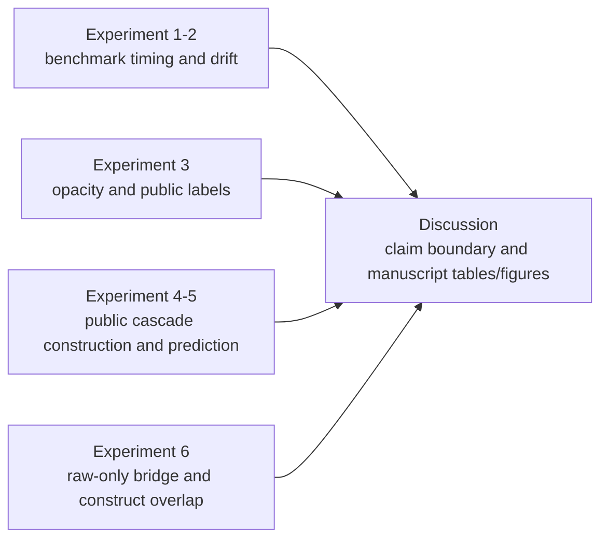

---
hide:
  - navigation
---

# Results and Discussion

_Generated by `just snapshot` from `artifacts/full_with_peer` at `2026-07-11T19:36:22+00:00`._

## Connection to Paper Plan

This page is the artifact-backed Results and Discussion companion to `docs/paper_plan.md`. The paper plan defines the research question, Materials and Methods, metric choices, and expected experiments; this snapshot reports the realized outcomes from those experiments using the current study artifacts.

The structure below follows the planned experiment sequence: benchmark timing, concept drift, opacity, public-cascade construction, public-cascade prediction, and benchmark-public construct overlap. Tables and figures are rendered directly at the end and also indexed so manuscript claims can be traced to concrete files.

When using this page for manuscript prose, read it as an interpretation guide rather than a model leaderboard.
Headline claims should describe filing-origin measurement, prevalence-aware ranking, and construct overlap within the stated bridge tier.
Single best windows, maximum PR-AUC rows, and severe-tail lifts are diagnostics unless the manuscript gives a pre-specified reason to elevate them.

## Results Overview

- **Research question.** Can filing-origin public SEC/PCAOB information predict whether an issuer later enters observable public review-and-correction channels, and how does this public reporting-risk construct relate to, but differ from, the detected-misstatement benchmark?

- **Data.** The workflow combines the `gvkey x data_year` detected-misstatement benchmark, the public SEC/PCAOB lake, the gold `issuer_origin_panel` and `filing_origin_panel`, and a raw-only `gvkey-CIK-year` bridge for overlap validation.

- **Models.** The core public cascade uses XGBoost over metadata, XBRL, auditor, oversight, visibility/history, and all-feature sets. Note/disclosure-breadth variables enter `all` without a standalone ablation. Peer-compatible Dechow, Perols, Bao, and Bertomeu-style suites are included when the peer-enabled study directory is present.

- **Metrics.** The common metric vocabulary is PR-AUC relative to prevalence, ROC-AUC, Brier, Brier Skill Score, ECE, top-k precision, top-decile lift, and Bao-style top-fraction precision, sensitivity, specificity, BAC, and NDCG.

- **Highest equal-task public-cascade row.** `all + expanding` with reported mean PR-AUC `0.2816`. Use this as a descriptive configuration diagnostic, not as a model-selection headline.

- **Bridge boundary.** Construct overlap is `wrds_validated` using the confirmed WRDS SEC Analytics Suite CIK-GVKEY bridge.

- **Sellable claim.** The strongest current framing is a measurement-and-ranking paper on filing-origin public reporting-risk states. It does not support causal claims, hidden-misconduct occurrence claims, or same-estimand performance rankings over prior detected-misstatement papers.

## Reproducibility Metadata

| Field | Value |
| --- | --- |
| Artifact generation time | `2026-07-11T18:26:35+00:00` |
| Snapshot generation time | `2026-07-11T19:36:22+00:00` |
| Snapshot mode | `full` |
| Study commit | `22e7edcccef4bee6ac6511b7cee5ed956de6eac8` |
| Git dirty | `False` |
| Config hash | `b7d16277bcdbc63ed0073518832797249b6fe9ca07ccdbea27d197458859f7ce` |
| Input hash | `99135fcbda1c7ff9ae030a304eff2463e049b48bc5fc125055351359dcc20e87` |
| uv.lock hash | `6dc4189116c9f7b6e5360060ed378743bf2250fbf320ff4671fb4853778b33b5` |
| Public-data as-of date | `2026-07-06` |
| Public-lake fresh build | `True` |
| Public-lake commit | `22e7edcccef4bee6ac6511b7cee5ed956de6eac8` |
| Public-lake Git dirty | `False` |
| Public-lake config hash | `a152148453ac37ae8eb44e577c817ffd587552cdafb24b2aa37b791cefe6e375` |
| Public-lake input hash | `487b655d0798e0f12e2e0843ab824afea509e8737e7dcf5f8710e6e0676f457e` |
| Public-lake uv.lock hash | `6dc4189116c9f7b6e5360060ed378743bf2250fbf320ff4671fb4853778b33b5` |
| Form AP source kind | `verified_zip_member` |
| Form AP archive hash | `8358afa8393084673b80e1efc5535d21c389ec1ff7dbb500c75f681945322d12` |
| Form AP member | `FirmFilings.csv` |
| Form AP member hash | `a05223c41169d4a2e80dd8e48e7367b6e0c55f2dafad3e987ec3cef4a34de5ee` |
| WRDS source | `15 observed combinations across 4 WRDS source families in the current run; full values remain hash-bound in the study manifest` |
| WRDS version | `WRDS SEC Analytics Suite / CIK-GVKEY Link Table.csv` |
| WRDS extraction time | `2026-07-11T18:15:12+00:00` |
| WRDS hash | `8e77c39e252b991250cadb58b236bb4106ddac96edc4ae1761bf4425a0691d9f` |
| Canonical status | `CANONICAL` |
| Canonical predicate failures | `none` |
| Public-lake final-report schema | `public-lake-final-report-v1` |
| Peer comparison mode | `full` |
| Bridge status | `crosswalk_available` |
| Construct-overlap validation tier | `wrds_validated` |

### Source roles and hashes

Local input paths are intentionally omitted; stable roles, availability, and content hashes identify the evidence inputs.

| Source role | Available | SHA-256 |
| --- | --- | --- |
| Detected-misstatement benchmark input | `True` | `468609b1879c6820618c01f051367eaea4094451087e9c51d3cd17b649bd05d2` |
| Public issuer dimension input | `True` | `82da70f6d0da068889f3dfad3d51f294366e816e13ca7cf72a64dafb283cb1f0` |
| Public issuer-origin panel input | `True` | `54c9c87c8d7cd38f7746d9728dfb09f71691246f62e29cf2724cbe2e2b22e6c9` |
| Public-lake final report input | `True` | `7389e1279667268e5413735af26dcafccea0eb9d2011493c3e253c4d30c0754f` |
| CIK-GVKEY bridge input | `True` | `8e77c39e252b991250cadb58b236bb4106ddac96edc4ae1761bf4425a0691d9f` |
| Public-lake run metadata input | `True` | `3b5f837b08e4610974dc3a8130468e315b07397bd3127861bbaf6b0c4bb56b98` |
| Form AP source metadata input | `True` | `8c899fc2dc627ddbe6d4a507e840e3efdc7f74e3e6f885970a32b69aca6c28b6` |

### Component status

| Component | Status | Tier | Artifact declared |
| --- | --- | --- | --- |
| benchmark | `complete` |  | `True` |
| public_cascade | `complete` |  | `True` |
| bridge_probe | `crosswalk_available` |  | `True` |
| peer_comparison | `complete` |  | `True` |
| public_peer_comparison | `complete` |  | `True` |
| construct_overlap | `complete` | `wrds_validated` | `True` |

### Claim maturity

| Claim | Status |
| --- | --- |
| public_prediction | `reportable` |
| feature_and_window_sensitivity | `supporting` |
| construct_alignment | `supporting` |
| opacity_dml | `diagnostic` |

### Evidence Map

### Manuscript Reading Guide

| Evidence block | What it supports | How to bound the claim |
| --- | --- | --- |
| Public task metrics and Figure 1 | Filing-origin public information ranks later public review-and-correction labels above task prevalence. | Annual-fold intervals describe evaluation-period dispersion; weak calibration rules out deployment-ready probability claims. |
| Feature-family metrics and Figure 2 | Feature fusion helps, while metadata remains a strong public information set. | Treat feature families as information-set evidence, not structural mechanisms or source dominance. |
| Peer-compatible model-family tables and Figures 3-4 | Detected-misstatement and public-label suites share metric language and transferable model families. | These rows are not original-study replications and do not establish same-estimand superiority. |
| Construct-overlap tables and Figure 5 | The WRDS-validated bridge shows related-but-non-identical overlap, especially in severe public correction states. | Read Item 4.02 lift with absolute precision/FDR and the broader label-contingency matrix. |
| Selection profile and DML opacity diagnostics | Public labels include selected public scrutiny and source-availability states. | The evidence is descriptive or adjusted-association evidence, not causal selection correction. |

## Results for Experiment 1: Label Observability and Detection Timing

This experiment reads detected-misstatement benchmark performance as an observability diagnostic rather than a hidden-misconduct detection result.

### Detected-Misstatement Benchmark Panel

| Field | Value |
| --- | --- |
| Rows | 82,908 |
| Firms | 9,156 |
| Years | 2001-2019 |
| Positive rate | 0.0297 |
| Positive rows without timing proxy | 2,309 |
| Timing claim status | `proxy_imputed_lag` |

### Best Timing-Sensitivity Rows by Label Mode

| Label mode | Best window | Mean PR-AUC | Mean ROC-AUC | Top-100 precision | Retained positive share |
| --- | --- | --- | --- | --- | --- |
| `naive` | `rolling_5y` | 0.0702 | 0.7261 | 0.0829 | 1.0000 |
| `proxy_imputed_lag_1y` | `rolling_7y` | 0.0432 | 0.6699 | 0.0636 | 0.8855 |
| `proxy_imputed_lag_2y` | `expanding` | 0.0405 | 0.6684 | 0.0557 | 0.9037 |
| `proxy_imputed_lag_3y` | `expanding` | 0.0339 | 0.6509 | 0.0450 | 0.8423 |
| `proxy_imputed_lag_5y` | `expanding` | 0.0303 | 0.6274 | 0.0429 | 0.6874 |
| `proxy_drop_observed` | `rolling_5y` | 0.0239 | 0.5404 | 0.0314 | 0.0549 |

### Full Window Summary

| Label mode | Window | PR-AUC | ROC-AUC | Brier Skill Score | ECE | Top-100 precision | Top-decile precision |
| --- | --- | --- | --- | --- | --- | --- | --- |
| `naive` | `rolling_5y` | 0.0702 | 0.7261 | -4.1971 | 0.2048 | 0.0829 | 0.0529 |
| `naive` | `rolling_7y` | 0.0652 | 0.7322 | -5.1230 | 0.2341 | 0.0779 | 0.0520 |
| `naive` | `rolling_10y` | 0.0588 | 0.7348 | -5.9424 | 0.2563 | 0.0771 | 0.0514 |
| `naive` | `expanding` | 0.0523 | 0.7357 | -5.4695 | 0.2503 | 0.0686 | 0.0527 |
| `proxy_drop_observed` | `rolling_5y` | 0.0239 | 0.5404 | -0.0298 | 0.0146 | 0.0314 | 0.0234 |
| `proxy_drop_observed` | `expanding` | 0.0230 | 0.5786 | -0.2866 | 0.0194 | 0.0250 | 0.0254 |
| `proxy_drop_observed` | `rolling_10y` | 0.0228 | 0.5588 | -0.1201 | 0.0132 | 0.0250 | 0.0252 |
| `proxy_drop_observed` | `rolling_7y` | 0.0218 | 0.5483 | -0.0502 | 0.0133 | 0.0271 | 0.0236 |
| `proxy_imputed_lag_1y` | `rolling_7y` | 0.0432 | 0.6699 | -3.3604 | 0.1740 | 0.0636 | 0.0413 |
| `proxy_imputed_lag_1y` | `expanding` | 0.0430 | 0.6897 | -3.9825 | 0.1992 | 0.0614 | 0.0410 |
| `proxy_imputed_lag_1y` | `rolling_5y` | 0.0423 | 0.6584 | -2.5838 | 0.1418 | 0.0579 | 0.0378 |
| `proxy_imputed_lag_1y` | `rolling_10y` | 0.0414 | 0.6836 | -4.1247 | 0.1990 | 0.0600 | 0.0442 |
| `proxy_imputed_lag_2y` | `expanding` | 0.0405 | 0.6684 | -3.2242 | 0.1688 | 0.0557 | 0.0397 |
| `proxy_imputed_lag_2y` | `rolling_10y` | 0.0374 | 0.6589 | -3.3740 | 0.1677 | 0.0600 | 0.0378 |
| `proxy_imputed_lag_2y` | `rolling_7y` | 0.0340 | 0.6398 | -2.7250 | 0.1426 | 0.0479 | 0.0368 |
| `proxy_imputed_lag_2y` | `rolling_5y` | 0.0337 | 0.6300 | -1.8475 | 0.1053 | 0.0500 | 0.0329 |
| `proxy_imputed_lag_3y` | `expanding` | 0.0339 | 0.6509 | -2.6100 | 0.1385 | 0.0450 | 0.0350 |
| `proxy_imputed_lag_3y` | `rolling_10y` | 0.0331 | 0.6372 | -2.7713 | 0.1361 | 0.0464 | 0.0331 |
| `proxy_imputed_lag_3y` | `rolling_7y` | 0.0292 | 0.6126 | -1.9625 | 0.1062 | 0.0443 | 0.0291 |
| `proxy_imputed_lag_3y` | `rolling_5y` | 0.0275 | 0.5951 | -1.1455 | 0.0658 | 0.0329 | 0.0280 |
| `proxy_imputed_lag_5y` | `expanding` | 0.0303 | 0.6274 | -1.7743 | 0.0970 | 0.0429 | 0.0329 |
| `proxy_imputed_lag_5y` | `rolling_10y` | 0.0286 | 0.6164 | -1.8568 | 0.0943 | 0.0386 | 0.0302 |
| `proxy_imputed_lag_5y` | `rolling_7y` | 0.0273 | 0.5887 | -0.9245 | 0.0543 | 0.0336 | 0.0256 |
| `proxy_imputed_lag_5y` | `rolling_5y` | 0.0216 | 0.5422 | -0.0305 | 0.0148 | 0.0300 | 0.0216 |

### Interpretation

These outcomes show how much the detected-misstatement benchmark depends on label-timing assumptions and retained-positive coverage. The discussion should treat timing-sensitive performance as evidence about observability, not as a direct estimate of hidden misconduct.

## Results for Experiment 2: Concept Drift and Model Shelf-Life

This experiment compares rolling and expanding windows and checks whether feature-family importance shifts around candidate regime breaks.

### Strongest Structural-Break Diagnostics

| Window | Label mode | Feature family | Break year | F-stat | p-value |
| --- | --- | --- | --- | --- | --- |
| `expanding` | `proxy_imputed_lag_2y` | `accounting` | 2005 | 5285.9121 | <0.001 |
| `expanding` | `naive` | `accounting` | 2005 | 3985.9367 | <0.001 |
| `expanding` | `naive` | `market` | 2005 | 3810.7723 | <0.001 |
| `expanding` | `proxy_imputed_lag_1y` | `accounting` | 2005 | 3363.0597 | <0.001 |
| `expanding` | `naive` | `audit` | 2005 | 3337.9848 | <0.001 |
| `expanding` | `proxy_imputed_lag_2y` | `audit` | 2005 | 2623.5074 | <0.001 |
| `rolling_7y` | `proxy_imputed_lag_2y` | `audit` | 2005 | 2592.2930 | <0.001 |
| `rolling_10y` | `naive` | `market` | 2005 | 2417.0742 | <0.001 |
| `rolling_7y` | `proxy_imputed_lag_1y` | `market` | 2005 | 2284.4359 | <0.001 |
| `expanding` | `proxy_imputed_lag_1y` | `industry` | 2005 | 2261.5146 | <0.001 |
| `expanding` | `proxy_drop_observed` | `accounting` | 2005 | 2108.3941 | <0.001 |
| `rolling_5y` | `naive` | `market` | 2005 | 1944.2735 | <0.001 |

### Mean Feature-Family Importance

| Label mode | Feature family | Mean importance share |
| --- | --- | --- |
| `proxy_drop_observed` | `accounting` | 0.3734 |
| `proxy_imputed_lag_5y` | `accounting` | 0.3258 |
| `proxy_imputed_lag_3y` | `accounting` | 0.3038 |
| `proxy_imputed_lag_1y` | `accounting` | 0.3004 |
| `proxy_imputed_lag_2y` | `accounting` | 0.2983 |
| `naive` | `accounting` | 0.2931 |
| `naive` | `industry` | 0.1782 |
| `proxy_imputed_lag_3y` | `audit` | 0.1773 |
| `proxy_imputed_lag_5y` | `audit` | 0.1771 |
| `proxy_imputed_lag_2y` | `audit` | 0.1767 |
| `proxy_imputed_lag_1y` | `audit` | 0.1733 |
| `naive` | `missingness` | 0.1722 |

### Interpretation

These tables translate the paper-plan shelf-life question into realized window-level and feature-family evidence. Large window differences or breakpoint rows should be read as model-maintenance evidence rather than causal regime-shift proof.

## Results for Experiment 3: Opacity and Public Review/Correction Risk

The opacity analysis reports adjusted associations from DML partially linear regressions. These estimates are not causal effects.

| Outcome | Rows | Prevalence | Mean treatment | Coef | Std err | p-value | Status |
| --- | --- | --- | --- | --- | --- | --- | --- |
| `comment_thread` | 96,733 | 0.2689 | 0.4580 | 0.0389 | 0.0936 | 0.6776 | `fit` |
| `amendment` | 96,733 | 0.1853 | 0.4580 | -0.0602 | 0.0816 | 0.4606 | `fit` |
| `8k_402` | 96,733 | 0.0215 | 0.4580 | -0.0011 | 0.0297 | 0.9698 | `fit` |

### Interpretation

The DML rows report adjusted association between filing-origin opacity and later public review/correction outcomes. They distinguish source-availability and missingness diagnostics from silent-imputation claims, and they support discussion of measurement and risk ranking rather than causal claims about SEC or issuer behavior.

## Results for Experiment 4: Public Cascade Construction

This experiment validates whether public SEC/PCAOB data can support the filing-origin review-and-correction measurement surface.

### Public Lake and Gold Panel Scale

| Layer | Artifact | Rows | Notes |
| --- | --- | --- | --- |
| Silver | `filing_dim` | 21,832,838 | normalized public filing index |
| Silver | `issuer_dim` | 970,155 | normalized issuer dimension |
| Silver | `xbrl_core_fact` | 21,419,232 | controlled XBRL core facts |
| Silver | `xbrl_fact_summary` | 421,160 | accession-level fact coverage |
| Silver | `note_summary` | 590,306 | Notes summary mode |
| Silver | `comment_thread` | 125,493 | SEC comment-thread signal |
| Silver | `correction_event` | 90,135 | amended-filing/correction signal |
| Gold | `issuer_origin_panel` | 205,652 | annual issuer-year modeling table |
| Gold | `filing_origin_panel` | 21,832,838 | filing-origin provenance table |

### Public Cascade Readiness

| Field | Value |
| --- | --- |
| Main sample rows | 96,733 |
| Fiscal-year span | 2011-2024 |
| Domestic US GAAP only | `True` |
| Task positive counts | `{"8k_402": 2076, "amendment": 17926, "comment_thread": 26015}` |
| Task exclusion counts | `{"8k_402": 0, "amendment": 0, "comment_thread": 0}` |
| Zero-positive tasks | `none` |
| Task status counts | `{"fit": 648}` |
| Readiness level | `xbrl_ratio_baseline` |

### Public Cascade Fit and Skip Status

| Status | Reason | Rows |
| --- | --- | --- |
| `fit` |  | 648 |

### Interpretation

Construction results document whether the public lake has enough coverage, nonzero positive labels, and feature-family availability to support the planned public-cascade experiments.

## Results for Experiment 5: Public Cascade Prediction

This experiment estimates the filing-origin public reporting-risk state and compares feature families and peer-compatible model families.

### Public Task Metrics

| Task | Positives | Mean prevalence | Mean PR-AUC | Mean ROC-AUC | Brier Skill | ECE | Folds | Metric rows |
| --- | --- | --- | --- | --- | --- | --- | --- | --- |
| `comment_thread` | 15,682 | 0.2531 | 0.4453 | 0.7166 | -0.1006 | 0.1855 | 9 | 9 |
| `amendment` | 9,245 | 0.1500 | 0.3341 | 0.7249 | -0.3136 | 0.2041 | 9 | 9 |
| `8k_402` | 1,298 | 0.0208 | 0.0656 | 0.7641 | -6.4803 | 0.2349 | 9 | 9 |

These task rows are the main ranking evidence. Brier Skill Score and ECE are calibration diagnostics; negative skill or large ECE should push the manuscript toward a ranking/prioritization interpretation rather than a calibrated decision-rule interpretation.

### Annual Fold Support

| Task | Test year | Configs | Test rows | Positives | Prevalence | Sparse excluded |
| --- | --- | --- | --- | --- | --- | --- |
| `8k_402` | 2016 | 24 | 6,782 | 100 | 0.0147 | No |
| `8k_402` | 2017 | 24 | 6,716 | 86 | 0.0128 | No |
| `8k_402` | 2018 | 24 | 6,657 | 58 | 0.0087 | No |
| `8k_402` | 2019 | 24 | 6,586 | 60 | 0.0091 | No |
| `8k_402` | 2020 | 24 | 6,856 | 433 | 0.0632 | No |
| `8k_402` | 2021 | 24 | 7,608 | 155 | 0.0204 | No |
| `8k_402` | 2022 | 24 | 7,299 | 180 | 0.0247 | No |
| `8k_402` | 2023 | 24 | 6,800 | 158 | 0.0232 | No |
| `8k_402` | 2024 | 24 | 6,499 | 68 | 0.0105 | No |
| `amendment` | 2016 | 24 | 6,782 | 1,142 | 0.1684 | No |
| `amendment` | 2017 | 24 | 6,716 | 1,143 | 0.1702 | No |
| `amendment` | 2018 | 24 | 6,657 | 1,154 | 0.1734 | No |
| `amendment` | 2019 | 24 | 6,586 | 1,093 | 0.1660 | No |
| `amendment` | 2020 | 24 | 6,856 | 1,169 | 0.1705 | No |
| `amendment` | 2021 | 24 | 7,608 | 960 | 0.1262 | No |
| `amendment` | 2022 | 24 | 7,299 | 968 | 0.1326 | No |
| `amendment` | 2023 | 24 | 6,800 | 921 | 0.1354 | No |
| `amendment` | 2024 | 24 | 6,499 | 695 | 0.1069 | No |
| `comment_thread` | 2016 | 24 | 6,782 | 1,990 | 0.2934 | No |
| `comment_thread` | 2017 | 24 | 6,716 | 1,725 | 0.2568 | No |
| `comment_thread` | 2018 | 24 | 6,657 | 1,488 | 0.2235 | No |
| `comment_thread` | 2019 | 24 | 6,586 | 1,706 | 0.2590 | No |
| `comment_thread` | 2020 | 24 | 6,856 | 1,675 | 0.2443 | No |
| `comment_thread` | 2021 | 24 | 7,608 | 2,043 | 0.2685 | No |
| `comment_thread` | 2022 | 24 | 7,299 | 1,901 | 0.2604 | No |
| `comment_thread` | 2023 | 24 | 6,800 | 1,945 | 0.2860 | No |
| `comment_thread` | 2024 | 24 | 6,499 | 1,209 | 0.1860 | No |

Fold support is reported to make sparse-label claims auditable. A task-year with fewer than 10 positives should not carry a formal interval claim; in the current artifact set, Item 4.02 remains rare but has at least 58 positives in every annual test fold.

### Public Feature-Family Metrics

| Feature set | Features | XBRL ratios | XBRL coverage | Mean PR-AUC | Mean ROC-AUC | Metric rows |
| --- | --- | --- | --- | --- | --- | --- |
| `all` | 76 | 11 | 15 | 0.2805 | 0.7323 | 108 |
| `metadata` | 25 | 0 | 0 | 0.2674 | 0.7129 | 108 |
| `visibility_history` | 23 | 0 | 0 | 0.2655 | 0.7094 | 108 |
| `xbrl` | 42 | 11 | 15 | 0.2222 | 0.6576 | 108 |
| `oversight` | 1 | 0 | 0 | 0.1564 | 0.5343 | 108 |
| `auditor` | 6 | 0 | 0 | 0.1483 | 0.5182 | 108 |

This aggregate table averages across tasks, train windows, and annual folds. Use it for the broad information-set claim only; task-specific feature-family rows below are the safer source for label-by-label prose.

### Task by Feature-Family Metrics

| Task | Feature set | Mean prevalence | Mean PR-AUC | Mean ROC-AUC | Brier Skill | ECE | Folds | Metric rows |
| --- | --- | --- | --- | --- | --- | --- | --- | --- |
| `8k_402` | `all` | 0.0208 | 0.0611 | 0.7571 | -6.1348 | 0.2240 | 9 | 36 |
| `8k_402` | `visibility_history` | 0.0208 | 0.0561 | 0.7162 | -8.0290 | 0.2784 | 9 | 36 |
| `8k_402` | `metadata` | 0.0208 | 0.0494 | 0.7240 | -8.0477 | 0.2820 | 9 | 36 |
| `8k_402` | `xbrl` | 0.0208 | 0.0417 | 0.6640 | -8.7523 | 0.2950 | 9 | 36 |
| `8k_402` | `auditor` | 0.0208 | 0.0284 | 0.5300 | -15.5661 | 0.4581 | 9 | 36 |
| `8k_402` | `oversight` | 0.0208 | 0.0235 | 0.5222 | -14.2926 | 0.4235 | 9 | 36 |
| `amendment` | `visibility_history` | 0.1500 | 0.3367 | 0.7171 | -0.4818 | 0.2514 | 9 | 36 |
| `amendment` | `metadata` | 0.1500 | 0.3357 | 0.7159 | -0.3876 | 0.2272 | 9 | 36 |
| `amendment` | `all` | 0.1500 | 0.3325 | 0.7222 | -0.3941 | 0.2210 | 9 | 36 |
| `amendment` | `xbrl` | 0.1500 | 0.2240 | 0.6363 | -0.7536 | 0.2930 | 9 | 36 |
| `amendment` | `oversight` | 0.1500 | 0.1686 | 0.5309 | -1.0031 | 0.3454 | 9 | 36 |
| `amendment` | `auditor` | 0.1500 | 0.1586 | 0.5183 | -1.0456 | 0.3566 | 9 | 36 |
| `comment_thread` | `all` | 0.2531 | 0.4479 | 0.7175 | -0.1102 | 0.1892 | 9 | 36 |
| `comment_thread` | `metadata` | 0.2531 | 0.4170 | 0.6989 | -0.1510 | 0.1968 | 9 | 36 |
| `comment_thread` | `visibility_history` | 0.2531 | 0.4036 | 0.6949 | -0.1574 | 0.2028 | 9 | 36 |
| `comment_thread` | `xbrl` | 0.2531 | 0.4010 | 0.6724 | -0.2568 | 0.2411 | 9 | 36 |
| `comment_thread` | `oversight` | 0.2531 | 0.2771 | 0.5498 | -0.3469 | 0.2498 | 9 | 36 |
| `comment_thread` | `auditor` | 0.2531 | 0.2580 | 0.5064 | -0.3392 | 0.2458 | 9 | 36 |

The task-by-family matrix clarifies that feature-family rankings are not uniform across labels. It supports a measured feature-fusion claim, not a feature-importance-as-mechanism claim.

### Selection-Aware Descriptive Profile

| Stratum | Group | Issuer-years | Comment rate | Amendment rate | Item 4.02 rate |
| --- | --- | --- | --- | --- | --- |
| Filing size | Below median (1855856.5000) | 99,610 | 0.1116 | 0.2538 | 0.0169 |
| Filing size | At/above median (1855856.5000) | 99,610 | 0.2952 | 0.1914 | 0.0251 |
| XBRL log assets | Below median (19.0616) | 39,863 | 0.2889 | 0.2334 | 0.0287 |
| XBRL log assets | At/above median (19.0616) | 39,863 | 0.3003 | 0.1257 | 0.0163 |
| Prior filing count | Below median (113) | 99,547 | 0.1117 | 0.2356 | 0.0169 |
| Prior filing count | At/above median (113) | 99,673 | 0.2950 | 0.2096 | 0.0251 |
| Days since prior filing | Below median (13.0000) | 97,771 | 0.2702 | 0.2163 | 0.0247 |
| Days since prior filing | At/above median (13.0000) | 100,557 | 0.1400 | 0.2284 | 0.0176 |
| Prior public comment-thread history | No prior 3y public thread | 113,956 | 0.1034 | 0.2147 | 0.0136 |
| Prior public comment-thread history | Any prior 3y public thread | 85,264 | 0.3370 | 0.2331 | 0.0309 |
| Annual form | 10-K | 196,919 | 0.2051 | 0.2206 | 0.0211 |
| Annual form | 10-K/A | 2,301 | 0.0587 | 0.3942 | 0.0126 |
| Foreign issuer proxy | No FPI-year flag | 198,911 | 0.2031 | 0.2225 | 0.0210 |
| Foreign issuer proxy | FPI-year flag | 309 | 0.3722 | 0.3139 | 0.0324 |

Selection-profile rows describe where public-label rates are concentrated across issuer visibility, filing-history, and public-scrutiny strata. They help interpret comment-thread prediction as selected public scrutiny plus issuer reporting-risk signals, but they are not a causal SEC-selection model.

### Detected-Misstatement Peer-Compatible Literature Benchmarks

These rows are present only when the peer-enabled study has run. They are model-family transfer and metric-language alignment, not exact replications of the original-paper samples.

| Model | Metric rows | Mean PR-AUC | Mean ROC-AUC | Max config PR-AUC | Mean Brier |
| --- | --- | --- | --- | --- | --- |
| `bertomeu_style_xgb` | 336 | 0.0424 | 0.6599 | 0.1670 | 0.0162 |
| `perols_logit` | 336 | 0.0315 | 0.6156 | 0.0759 | 0.1775 |
| `perols_bagged` | 336 | 0.0311 | 0.6271 | 0.0868 | 0.1809 |
| `perols_linear_svm` | 336 | 0.0306 | 0.6131 | 0.0745 | 0.1862 |
| `perols_stacking` | 336 | 0.0302 | 0.6075 | 0.0708 | 0.1967 |
| `perols_mlp` | 336 | 0.0297 | 0.5888 | 0.0716 | 0.2022 |
| `bao_inspired_tree_ensemble` | 336 | 0.0280 | 0.6254 | 0.0661 | 0.0165 |
| `dechow_variable_logit` | 336 | 0.0235 | 0.5225 | 0.0672 | 0.2466 |
| `perols_entropy_tree` | 336 | 0.0227 | 0.5810 | 0.0444 | 0.2245 |

### Detected-Misstatement Peer Fit and Skip Status

| Status | Reason | Rows |
| --- | --- | --- |
| `fit` | `fit` | 3,024 |
| `skipped` | `missing_required_mapping` | 336 |

### Public-Label Peer Transfer

| Model | Metric rows | Mean PR-AUC | Mean ROC-AUC | Max config PR-AUC | Mean Brier |
| --- | --- | --- | --- | --- | --- |
| `bertomeu_style_xgb` | 540 | 0.2158 | 0.6366 | 0.5150 | 0.1091 |
| `bao_inspired_tree_ensemble` | 540 | 0.2158 | 0.6364 | 0.5103 | 0.1090 |
| `perols_bagged` | 540 | 0.2054 | 0.6234 | 0.4706 | 0.2254 |
| `perols_stacking` | 540 | 0.1990 | 0.6105 | 0.4618 | 0.2261 |
| `perols_mlp` | 540 | 0.1944 | 0.6069 | 0.4445 | 0.2292 |
| `perols_linear_svm` | 540 | 0.1934 | 0.6089 | 0.5646 | 0.2270 |
| `perols_entropy_tree` | 540 | 0.1930 | 0.6064 | 0.4360 | 0.2299 |
| `perols_logit` | 540 | 0.1915 | 0.6065 | 0.4359 | 0.2245 |
| `dechow_public_xbrl_proxy_logit` | 108 | 0.1694 | 0.5664 | 0.3432 | 0.2500 |

### Public Peer Task Summary

| Task | Metric rows | Mean prevalence | Mean PR-AUC | Mean ROC-AUC | Max config PR-AUC |
| --- | --- | --- | --- | --- | --- |
| `comment_thread` | 1,476 | 0.2531 | 0.3338 | 0.6092 | 0.5150 |
| `amendment` | 1,476 | 0.1500 | 0.2275 | 0.6098 | 0.3851 |
| `8k_402` | 1,476 | 0.0208 | 0.0394 | 0.6281 | 0.5646 |

### Public Peer Fit and Skip Status

| Status | Reason | Rows |
| --- | --- | --- |
| `fit` | `fit` | 4,428 |
| `skipped` | `missing_required_mapping` | 540 |

### Interpretation

Prediction results should be read within each label, prevalence, feature family, training window, and model-family mapping. Public peer rows provide model-language transfer evidence, not same-estimand superiority over the detected-misstatement literature. `Max config PR-AUC` is retained as a diagnostic for model-selection optimism; it should not become a headline claim without a pre-specified selection rule or external validation.

## Results for Experiment 6: Detected-Misstatement Benchmark and Public Cascade Overlap

This experiment is the integrated-paper gate. The current bridge is the confirmed WRDS SEC Analytics Suite CIK-GVKEY link export, used as a raw-only `gvkey-CIK-year` bridge.

### Bridge Coverage

| Metric | Value |
| --- | --- |
| raw_rows | 82,908 |
| raw_firms | 9,156 |
| matched_raw_rows | 79,273 |
| matched_raw_firms | 8,758 |
| row_coverage_rate | 0.9562 |
| firm_coverage_rate | 0.9565 |
| raw_positive_rows | 2,460 |
| matched_positive_rows | 2,337 |

### Overlap Sample Flow

| Bridge tier | Rows | Benchmark positives |
| --- | --- | --- |
| `full_raw` | 82,908 | 2,460 |
| `ambiguous` | 2,158 | 65 |
| `dropped` | 36,567 | 1,092 |
| `high_confidence` | 44,183 | 1,303 |

### Declared primary construct-alignment rows

Generated Table 9 is the sole owner of the two declared primary rows shown below; the snapshot does not reselect them from the raw alignment grids.

| Direction | Model | Target | PR-AUC | ROC-AUC | Top-10% precision | Top-10% FDR | Top-decile lift | Lift interval |
| --- | --- | --- | --- | --- | --- | --- | --- | --- |
| Public score to benchmark positives | `public_cascade` | `Item 4.02` | 0.0310 | 0.7166 | 0.0411 | 0.9589 | 3.4824 | [2.7831, 4.3256] |
| Detected-misstatement score to public labels | `benchmark_xgb` | `Item 4.02` | 0.0354 | 0.6747 | 0.0420 | 0.9580 | 2.6429 | [2.2554, 3.0550] |

The declared primary ranking-alignment rows are severe-tail diagnostics. Lift above one shows enrichment, while low absolute precision and high FDR keep the interpretation bounded to construct overlap rather than event identification.

### Exploratory maxima (post-hoc)

These exploratory, post-hoc maxima summarize the searched raw alignment grids. They disclose search-universe size and model-selection spread but never replace the generated Table 9 primary rows.

| Direction | Search-universe rows | Maximum-row keys | Maximum lift | Primary lift | max_minus_primary |
| --- | --- | --- | --- | --- | --- |
| `public_to_benchmark` | 72 | `{"bridge_tier": "high_confidence", "feature_set": "all", "label_mode": "benchmark_naive", "model_id": "public_cascade", "score_aggregation": "mean", "task": "8k_402", "train_window": "expanding"}` | 3.4824 | 3.4824 | -0.0000 |
| `benchmark_to_public` | 720 | `{"bridge_tier": "high_confidence", "feature_set": "peer_compatible", "label_mode": "naive", "model_id": "bertomeu_style_xgb", "score_aggregation": "benchmark_score", "target_public_label": "label_8k_402_365", "train_window": "rolling_7y"}` | 3.1360 | 2.6429 | 0.4931 |

### Label Contingency and Lift

| Public label | Bridge tier | Rows | Benchmark positives | Public positives | Both positive | Benchmark rate | Public rate | Public rate if benchmark pos | Benchmark rate if public pos | Lift public given benchmark | Lift benchmark given public |
| --- | --- | --- | --- | --- | --- | --- | --- | --- | --- | --- | --- |
| `label_comment_thread_365` | `high_confidence` | 44,183 | 1,303 | 13,394 | 407 | 0.0295 | 0.3031 | 0.3124 | 0.0304 | 1.0304 | 1.0304 |
| `label_amendment_365` | `high_confidence` | 44,183 | 1,303 | 9,373 | 532 | 0.0295 | 0.2121 | 0.4083 | 0.0568 | 1.9246 | 1.9246 |
| `label_8k_402_365` | `high_confidence` | 44,183 | 1,303 | 1,025 | 258 | 0.0295 | 0.0232 | 0.1980 | 0.2517 | 8.5351 | 8.5351 |
| `label_comment_thread_365` | `ambiguous` | 2,158 | 65 | 760 | 21 | 0.0301 | 0.3522 | 0.3231 | 0.0276 | 0.9174 | 0.9174 |
| `label_amendment_365` | `ambiguous` | 2,158 | 65 | 470 | 28 | 0.0301 | 0.2178 | 0.4308 | 0.0596 | 1.9779 | 1.9779 |
| `label_8k_402_365` | `ambiguous` | 2,158 | 65 | 47 | 14 | 0.0301 | 0.0218 | 0.2154 | 0.2979 | 9.8894 | 9.8894 |
| `label_comment_thread_365` | `all_matched` | 46,341 | 1,368 | 14,154 | 428 | 0.0295 | 0.3054 | 0.3129 | 0.0302 | 1.0243 | 1.0243 |
| `label_amendment_365` | `all_matched` | 46,341 | 1,368 | 9,843 | 560 | 0.0295 | 0.2124 | 0.4094 | 0.0569 | 1.9273 | 1.9273 |
| `label_8k_402_365` | `all_matched` | 46,341 | 1,368 | 1,072 | 272 | 0.0295 | 0.0231 | 0.1988 | 0.2537 | 8.5951 | 8.5951 |

The contingency matrix is the broader construct-validity evidence. Comment threads are broad public scrutiny, amendments show stronger correction/friction alignment, and Item 4.02 is a rare severe-tail state; the integrated claim rests on this typed pattern plus the bridge gate, not on Item 4.02 alone.

### Aggregation Sensitivity

| Public label | Bridge tier | Aggregation rule | Rows | Pre-agg rate | Post-agg rate | Rate delta | Sensitive |
| --- | --- | --- | --- | --- | --- | --- | --- |
| `label_comment_thread_365` | `ambiguous` | label_max | 2,158 | 0.1896 | 0.3522 | 0.1626 | `True` |
| `label_comment_thread_365` | `high_confidence` | label_max | 44,183 | 0.3031 | 0.3031 | 0.0000 | `False` |
| `label_amendment_365` | `ambiguous` | label_max | 2,158 | 0.1152 | 0.2178 | 0.1026 | `True` |
| `label_amendment_365` | `high_confidence` | label_max | 44,183 | 0.2121 | 0.2121 | 0.0000 | `False` |
| `label_8k_402_365` | `ambiguous` | label_max | 2,158 | 0.0110 | 0.0218 | 0.0108 | `True` |
| `label_8k_402_365` | `high_confidence` | label_max | 44,183 | 0.0232 | 0.0232 | 0.0000 | `False` |

### Benchmark-Positive Public-Label Co-occurrence

| Pattern | Comment | Amendment | 8-K 4.02 | Benchmark positives | Share | Display count |
| --- | --- | --- | --- | --- | --- | --- |
| `none` | 0 | 0 | 0 | 513 | 0.3937 | 513 |
| `8k_402_365` | 0 | 0 | 1 | 41 | 0.0315 | 41 |
| `amendment_365` | 0 | 1 | 0 | 271 | 0.2080 | 271 |
| `amendment_365+8k_402_365` | 0 | 1 | 1 | 71 | 0.0545 | 71 |
| `comment_thread_365` | 1 | 0 | 0 | 178 | 0.1366 | 178 |
| `comment_thread_365+8k_402_365` | 1 | 0 | 1 | 39 | 0.0299 | 39 |
| `comment_thread_365+amendment_365` | 1 | 1 | 0 | 83 | 0.0637 | 83 |
| `comment_thread_365+amendment_365+8k_402_365` | 1 | 1 | 1 | 107 | 0.0821 | 107 |

### Event-Time Concentration

| Relative year | Public label | Benchmark pos rows | Benchmark neg rows | Rate if benchmark pos | Rate if benchmark neg | Difference | Balanced window |
| --- | --- | --- | --- | --- | --- | --- | --- |
| -3 | `label_comment_thread_365` | 610 | 20,518 | 0.1738 | 0.3014 | -0.1277 | `True` |
| -3 | `label_amendment_365` | 610 | 20,518 | 0.2902 | 0.2028 | 0.0873 | `True` |
| -3 | `label_8k_402_365` | 610 | 20,518 | 0.0213 | 0.0199 | 0.0014 | `True` |
| -2 | `label_comment_thread_365` | 610 | 20,518 | 0.2066 | 0.3076 | -0.1010 | `True` |
| -2 | `label_amendment_365` | 610 | 20,518 | 0.2984 | 0.1966 | 0.1018 | `True` |
| -2 | `label_8k_402_365` | 610 | 20,518 | 0.0328 | 0.0213 | 0.0114 | `True` |
| -1 | `label_comment_thread_365` | 610 | 20,518 | 0.2557 | 0.3066 | -0.0508 | `True` |
| -1 | `label_amendment_365` | 610 | 20,518 | 0.3033 | 0.1859 | 0.1173 | `True` |
| -1 | `label_8k_402_365` | 610 | 20,518 | 0.1049 | 0.0182 | 0.0867 | `True` |
| 0 | `label_comment_thread_365` | 610 | 20,518 | 0.3344 | 0.3089 | 0.0256 | `True` |
| 0 | `label_amendment_365` | 610 | 20,518 | 0.4082 | 0.1788 | 0.2294 | `True` |
| 0 | `label_8k_402_365` | 610 | 20,518 | 0.2131 | 0.0166 | 0.1965 | `True` |
| 1 | `label_comment_thread_365` | 610 | 20,518 | 0.3770 | 0.3064 | 0.0707 | `True` |
| 1 | `label_amendment_365` | 610 | 20,518 | 0.3689 | 0.1701 | 0.1987 | `True` |
| 1 | `label_8k_402_365` | 610 | 20,518 | 0.1934 | 0.0173 | 0.1761 | `True` |
| 2 | `label_comment_thread_365` | 610 | 20,518 | 0.3902 | 0.3089 | 0.0813 | `True` |
| 2 | `label_amendment_365` | 610 | 20,518 | 0.3098 | 0.1663 | 0.1435 | `True` |
| 2 | `label_8k_402_365` | 610 | 20,518 | 0.1607 | 0.0180 | 0.1426 | `True` |
| 3 | `label_comment_thread_365` | 610 | 20,518 | 0.3721 | 0.3038 | 0.0683 | `True` |
| 3 | `label_amendment_365` | 610 | 20,518 | 0.2721 | 0.1801 | 0.0920 | `True` |
| 3 | `label_8k_402_365` | 610 | 20,518 | 0.1164 | 0.0170 | 0.0994 | `True` |

### Interpretation

Overlap results determine whether the benchmark and public cascade are related enough for an integrated construct argument. The evidence can support a related-but-non-identical interpretation only when bridge coverage, multiplicity, reciprocal alignment, and event-time concentration are all reported.

## Discussion

### Key Readings

The evidence supports a filing-origin measurement and ranking contribution, not a hidden-misconduct detector or calibrated deployment rule. The frozen public specification is interpreted against prevalence and calibration, while WRDS-validated overlap establishes related but non-identical constructs.

### Answers to the research questions

- Public task results support a prevalence-aware ranking claim for three public cascade labels, but calibration diagnostics keep the interpretation to ranking and prioritization.
- Public labels and detected-misstatement benchmark labels are related but non-identical constructs.
- Public-cascade scores can rank benchmark positives in the matched overlap; detected-misstatement scores can also rank severe public correction labels.
- Selection-profile rows show that public comment-thread outcomes are partly public-scrutiny states, not a clean issuer-risk-only label.
- `wrds_validated` bridge evidence supports the integrated benchmark-to-public construct-overlap interpretation.

### Comparison with prior literature

The detected-misstatement and public-label peer suites align model-family and metric language with prior accounting prediction work. They are transferred family diagnostics, not original-sample replications or same-estimand leaderboard comparisons.

### Accounting and institutional interpretation

The public outcomes capture observable review, correction, and filing-friction states. The accounting contribution is therefore a filing-origin measurement and prioritization design, with machine learning serving as measurement infrastructure.

### Selection and visibility

Comment-thread and correction labels are partly selected by issuer visibility, filing history, source availability, and public scrutiny. Selection-profile and opacity rows describe those boundaries without claiming a causal selection correction.

### Generalizability

Public-cascade findings generalize to the documented fiscal-year, filing-origin, and observability frame. Construct-overlap findings generalize only to the covered `wrds_validated` bridge sample.

### Limitations and future work

- The evidence supports measurement and decision-useful ranking claims, not causal proof of hidden misconduct.
- Comment letters are public scrutiny signals, not the complete SEC review universe.
- Negative Brier Skill Score or large ECE remains evidence against deployment-ready probability rules.
- External temporal validation and identified selection corrections remain future work rather than current findings.

### Claim ledger

The controlled categories are `reportable`, `supporting`, `diagnostic`, and `deferred`; no headline is promoted from a raw maximum.

| Claim | Evidence | Category | Boundary |
| --- | --- | --- | --- |
| Filing-origin public information ranks later public review-and-correction labels. | Generated Table 3, annual fold support, and Figure 1. | `reportable` | Ranking evidence relative to prevalence, not calibrated deployment. |
| Feature and training-window patterns qualify the frozen public specification. | Generated Tables 4 and 14 plus Figure 2. | `supporting` | Information-set evidence, not mechanism or XBRL dominance. |
| Public and detected-misstatement constructs are related but non-identical. | WRDS bridge coverage, generated Table 9, Figure 5, and contingency matrix. | `supporting` | Conditional on bridge tier and covered sample. |
| Opacity/missingness has adjusted-association evidence for public labels. | DML adjusted-association rows. | `diagnostic` | Null or weak rows cannot support strategic-silence claims. |
| Exploratory maximum lifts describe the searched alignment grid. | Separately labeled post-hoc maximum table and search-universe counts. | `diagnostic` | Never substitutes for the declared primary alignment rows. |
| The models identify hidden misconduct or causal regulatory effects. | No current artifact identifies either estimand. | `deferred` | Requires a different design and evidence base. |

## Tables, Figures, and Artifact Index

This section is intentionally redundant with the prose results above: it renders every current manuscript-package figure and table in one place, then keeps the file index for provenance checks.

### Evidence Gallery

Each display is paired with a claim, the evidence it contributes, and the boundary that prevents over-interpretation.

### Inline Figure Gallery

The figures below are rendered directly from the current manuscript package PNG assets. The adjacent PDF files remain the LaTeX manuscript copies.

#### Public task PR-AUC

- **Claim.** The revision-frozen primary public specification ranks later public review-and-correction states above task prevalence.
- **Evidence.** Figure 1 receives only the declared `all + expanding` rows also owned by generated Table 3.
- **Boundary.** This is ranking evidence, not calibrated deployment evidence; Brier Skill Score and ECE remain the calibration gate.

**Figure note.** Colored bars or dots encode mean PR-AUC; grey points encode valid annual test folds; capped black lines encode descriptive fold-dispersion intervals.

- **Source PNG.** `artifacts/manuscript_package/figures/figure_01_public_task_pr_auc.png`
- **Manuscript PDF.** `artifacts/manuscript_package/figures/figure_01_public_task_pr_auc.pdf`

#### Feature-family PR-AUC

- **Claim.** Feature-family comparisons provide sensitivity evidence around the frozen public specification.
- **Evidence.** The figure compares all-feature, metadata, XBRL, auditor, oversight, and visibility/history information sets under the same public-label evaluation frame.
- **Boundary.** Interpret as information-set evidence rather than a structural source-importance or mechanism claim.

**Figure note.** Colored bars or dots encode mean PR-AUC; grey points encode valid annual test folds; capped black lines encode descriptive fold-dispersion intervals.

- **Source PNG.** `artifacts/manuscript_package/figures/figure_02_feature_family_pr_auc.png`
- **Manuscript PDF.** `artifacts/manuscript_package/figures/figure_02_feature_family_pr_auc.pdf`

#### Detected-misstatement peer-family PR-AUC

- **Claim.** Detected-misstatement peer-compatible model families provide benchmark-side metric-language context.
- **Evidence.** The figure reports Dechow-, Perols-, Bao-, and Bertomeu-style families on the detected-misstatement benchmark task.
- **Boundary.** These rows are transferred model-family diagnostics, not original-paper numeric replications.

**Figure note.** Colored bars or dots encode mean PR-AUC; grey points encode valid annual test folds; capped black lines encode descriptive fold-dispersion intervals.

- **Source PNG.** `artifacts/manuscript_package/figures/figure_03_detected_misstatement_peer_pr_auc.png`
- **Manuscript PDF.** `artifacts/manuscript_package/figures/figure_03_detected_misstatement_peer_pr_auc.pdf`

#### Public-label peer-family PR-AUC

- **Claim.** Familiar accounting ML model-family vocabularies can be evaluated on public review-and-correction labels.
- **Evidence.** The figure moves the peer-compatible families to the public-label task and keeps the metric vocabulary comparable.
- **Boundary.** Do not compare these values as same-estimand superiority over detected-misstatement studies.

**Figure note.** Colored bars or dots encode mean PR-AUC; grey points encode valid annual test folds; capped black lines encode descriptive fold-dispersion intervals.

- **Source PNG.** `artifacts/manuscript_package/figures/figure_04_public_peer_pr_auc.png`
- **Manuscript PDF.** `artifacts/manuscript_package/figures/figure_04_public_peer_pr_auc.pdf`

#### Construct-overlap lift

- **Claim.** The WRDS-validated bridge supports related-but-non-identical overlap between public labels and detected-misstatement labels.
- **Evidence.** Figure 5 receives exactly the two declared primary alignment rows owned by generated Table 9, alongside precision/FDR context in the table.
- **Boundary.** Item 4.02 lift is a severe-tail diagnostic, not the sole construct-validity basis or event-identification proof.

**Figure note.** Blue bars encode top-decile lift; capped black lines encode row-level percentile-bootstrap intervals; the dashed vertical line marks lift = 1; annotations report top-decile precision and FDR.

- **Source PNG.** `artifacts/manuscript_package/figures/figure_05_construct_overlap_lift.png`
- **Manuscript PDF.** `artifacts/manuscript_package/figures/figure_05_construct_overlap_lift.pdf`

### Inline Table Gallery

The tables below are expanded directly from the current manuscript package Markdown table files. CSV and TeX copies remain listed in the provenance index.

#### `table_01_component_status`

- **Claim.** All paper-facing study components are available for the current artifact-backed run.
- **Evidence.** Component statuses are read from the peer-enabled study manifest.
- **Boundary.** Component completion is a reproducibility status, not by itself a substantive empirical claim.

- **Source table.** `artifacts/manuscript_package/tables/table_01_component_status.md`

Table: Study component status for manuscript evidence

| Component | Status | Tier | Manuscript role |
| --- | --- | --- | --- |
| benchmark | complete |  | Detected-misstatement timing and model-family diagnostics |
| public_cascade | complete |  | Filing-origin public-label ranking evidence |
| bridge_probe | crosswalk_available |  | CIK-GVKEY coverage and multiplicity checks |
| peer_comparison | complete |  | Benchmark model-family transfer checks |
| public_peer_comparison | complete |  | Public-label model-family transfer checks |
| construct_overlap | complete | wrds_validated | Bridge-gated related-construct evidence |

#### `table_02_public_lake_scale`

- **Claim.** The public SEC/PCAOB lake supports the filing-origin measurement surface at scale.
- **Evidence.** Silver and gold row counts show filing, issuer, XBRL, notes, comment-thread, correction, and annual origin coverage.
- **Boundary.** Scale and coverage establish feasibility, not causal interpretation or complete regulatory review coverage.

- **Source table.** `artifacts/manuscript_package/tables/table_02_public_lake_scale.md`

Table: Public data architecture and analytical panel scale

| Layer | Artifact | Artifact_Rows | Description |
| --- | --- | --- | --- |
| Normalized | filing_dim | 21,832,838 | Public filing index |
| Normalized | issuer_dim | 970,155 | Issuer dimension |
| Normalized | xbrl_core_fact | 21,419,232 | Controlled XBRL core facts |
| Normalized | xbrl_fact_summary | 421,160 | Accession-level XBRL coverage |
| Normalized | note_summary | 590,306 | Notes summary mode |
| Normalized | comment_thread | 125,493 | SEC comment-thread signal |
| Normalized | correction_event | 90,135 | Amendment/correction signal |
| Analytical | issuer_origin_panel | 205,652 | Annual issuer-year modeling table |
| Analytical | filing_origin_panel | 21,832,838 | Filing-origin provenance table |

#### `table_03_public_task_metrics`

- **Claim.** The revision-frozen primary public specification produces above-prevalence ranking evidence for the three public labels.
- **Evidence.** Generated Table 3 owns the `all + expanding` primary rows and reports PR-AUC, ROC-AUC, fold support, calibration diagnostics, and prevalence by task.
- **Boundary.** Weak Brier Skill Score and ECE keep the claim to ranking/prioritization rather than calibrated probability rules.

- **Source table.** `artifacts/manuscript_package/tables/table_03_public_task_metrics.md`

Table: Public cascade task metrics

| Task | Panel_Positives | n_folds | valid_folds | Mean_Prevalence | Mean_PR_AUC | Excluding_2020_PR_AUC | Excluding_2020_Delta | PR_AUC_Dispersion | Mean_ROC_AUC | Mean_Brier | Mean_Brier_Skill | Mean_ECE |
| --- | --- | --- | --- | --- | --- | --- | --- | --- | --- | --- | --- | --- |
| comment_thread | 15,682 | 9 | 9 | 0.2531 | 0.4453 | 0.4483 | 0.0030 | [0.4127, 0.4780] | 0.7166 | 0.2054 | -0.1006 | 0.1855 |
| amendment | 9,245 | 9 | 9 | 0.1500 | 0.3341 | 0.3349 | 0.0008 | [0.2966, 0.3715] | 0.7249 | 0.1644 | -0.3136 | 0.2041 |
| 8k_402 | 1,298 | 9 | 9 | 0.0208 | 0.0656 | 0.0576 | -0.0079 | [0.0440, 0.0871] | 0.7641 | 0.1138 | -6.4803 | 0.2349 |

Note: PR-AUC dispersion entries are descriptive fold-dispersion intervals over annual out-of-time test folds after excluding sparse folds with fewer than 10 positives. Rolling and expanding training windows overlap, so the intervals describe evaluation-period dispersion rather than independent sampling uncertainty, superpopulation confidence intervals, or causal inference uncertainty. Table 3 and Figure 1 report only the revision-frozen all + expanding primary specification. The excluding-2020 sensitivity excludes the 2020 test fold; training specifications are unchanged. The evaluation unit is a public-cascade task summarized over annual out-of-time folds at the issuer-CIK fiscal-year origin grain. Panel positives sum exact positive_test support over the one-to-one fit-owner rows, while mean prevalence is averaged over the reported task-window-feature evaluations; it should not be read as positives divided by a single manuscript-wide denominator.  Brier Skill Score is measured relative to the corresponding prevalence-only Brier baseline. ECE is a 10-bin uniform-width calibration diagnostic from raw probability scores. Weak calibration should be read as evidence against using the scores as calibrated decision rules, not against the paper's ranking estimand.

#### `table_04_feature_family_metrics`

- **Claim.** Feature-family comparisons provide sensitivity evidence around the frozen primary public specification.
- **Evidence.** Feature counts and PR-AUC dispersion are shown across the configured public feature-family grid.
- **Boundary.** Feature-family summaries are aggregation evidence and should not be read as causal source dominance.

- **Source table.** `artifacts/manuscript_package/tables/table_04_feature_family_metrics.md`

Table: Public cascade feature-family metrics

| Feature_Set | Features | XBRL_Ratios | XBRL_Coverage | Best_Window | n_folds | valid_folds | Mean_PR_AUC | PR_AUC_Dispersion | Mean_ROC_AUC |
| --- | --- | --- | --- | --- | --- | --- | --- | --- | --- |
| all | 76 | 11 | 15 | expanding | 9 | 9 | 0.2805 | [0.2640, 0.2970] | 0.7323 |
| metadata | 25 | 0 | 0 | rolling_7y | 9 | 9 | 0.2674 | [0.2521, 0.2827] | 0.7129 |
| visibility_history | 23 | 0 | 0 | expanding | 9 | 9 | 0.2655 | [0.2486, 0.2823] | 0.7094 |
| xbrl | 42 | 11 | 15 | rolling_5y | 9 | 9 | 0.2222 | [0.2067, 0.2377] | 0.6576 |
| oversight | 1 | 0 | 0 | expanding | 9 | 9 | 0.1564 | [0.1409, 0.1719] | 0.5343 |
| auditor | 6 | 0 | 0 | rolling_5y | 9 | 9 | 0.1483 | [0.1356, 0.1611] | 0.5182 |

Note: PR-AUC dispersion entries are descriptive fold-dispersion intervals over annual out-of-time test folds after excluding sparse folds with fewer than 10 positives. Rolling and expanding training windows overlap, so the intervals describe evaluation-period dispersion rather than independent sampling uncertainty, superpopulation confidence intervals, or causal inference uncertainty. Entries are feature-family summaries over public-cascade task-window evaluations, not issuer-year sample sizes. Task-specific base-rate context is reported in the task tables. Note/disclosure-breadth variables enter the all-feature information set but are not reported as a standalone family row. Best-window entries are descriptive configuration summaries, not headline model-selection claims.

#### `table_05_benchmark_timing_metrics`

- **Claim.** Detected-misstatement benchmark performance is sensitive to label observability and timing assumptions.
- **Evidence.** Naive, proxy-imputed, and proxy-drop timing modes are compared under annual out-of-time folds.
- **Boundary.** This is benchmark-validity evidence, not a hidden-misconduct detector result.

- **Source table.** `artifacts/manuscript_package/tables/table_05_benchmark_timing_metrics.md`

Table: Detected-misstatement benchmark timing diagnostics

| Label_Mode | Best_Window | n_folds | valid_folds | Mean_PR_AUC | PR_AUC_Dispersion | Mean_ROC_AUC | Top_100_Precision | Retained_Positive_Share |
| --- | --- | --- | --- | --- | --- | --- | --- | --- |
| naive | rolling_5y | 14 | 14 | 0.0702 | [0.0465, 0.0939] | 0.7261 | 0.0829 | 1.0000 |
| proxy_imputed_lag_1y | rolling_7y | 14 | 14 | 0.0432 | [0.0349, 0.0514] | 0.6699 | 0.0636 | 0.8855 |
| proxy_imputed_lag_2y | expanding | 14 | 14 | 0.0405 | [0.0327, 0.0482] | 0.6684 | 0.0557 | 0.9037 |
| proxy_imputed_lag_3y | expanding | 14 | 14 | 0.0339 | [0.0290, 0.0389] | 0.6509 | 0.0450 | 0.8423 |
| proxy_imputed_lag_5y | expanding | 14 | 14 | 0.0303 | [0.0264, 0.0343] | 0.6274 | 0.0429 | 0.6874 |
| proxy_drop_observed | rolling_5y | 14 | 14 | 0.0239 | [0.0199, 0.0279] | 0.5404 | 0.0314 | 0.0549 |

Note: PR-AUC dispersion entries are descriptive fold-dispersion intervals over annual out-of-time test folds after excluding sparse folds with fewer than 10 positives. Rolling and expanding training windows overlap, so the intervals describe evaluation-period dispersion rather than independent sampling uncertainty, superpopulation confidence intervals, or causal inference uncertainty. Entries are detected-misstatement label-mode timing diagnostics. Best-window entries are descriptive label-observability sensitivity checks, not headline model-selection claims.

#### `table_06_detected_misstatement_peer_metrics`

- **Claim.** Peer-compatible model families provide benchmark-side metric-language alignment.
- **Evidence.** Detected-misstatement peer-family PR-AUC and ROC-AUC are reported across valid folds.
- **Boundary.** These are model-family transfer checks, not exact replications of prior samples or private data settings.

- **Source table.** `artifacts/manuscript_package/tables/table_06_detected_misstatement_peer_metrics.md`

Table: Detected-misstatement peer-compatible model-family metrics

| Model | n_folds | valid_folds | Mean_PR_AUC | PR_AUC_Dispersion | Mean_ROC_AUC |
| --- | --- | --- | --- | --- | --- |
| bertomeu_style_xgb | 14 | 14 | 0.0424 | [0.0361, 0.0487] | 0.6599 |
| perols_logit | 14 | 14 | 0.0315 | [0.0273, 0.0357] | 0.6156 |
| perols_bagged | 14 | 14 | 0.0311 | [0.0275, 0.0347] | 0.6271 |
| perols_linear_svm | 14 | 14 | 0.0306 | [0.0267, 0.0346] | 0.6131 |
| perols_stacking | 14 | 14 | 0.0302 | [0.0260, 0.0344] | 0.6075 |
| perols_mlp | 14 | 14 | 0.0297 | [0.0253, 0.0341] | 0.5888 |
| bao_inspired_tree_ensemble | 14 | 14 | 0.0280 | [0.0241, 0.0319] | 0.6254 |
| dechow_variable_logit | 14 | 14 | 0.0235 | [0.0170, 0.0300] | 0.5225 |
| perols_entropy_tree | 14 | 14 | 0.0227 | [0.0194, 0.0259] | 0.5810 |

Note: PR-AUC dispersion entries are descriptive fold-dispersion intervals over annual out-of-time test folds after excluding sparse folds with fewer than 10 positives. Rolling and expanding training windows overlap, so the intervals describe evaluation-period dispersion rather than independent sampling uncertainty, superpopulation confidence intervals, or causal inference uncertainty. Peer-compatible families are ranking checks under transferred model vocabularies, not calibrated probability comparisons or original-paper replications. Peer-model folds and public-cascade folds can cover different historical sequences, so dispersion widths should not be compared across evidence layers.

#### `table_07_public_peer_metrics`

- **Claim.** Peer-compatible families also rank public-label outcomes under the public-cascade estimand.
- **Evidence.** Public-label peer-family PR-AUC and ROC-AUC are reported under the same public-label task design.
- **Boundary.** These values are within-public-label diagnostics, not cross-estimand superiority claims.

- **Source table.** `artifacts/manuscript_package/tables/table_07_public_peer_metrics.md`

Table: Public-label peer-compatible model-family metrics

| Model | n_folds | valid_folds | Mean_PR_AUC | PR_AUC_Dispersion | Mean_ROC_AUC |
| --- | --- | --- | --- | --- | --- |
| bertomeu_style_xgb | 9 | 9 | 0.2158 | [0.2020, 0.2296] | 0.6366 |
| bao_inspired_tree_ensemble | 9 | 9 | 0.2158 | [0.2021, 0.2295] | 0.6364 |
| perols_bagged | 9 | 9 | 0.2054 | [0.1925, 0.2182] | 0.6234 |
| perols_stacking | 9 | 9 | 0.1990 | [0.1865, 0.2114] | 0.6105 |
| perols_mlp | 9 | 9 | 0.1944 | [0.1804, 0.2083] | 0.6069 |
| perols_linear_svm | 9 | 9 | 0.1934 | [0.1761, 0.2107] | 0.6089 |
| perols_entropy_tree | 9 | 9 | 0.1930 | [0.1808, 0.2052] | 0.6064 |
| perols_logit | 9 | 9 | 0.1915 | [0.1766, 0.2065] | 0.6065 |
| dechow_public_xbrl_proxy_logit | 9 | 9 | 0.1694 | [0.1570, 0.1818] | 0.5664 |

Note: PR-AUC dispersion entries are descriptive fold-dispersion intervals over annual out-of-time test folds after excluding sparse folds with fewer than 10 positives. Rolling and expanding training windows overlap, so the intervals describe evaluation-period dispersion rather than independent sampling uncertainty, superpopulation confidence intervals, or causal inference uncertainty. Peer-compatible families are ranking checks under transferred model vocabularies, not calibrated probability comparisons or original-paper replications. Peer-model folds and public-cascade folds can cover different historical sequences, so dispersion widths should not be compared across evidence layers.

#### `table_08_bridge_coverage`

- **Claim.** The bridge covers most benchmark rows and firms before overlap claims are made.
- **Evidence.** Row, firm, and positive-row coverage are reported for the raw-only WRDS gvkey-CIK-year bridge.
- **Boundary.** Construct-overlap claims remain bounded to matched bridge rows.

- **Source table.** `artifacts/manuscript_package/tables/table_08_bridge_coverage.md`

Table: Bridge coverage

| Metric | Value |
| --- | --- |
| raw_rows | 82,908 |
| raw_firms | 9,156 |
| matched_raw_rows | 79,273 |
| matched_raw_firms | 8,758 |
| row_coverage_rate | 0.9562 |
| firm_coverage_rate | 0.9565 |
| raw_positive_rows | 2,460 |
| matched_positive_rows | 2,337 |

Note: These rates describe raw CIK-GVKEY bridge availability. Construct-overlap claims use the narrower high-confidence sample reported in the bridge-overlap sample-boundaries appendix table.

#### `table_09_construct_alignment`

- **Claim.** Public scores and detected-misstatement scores show reciprocal severe-tail enrichment under the bridge gate.
- **Evidence.** Generated Table 9 is the sole owner of the two declared primary alignment rows and their top-decile lift, precision, FDR, and bootstrap intervals.
- **Boundary.** Lift above one supports enrichment, while low absolute precision and high FDR rule out event-identification claims.

- **Source table.** `artifacts/manuscript_package/tables/table_09_construct_alignment.md`

Table: Construct-overlap ranking alignment

| Direction | Model | Target | Feature_Set | Window | N | Positives | Top_10pct_K | Top_10pct_Hits | PR_AUC | Top_Decile_Lift | Top_10pct_Precision | Top_10pct_FDR | Lift_Bootstrap_Interval | Confidence_Tier |
| --- | --- | --- | --- | --- | --- | --- | --- | --- | --- | --- | --- | --- | --- | --- |
| Public score to benchmark positives | public_cascade | Item 4.02 | all | expanding | 11,443 | 135 | 1,144 | 47 | 0.0310 | 3.4824 | 0.0411 | 0.9589 | [2.7831, 4.3256] | high_confidence |
| Detected-misstatement score to public labels | benchmark_xgb | Item 4.02 | benchmark_all | expanding | 31,909 | 507 | 3,191 | 134 | 0.0354 | 2.6429 | 0.0420 | 0.9580 | [2.2554, 3.0550] | high_confidence |

Note: Lift bootstrap intervals are row-level percentile bootstrap intervals from the bridge-gated artifacts, not annual fold-dispersion intervals. Bridge tier is wrds_validated, and displayed rows are restricted to high-confidence bridge rows. Top-10% precision and FDR report the absolute base-rate burden behind lift; the implicit bridge-sample base rate can differ from the full public-cascade task prevalence because of the high-confidence bridge restriction. These Item 4.02 rows are severe-tail diagnostics within the broader construct-validation case; they support related-construct enrichment rather than label equivalence.

#### `table_12_public_opacity_dml`

- **Claim.** Opacity/missingness has at most diagnostic adjusted-association evidence in the current public-label setting.
- **Evidence.** DML-style coefficients, robust standard errors, intervals, and p-values are reported by public label.
- **Boundary.** These are adjusted associations and do not identify causal selection or strategic silence.

- **Source table.** `artifacts/manuscript_package/tables/table_12_public_opacity_dml.md`

Table: Public opacity DML-style adjusted associations

| Outcome | Status | N_Obs | Prevalence | Raw_Controls | Encoded_Controls | Opacity_Components | Coef | Std_Err | CI_95 | P_Value |
| --- | --- | --- | --- | --- | --- | --- | --- | --- | --- | --- |
| comment_thread | fit | 96,733 | 0.2689 | 59 | 62 | 17 | 0.0389 | 0.0936 | [-0.1445, 0.2223] | 0.6776 |
| amendment | fit | 96,733 | 0.1853 | 59 | 62 | 17 | -0.0602 | 0.0816 | [-0.2200, 0.0997] | 0.4606 |
| 8k_402 | fit | 96,733 | 0.0215 | 59 | 62 | 17 | -0.0011 | 0.0297 | [-0.0594, 0.0571] | 0.9698 |

Note: Raw controls are source variables before encoding; encoded controls are nuisance-model columns reported at the maximum fold-local width after training-fold categorical expansion and imputation; opacity components form the missingness-density treatment. Intervals use HC3 residual OLS after cross-fitting. The estimates are adjusted associations, not identified structural effects.

#### `table_13_public_fold_support`

- **Claim.** Annual public-label test folds have sufficient positive support for reported dispersion summaries.
- **Evidence.** Task-year rows, positives, prevalence, and sparse-fold flags are reported.
- **Boundary.** Fold support makes dispersion auditable; it does not remove class-imbalance or calibration concerns.

- **Source table.** `artifacts/manuscript_package/tables/table_13_public_fold_support.md`

Table: Annual public-label fold support

| Task | Test_Year | Configs | Test_Rows | Positives | Prevalence | Sparse_Excluded |
| --- | --- | --- | --- | --- | --- | --- |
| 8k_402 | 2016 | 24 | 6,782 | 100 | 0.0147 | No |
| 8k_402 | 2017 | 24 | 6,716 | 86 | 0.0128 | No |
| 8k_402 | 2018 | 24 | 6,657 | 58 | 0.0087 | No |
| 8k_402 | 2019 | 24 | 6,586 | 60 | 0.0091 | No |
| 8k_402 | 2020 | 24 | 6,856 | 433 | 0.0632 | No |
| 8k_402 | 2021 | 24 | 7,608 | 155 | 0.0204 | No |
| 8k_402 | 2022 | 24 | 7,299 | 180 | 0.0247 | No |
| 8k_402 | 2023 | 24 | 6,800 | 158 | 0.0232 | No |
| 8k_402 | 2024 | 24 | 6,499 | 68 | 0.0105 | No |
| amendment | 2016 | 24 | 6,782 | 1,142 | 0.1684 | No |
| amendment | 2017 | 24 | 6,716 | 1,143 | 0.1702 | No |
| amendment | 2018 | 24 | 6,657 | 1,154 | 0.1734 | No |
| amendment | 2019 | 24 | 6,586 | 1,093 | 0.1660 | No |
| amendment | 2020 | 24 | 6,856 | 1,169 | 0.1705 | No |
| amendment | 2021 | 24 | 7,608 | 960 | 0.1262 | No |
| amendment | 2022 | 24 | 7,299 | 968 | 0.1326 | No |
| amendment | 2023 | 24 | 6,800 | 921 | 0.1354 | No |
| amendment | 2024 | 24 | 6,499 | 695 | 0.1069 | No |
| comment_thread | 2016 | 24 | 6,782 | 1,990 | 0.2934 | No |
| comment_thread | 2017 | 24 | 6,716 | 1,725 | 0.2568 | No |
| comment_thread | 2018 | 24 | 6,657 | 1,488 | 0.2235 | No |
| comment_thread | 2019 | 24 | 6,586 | 1,706 | 0.2590 | No |
| comment_thread | 2020 | 24 | 6,856 | 1,675 | 0.2443 | No |
| comment_thread | 2021 | 24 | 7,608 | 2,043 | 0.2685 | No |
| comment_thread | 2022 | 24 | 7,299 | 1,901 | 0.2604 | No |
| comment_thread | 2023 | 24 | 6,800 | 1,945 | 0.2860 | No |
| comment_thread | 2024 | 24 | 6,499 | 1,209 | 0.1860 | No |

Note: Entries report annual out-of-time test support collapsed across configurations because test rows and positive counts are task-year properties. Sparse folds are those with fewer than 10 positives; such folds are excluded from formal fold-dispersion intervals.

#### `table_14_task_feature_family_metrics`

- **Claim.** Task-level feature-family rankings provide sensitivity evidence around the frozen primary rows.
- **Evidence.** Task-by-feature-family PR-AUC, ROC-AUC, calibration diagnostics, and fold support are reported across the configured grid.
- **Boundary.** Use this table for label-specific prose rather than a single global feature-family ranking.

- **Source table.** `artifacts/manuscript_package/tables/table_14_task_feature_family_metrics.md`

Table: Task-by-feature-family public-cascade metrics

| Task | Feature_Set | n_folds | valid_folds | Mean_Prevalence | Mean_PR_AUC | PR_AUC_Dispersion | Mean_ROC_AUC | Mean_Brier_Skill | Mean_ECE |
| --- | --- | --- | --- | --- | --- | --- | --- | --- | --- |
| 8k_402 | all | 9 | 9 | 0.0208 | 0.0611 | [0.0427, 0.0795] | 0.7571 | -6.1348 | 0.2240 |
| 8k_402 | visibility_history | 9 | 9 | 0.0208 | 0.0561 | [0.0304, 0.0819] | 0.7162 | -8.0290 | 0.2784 |
| 8k_402 | metadata | 9 | 9 | 0.0208 | 0.0494 | [0.0332, 0.0657] | 0.7240 | -8.0477 | 0.2820 |
| 8k_402 | xbrl | 9 | 9 | 0.0208 | 0.0417 | [0.0255, 0.0579] | 0.6640 | -8.7523 | 0.2950 |
| 8k_402 | auditor | 9 | 9 | 0.0208 | 0.0284 | [0.0137, 0.0430] | 0.5300 | -15.5661 | 0.4581 |
| 8k_402 | oversight | 9 | 9 | 0.0208 | 0.0235 | [0.0092, 0.0378] | 0.5222 | -14.2926 | 0.4235 |
| amendment | visibility_history | 9 | 9 | 0.1500 | 0.3367 | [0.3114, 0.3619] | 0.7171 | -0.4818 | 0.2514 |
| amendment | metadata | 9 | 9 | 0.1500 | 0.3357 | [0.3111, 0.3604] | 0.7159 | -0.3876 | 0.2272 |
| amendment | all | 9 | 9 | 0.1500 | 0.3325 | [0.2947, 0.3702] | 0.7222 | -0.3941 | 0.2210 |
| amendment | xbrl | 9 | 9 | 0.1500 | 0.2240 | [0.1991, 0.2489] | 0.6363 | -0.7536 | 0.2930 |
| amendment | oversight | 9 | 9 | 0.1500 | 0.1686 | [0.1414, 0.1958] | 0.5309 | -1.0031 | 0.3454 |
| amendment | auditor | 9 | 9 | 0.1500 | 0.1586 | [0.1454, 0.1718] | 0.5183 | -1.0456 | 0.3566 |
| comment_thread | all | 9 | 9 | 0.2531 | 0.4479 | [0.4160, 0.4798] | 0.7175 | -0.1102 | 0.1892 |
| comment_thread | metadata | 9 | 9 | 0.2531 | 0.4170 | [0.3899, 0.4441] | 0.6989 | -0.1510 | 0.1968 |
| comment_thread | visibility_history | 9 | 9 | 0.2531 | 0.4036 | [0.3763, 0.4308] | 0.6949 | -0.1574 | 0.2028 |
| comment_thread | xbrl | 9 | 9 | 0.2531 | 0.4010 | [0.3626, 0.4395] | 0.6724 | -0.2568 | 0.2411 |
| comment_thread | oversight | 9 | 9 | 0.2531 | 0.2771 | [0.2507, 0.3036] | 0.5498 | -0.3469 | 0.2498 |
| comment_thread | auditor | 9 | 9 | 0.2531 | 0.2580 | [0.2326, 0.2834] | 0.5064 | -0.3392 | 0.2458 |

Note: PR-AUC dispersion entries are descriptive fold-dispersion intervals over annual out-of-time test folds after excluding sparse folds with fewer than 10 positives. Rolling and expanding training windows overlap, so the intervals describe evaluation-period dispersion rather than independent sampling uncertainty, superpopulation confidence intervals, or causal inference uncertainty. Entries are task-by-feature-family averages over the configured public-cascade training windows. They clarify the aggregation behind the feature-family summary and should be read as information-set evidence, not causal decomposition.

#### `table_15_bridge_overlap_matrix`

- **Claim.** Public labels and detected-misstatement labels are related but not identical across bridge tiers.
- **Evidence.** The matrix reports benchmark/public rates, co-occurrence, and lifts by label and bridge tier.
- **Boundary.** The typed pattern is construct-validity evidence; it does not establish label equivalence.

- **Source table.** `artifacts/manuscript_package/tables/table_15_bridge_overlap_matrix.md`

Table: Bridge-gated public-label overlap matrix

| Public_Label | Bridge_Tier | Bridge_Rows | Benchmark_Positives | Public_Positives | Both_Positive | Benchmark_Rate | Public_Rate | Public_Rate_If_Benchmark_Pos | Benchmark_Rate_If_Public_Pos | Public_Lift_If_Benchmark_Pos | Benchmark_Lift_If_Public_Pos |
| --- | --- | --- | --- | --- | --- | --- | --- | --- | --- | --- | --- |
| comment_thread | high_confidence | 44,183 | 1,303 | 13,394 | 407 | 0.0295 | 0.3031 | 0.3124 | 0.0304 | 1.0304 | 1.0304 |
| comment_thread | ambiguous | 2,158 | 65 | 760 | 21 | 0.0301 | 0.3522 | 0.3231 | 0.0276 | 0.9174 | 0.9174 |
| comment_thread | all_matched | 46,341 | 1,368 | 14,154 | 428 | 0.0295 | 0.3054 | 0.3129 | 0.0302 | 1.0243 | 1.0243 |
| amendment | high_confidence | 44,183 | 1,303 | 9,373 | 532 | 0.0295 | 0.2121 | 0.4083 | 0.0568 | 1.9246 | 1.9246 |
| amendment | ambiguous | 2,158 | 65 | 470 | 28 | 0.0301 | 0.2178 | 0.4308 | 0.0596 | 1.9779 | 1.9779 |
| amendment | all_matched | 46,341 | 1,368 | 9,843 | 560 | 0.0295 | 0.2124 | 0.4094 | 0.0569 | 1.9273 | 1.9273 |
| 8k_402 | high_confidence | 44,183 | 1,303 | 1,025 | 258 | 0.0295 | 0.0232 | 0.1980 | 0.2517 | 8.5351 | 8.5351 |
| 8k_402 | ambiguous | 2,158 | 65 | 47 | 14 | 0.0301 | 0.0218 | 0.2154 | 0.2979 | 9.8894 | 9.8894 |
| 8k_402 | all_matched | 46,341 | 1,368 | 1,072 | 272 | 0.0295 | 0.0231 | 0.1988 | 0.2537 | 8.5951 | 8.5951 |

Note: Bridge_Rows are bridge-gated label-overlap diagnostics. The table reports absolute public and benchmark rates and lift for each public label by bridge tier. These descriptive rates broaden construct-validation evidence beyond the sparse Item 4.02 severe-tail ranking rows; they do not imply label equivalence.

#### `table_16_bridge_sample_boundaries`

- **Claim.** The bridge exercise has explicit covered, ambiguous, dropped, and unmatched sample boundaries.
- **Evidence.** Benchmark rows and positives are shown by bridge-overlap boundary.
- **Boundary.** Generalization beyond high-confidence mapped rows should be qualified.

- **Source table.** `artifacts/manuscript_package/tables/table_16_bridge_sample_boundaries.md`

Table: Bridge-overlap sample boundaries

| Boundary | Benchmark_Rows | Row_Share | Benchmark_Positives | Positive_Share | Interpretation |
| --- | --- | --- | --- | --- | --- |
| full_raw | 82,908 | 1.0000 | 2,460 | 1.0000 | Benchmark rows entering the bridge-overlap accounting screen |
| ambiguous | 2,158 | 0.0260 | 65 | 0.0264 | Mapped rows retained for sensitivity diagnostics, not headline overlap |
| dropped | 36,567 | 0.4411 | 1,092 | 0.4439 | Rows without a usable high-confidence public-side overlap match |
| high_confidence | 44,183 | 0.5329 | 1,303 | 0.5297 | Rows used for headline bridge-gated construct-alignment statistics |

Note: This table reports the construct-overlap sample boundary after bridge accounting, not the raw CIK-GVKEY coverage rate reported in the bridge-coverage table. Construct-overlap claims are bounded to high-confidence rows. Dropped rows define the generalizability boundary of the overlap exercise. An additional 3,635 raw benchmark rows lack a usable public-side identifier and are outside all overlap statistics.

#### `table_17_selection_profile`

- **Claim.** Public labels partly reflect selected public scrutiny and issuer visibility states.
- **Evidence.** Public-label rates are profiled across filing size, XBRL assets, filing history, prior comments, form type, and FPI proxy strata.
- **Boundary.** This descriptive profile is not a causal SEC-selection correction.

- **Source table.** `artifacts/manuscript_package/tables/table_17_selection_profile.md`

Table: Selection-aware public-label profile

| Stratum | Group | Issuer_Years | Comment_Rate | Amendment_Rate | Item_4_02_Rate |
| --- | --- | --- | --- | --- | --- |
| Filing size | Below median (1855856.5000) | 99,610 | 0.1116 | 0.2538 | 0.0169 |
| Filing size | At/above median (1855856.5000) | 99,610 | 0.2952 | 0.1914 | 0.0251 |
| XBRL log assets | Below median (19.0616) | 39,863 | 0.2889 | 0.2334 | 0.0287 |
| XBRL log assets | At/above median (19.0616) | 39,863 | 0.3003 | 0.1257 | 0.0163 |
| Prior filing count | Below median (113) | 99,547 | 0.1117 | 0.2356 | 0.0169 |
| Prior filing count | At/above median (113) | 99,673 | 0.2950 | 0.2096 | 0.0251 |
| Days since prior filing | Below median (13.0000) | 97,771 | 0.2702 | 0.2163 | 0.0247 |
| Days since prior filing | At/above median (13.0000) | 100,557 | 0.1400 | 0.2284 | 0.0176 |
| Prior public comment-thread history | No prior 3y public thread | 113,956 | 0.1034 | 0.2147 | 0.0136 |
| Prior public comment-thread history | Any prior 3y public thread | 85,264 | 0.3370 | 0.2331 | 0.0309 |
| Annual form | 10-K | 196,919 | 0.2051 | 0.2206 | 0.0211 |
| Annual form | 10-K/A | 2,301 | 0.0587 | 0.3942 | 0.0126 |
| Foreign issuer proxy | No FPI-year flag | 198,911 | 0.2031 | 0.2225 | 0.0210 |
| Foreign issuer proxy | FPI-year flag | 309 | 0.3722 | 0.3139 | 0.0324 |

Note: Issuer_Years are descriptive strata from the existing public issuer-origin panel. They show how public-label rates vary with filing visibility, history, and issuer profile variables. Parenthetical values in group labels are split thresholds, not sample sizes; XBRL log-asset strata are limited to observations with available XBRL asset values; days since prior filing refers to any prior EDGAR filing, not only a prior annual report. The table is selection-aware evidence, not a causal adjustment model or proof that SEC scrutiny selection has been solved.

#### `table_18_public_sample_attrition`

- **Claim.** The public sample has an explicit sequential construction path and task-specific eligibility branches.
- **Evidence.** Generated Table 18 reports source, year, domestic-status, observability, and task-eligibility row counts with parent-relative attrition.
- **Boundary.** Task rows branch from the shared observable horizon and must not be read as sequential losses from one another.

- **Source table.** `artifacts/manuscript_package/tables/table_18_public_sample_attrition.md`

Table: Public sample attrition and task eligibility

| Scope | Stage | Task | Rows | Dropped_From_Parent |
| --- | --- | --- | --- | --- |
| sequential | source_issuer_origin | all | 205652 | 0 |
| sequential | fiscal_year_2011_2024 | all | 97027 | 108625 |
| sequential | domestic_us_gaap_proxy | all | 96827 | 200 |
| sequential | observable_365_day_horizon | all | 96733 | 94 |
| task | eligible_comment_thread | comment_thread | 96733 | 0 |
| task | eligible_amendment | amendment | 96733 | 0 |
| task | eligible_8k_402 | 8k_402 | 96733 | 0 |

Note: Sequential rows compare with the preceding sample-construction stage. Task rows branch from observable_365_day_horizon and therefore compare with that common observable parent rather than with one another.

### Manuscript Package Tables and Figures

| Kind | File | Path |
| --- | --- | --- |
| Table | `table_01_component_status.csv` | artifacts/manuscript_package/tables/table_01_component_status.csv |
| Table | `table_01_component_status.md` | artifacts/manuscript_package/tables/table_01_component_status.md |
| Table | `table_01_component_status.tex` | artifacts/manuscript_package/tables/table_01_component_status.tex |
| Table | `table_02_public_lake_scale.csv` | artifacts/manuscript_package/tables/table_02_public_lake_scale.csv |
| Table | `table_02_public_lake_scale.md` | artifacts/manuscript_package/tables/table_02_public_lake_scale.md |
| Table | `table_02_public_lake_scale.tex` | artifacts/manuscript_package/tables/table_02_public_lake_scale.tex |
| Table | `table_03_public_task_metrics.csv` | artifacts/manuscript_package/tables/table_03_public_task_metrics.csv |
| Table | `table_03_public_task_metrics.md` | artifacts/manuscript_package/tables/table_03_public_task_metrics.md |
| Table | `table_03_public_task_metrics.tex` | artifacts/manuscript_package/tables/table_03_public_task_metrics.tex |
| Table | `table_04_feature_family_metrics.csv` | artifacts/manuscript_package/tables/table_04_feature_family_metrics.csv |
| Table | `table_04_feature_family_metrics.md` | artifacts/manuscript_package/tables/table_04_feature_family_metrics.md |
| Table | `table_04_feature_family_metrics.tex` | artifacts/manuscript_package/tables/table_04_feature_family_metrics.tex |
| Table | `table_05_benchmark_timing_metrics.csv` | artifacts/manuscript_package/tables/table_05_benchmark_timing_metrics.csv |
| Table | `table_05_benchmark_timing_metrics.md` | artifacts/manuscript_package/tables/table_05_benchmark_timing_metrics.md |
| Table | `table_05_benchmark_timing_metrics.tex` | artifacts/manuscript_package/tables/table_05_benchmark_timing_metrics.tex |
| Table | `table_06_detected_misstatement_peer_metrics.csv` | artifacts/manuscript_package/tables/table_06_detected_misstatement_peer_metrics.csv |
| Table | `table_06_detected_misstatement_peer_metrics.md` | artifacts/manuscript_package/tables/table_06_detected_misstatement_peer_metrics.md |
| Table | `table_06_detected_misstatement_peer_metrics.tex` | artifacts/manuscript_package/tables/table_06_detected_misstatement_peer_metrics.tex |
| Table | `table_07_public_peer_metrics.csv` | artifacts/manuscript_package/tables/table_07_public_peer_metrics.csv |
| Table | `table_07_public_peer_metrics.md` | artifacts/manuscript_package/tables/table_07_public_peer_metrics.md |
| Table | `table_07_public_peer_metrics.tex` | artifacts/manuscript_package/tables/table_07_public_peer_metrics.tex |
| Table | `table_08_bridge_coverage.csv` | artifacts/manuscript_package/tables/table_08_bridge_coverage.csv |
| Table | `table_08_bridge_coverage.md` | artifacts/manuscript_package/tables/table_08_bridge_coverage.md |
| Table | `table_08_bridge_coverage.tex` | artifacts/manuscript_package/tables/table_08_bridge_coverage.tex |
| Table | `table_09_construct_alignment.csv` | artifacts/manuscript_package/tables/table_09_construct_alignment.csv |
| Table | `table_09_construct_alignment.md` | artifacts/manuscript_package/tables/table_09_construct_alignment.md |
| Table | `table_09_construct_alignment.tex` | artifacts/manuscript_package/tables/table_09_construct_alignment.tex |
| Table | `table_12_public_opacity_dml.csv` | artifacts/manuscript_package/tables/table_12_public_opacity_dml.csv |
| Table | `table_12_public_opacity_dml.md` | artifacts/manuscript_package/tables/table_12_public_opacity_dml.md |
| Table | `table_12_public_opacity_dml.tex` | artifacts/manuscript_package/tables/table_12_public_opacity_dml.tex |
| Table | `table_13_public_fold_support.csv` | artifacts/manuscript_package/tables/table_13_public_fold_support.csv |
| Table | `table_13_public_fold_support.md` | artifacts/manuscript_package/tables/table_13_public_fold_support.md |
| Table | `table_13_public_fold_support.tex` | artifacts/manuscript_package/tables/table_13_public_fold_support.tex |
| Table | `table_14_task_feature_family_metrics.csv` | artifacts/manuscript_package/tables/table_14_task_feature_family_metrics.csv |
| Table | `table_14_task_feature_family_metrics.md` | artifacts/manuscript_package/tables/table_14_task_feature_family_metrics.md |
| Table | `table_14_task_feature_family_metrics.tex` | artifacts/manuscript_package/tables/table_14_task_feature_family_metrics.tex |
| Table | `table_15_bridge_overlap_matrix.csv` | artifacts/manuscript_package/tables/table_15_bridge_overlap_matrix.csv |
| Table | `table_15_bridge_overlap_matrix.md` | artifacts/manuscript_package/tables/table_15_bridge_overlap_matrix.md |
| Table | `table_15_bridge_overlap_matrix.tex` | artifacts/manuscript_package/tables/table_15_bridge_overlap_matrix.tex |
| Table | `table_16_bridge_sample_boundaries.csv` | artifacts/manuscript_package/tables/table_16_bridge_sample_boundaries.csv |
| Table | `table_16_bridge_sample_boundaries.md` | artifacts/manuscript_package/tables/table_16_bridge_sample_boundaries.md |
| Table | `table_16_bridge_sample_boundaries.tex` | artifacts/manuscript_package/tables/table_16_bridge_sample_boundaries.tex |
| Table | `table_17_selection_profile.csv` | artifacts/manuscript_package/tables/table_17_selection_profile.csv |
| Table | `table_17_selection_profile.md` | artifacts/manuscript_package/tables/table_17_selection_profile.md |
| Table | `table_17_selection_profile.tex` | artifacts/manuscript_package/tables/table_17_selection_profile.tex |
| Table | `table_18_public_sample_attrition.csv` | artifacts/manuscript_package/tables/table_18_public_sample_attrition.csv |
| Table | `table_18_public_sample_attrition.md` | artifacts/manuscript_package/tables/table_18_public_sample_attrition.md |
| Table | `table_18_public_sample_attrition.tex` | artifacts/manuscript_package/tables/table_18_public_sample_attrition.tex |
| Figure | `figure_01_public_task_pr_auc.pdf` | artifacts/manuscript_package/figures/figure_01_public_task_pr_auc.pdf |
| Figure | `figure_01_public_task_pr_auc.png` | artifacts/manuscript_package/figures/figure_01_public_task_pr_auc.png |
| Figure | `figure_02_feature_family_pr_auc.pdf` | artifacts/manuscript_package/figures/figure_02_feature_family_pr_auc.pdf |
| Figure | `figure_02_feature_family_pr_auc.png` | artifacts/manuscript_package/figures/figure_02_feature_family_pr_auc.png |
| Figure | `figure_03_detected_misstatement_peer_pr_auc.pdf` | artifacts/manuscript_package/figures/figure_03_detected_misstatement_peer_pr_auc.pdf |
| Figure | `figure_03_detected_misstatement_peer_pr_auc.png` | artifacts/manuscript_package/figures/figure_03_detected_misstatement_peer_pr_auc.png |
| Figure | `figure_04_public_peer_pr_auc.pdf` | artifacts/manuscript_package/figures/figure_04_public_peer_pr_auc.pdf |
| Figure | `figure_04_public_peer_pr_auc.png` | artifacts/manuscript_package/figures/figure_04_public_peer_pr_auc.png |
| Figure | `figure_05_construct_overlap_lift.pdf` | artifacts/manuscript_package/figures/figure_05_construct_overlap_lift.pdf |
| Figure | `figure_05_construct_overlap_lift.png` | artifacts/manuscript_package/figures/figure_05_construct_overlap_lift.png |

### Selected Artifact Index

This index lists high-signal artifacts referenced by this generated snapshot.

- `artifacts/full_with_peer/study_summary.md` (present)
- `artifacts/full_with_peer/study_run_manifest.json` (present)
- `artifacts/full_with_peer/benchmark/benchmark_summary.md` (present)
- `artifacts/full_with_peer/benchmark/rolling_metrics.csv` (present)
- `artifacts/full_with_peer/public_cascade/public_cascade_summary.md` (present)
- `artifacts/full_with_peer/public_cascade/public_cascade_metrics.csv` (present)
- `artifacts/full_with_peer/peer_comparison/peer_comparison_summary.md` (present)
- `artifacts/full_with_peer/peer_comparison/detected_misstatement_model_family_metrics.csv` (present)
- `artifacts/full_with_peer/public_peer_comparison/public_model_family_summary.md` (present)
- `artifacts/full_with_peer/public_peer_comparison/public_model_family_metrics.csv` (present)
- `artifacts/full_with_peer/bridge_probe/bridge_probe_summary.json` (present)
- `artifacts/full_with_peer/bridge_probe/coverage_report.csv` (present)
- `artifacts/full_with_peer/construct_overlap/construct_overlap_summary.md` (present)
- `artifacts/full_with_peer/construct_overlap/public_score_benchmark_ranking.csv` (present)
- `artifacts/full_with_peer/construct_overlap/reciprocal_alignment.csv` (present)
- `artifacts/full_with_peer/opacity_validation_refresh/opacity_diagnostics_summary.csv` (present)

### Full Study Artifact Inventory

- `artifacts/full_with_peer/benchmark/benchmark_summary.md`
- `artifacts/full_with_peer/benchmark/cluster_meta.json`
- `artifacts/full_with_peer/benchmark/dml_result.json`
- `artifacts/full_with_peer/benchmark/feature_family_importance.csv`
- `artifacts/full_with_peer/benchmark/master_panel.parquet`
- `artifacts/full_with_peer/benchmark/missing_profile_clusters.csv`
- `artifacts/full_with_peer/benchmark/recommendation.json`
- `artifacts/full_with_peer/benchmark/rolling_metrics.csv`
- `artifacts/full_with_peer/benchmark/rolling_predictions.parquet`
- `artifacts/full_with_peer/benchmark/structural_breaks.csv`
- `artifacts/full_with_peer/benchmark/timing_coverage.csv`
- `artifacts/full_with_peer/benchmark/timing_summary.json`
- `artifacts/full_with_peer/benchmark/window_summary.csv`
- `artifacts/full_with_peer/benchmark/year_summary.csv`
- `artifacts/full_with_peer/bridge_probe/bridge_probe_summary.json`
- `artifacts/full_with_peer/bridge_probe/candidate_crosswalk.csv`
- `artifacts/full_with_peer/bridge_probe/coverage_report.csv`
- `artifacts/full_with_peer/bridge_probe/multiplicity_report.csv`
- `artifacts/full_with_peer/bridge_probe/unmatched_raw_characteristics.csv`
- `artifacts/full_with_peer/construct_overlap/aggregation_sensitivity.csv`
- `artifacts/full_with_peer/construct_overlap/benchmark_positive_public_label_cooccurrence.csv`
- `artifacts/full_with_peer/construct_overlap/bridge_confidence_tiers.csv`
- `artifacts/full_with_peer/construct_overlap/bridge_multiplicity_in_overlap.csv`
- `artifacts/full_with_peer/construct_overlap/construct_overlap_blockers.json`
- `artifacts/full_with_peer/construct_overlap/construct_overlap_manifest.json`
- `artifacts/full_with_peer/construct_overlap/construct_overlap_summary.md`
- `artifacts/full_with_peer/construct_overlap/event_time_concentration.csv`
- `artifacts/full_with_peer/construct_overlap/event_time_coverage.csv`
- `artifacts/full_with_peer/construct_overlap/label_contingency_lift.csv`
- `artifacts/full_with_peer/construct_overlap/overlap_panel.parquet`
- `artifacts/full_with_peer/construct_overlap/overlap_sample_flow.csv`
- `artifacts/full_with_peer/construct_overlap/public_score_benchmark_ranking.csv`
- `artifacts/full_with_peer/construct_overlap/public_score_benchmark_ranking_sensitivity.csv`
- `artifacts/full_with_peer/construct_overlap/reciprocal_alignment.csv`
- `artifacts/full_with_peer/construct_overlap/res_an_proxy_coverage.csv`
- `artifacts/full_with_peer/construct_overlap/top_decile_lift.csv`
- `artifacts/full_with_peer/opacity_validation_refresh/opacity_diagnostics_summary.csv`
- `artifacts/full_with_peer/opacity_validation_refresh/opacity_validation_blockers.json`
- `artifacts/full_with_peer/opacity_validation_refresh/opacity_validation_refresh_summary.md`
- `artifacts/full_with_peer/peer_comparison/detected_misstatement_feature_importance.csv`
- `artifacts/full_with_peer/peer_comparison/detected_misstatement_model_family_metrics.csv`
- `artifacts/full_with_peer/peer_comparison/detected_misstatement_model_family_predictions.parquet`
- `artifacts/full_with_peer/peer_comparison/feature_mapping_attrition.csv`
- `artifacts/full_with_peer/peer_comparison/imbalance_strategy_report.csv`
- `artifacts/full_with_peer/peer_comparison/peer_blockers.json`
- `artifacts/full_with_peer/peer_comparison/peer_comparison_manifest.json`
- `artifacts/full_with_peer/peer_comparison/peer_comparison_summary.md`
- `artifacts/full_with_peer/peer_comparison/peer_task_status.csv`
- `artifacts/full_with_peer/public_cascade/public_cascade_metrics.csv`
- `artifacts/full_with_peer/public_cascade/public_cascade_predictions.parquet`
- `artifacts/full_with_peer/public_cascade/public_cascade_summary.json`
- `artifacts/full_with_peer/public_cascade/public_cascade_summary.md`
- `artifacts/full_with_peer/public_cascade/public_cascade_task_status.csv`
- `artifacts/full_with_peer/public_cascade/public_opacity_dml.csv`
- `artifacts/full_with_peer/public_cascade/public_opacity_dml_meta.json`
- `artifacts/full_with_peer/public_cascade/public_sample_attrition.csv`
- `artifacts/full_with_peer/public_peer_comparison/public_model_family_blockers.json`
- `artifacts/full_with_peer/public_peer_comparison/public_model_family_feature_importance.csv`
- `artifacts/full_with_peer/public_peer_comparison/public_model_family_imbalance_strategy_report.csv`
- `artifacts/full_with_peer/public_peer_comparison/public_model_family_manifest.json`
- `artifacts/full_with_peer/public_peer_comparison/public_model_family_mapping_attrition.csv`
- `artifacts/full_with_peer/public_peer_comparison/public_model_family_metrics.csv`
- `artifacts/full_with_peer/public_peer_comparison/public_model_family_predictions.parquet`
- `artifacts/full_with_peer/public_peer_comparison/public_model_family_summary.md`
- `artifacts/full_with_peer/public_peer_comparison/public_model_family_task_status.csv`
- `artifacts/full_with_peer/study_run_manifest.json`
- `artifacts/full_with_peer/study_summary.md`
