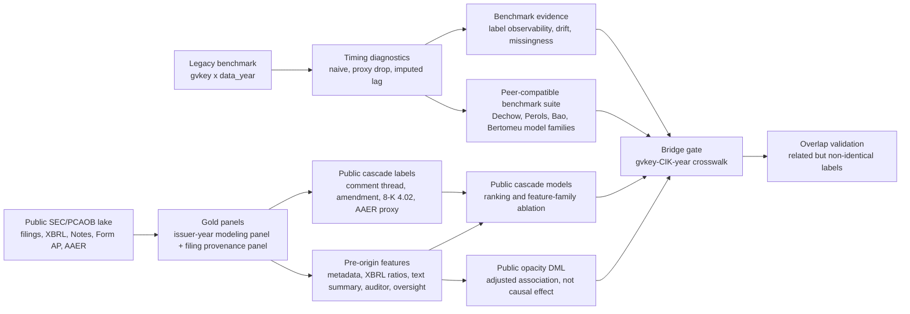
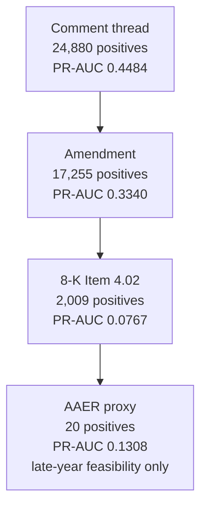
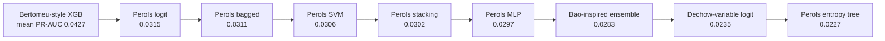

# Results Snapshot

!!! warning "Static snapshot"
    This page records the current local `artifacts/full_with_peer` run generated on
    `2026-04-26`. It is a docs-facing snapshot for inspection and GitHub Pages,
    not a substitute for rerunning the workflow. Regenerate the public lake with
    `just full mode=full dataset=raw out_dir=artifacts/full fresh_build=0 resume=1`,
    then rerun the full peer-enabled study with `just task study raw
    artifacts/full_with_peer extra="--peer-comparison-mode full --parallel-jobs 2
    --model-threads 4 --seed-policy task-isolated"` before updating these
    numbers.

## Run Metadata

| Field | Value |
| --- | --- |
| Study manifest timestamp | `2026-04-26T11:49:59+00:00` |
| Runtime | `parallel_jobs=2`, `model_threads=4`, `seed_policy=task-isolated` |
| Benchmark input | `data/raw_dataset_misstatement.parquet` |
| Public issuer panel | `data/public_lake/gold/issuer_origin_panel.parquet` |
| Public filing panel | `data/public_lake/gold/filing_origin_panel.parquet` |
| Bridge crosswalk | `data/external/gvkey_cik_year.csv` |
| Peer comparison | `full`, benchmark-only PR1 suite |

## Evidence Map

## Table 1. Public Lake and Gold Panel Scale

| Layer | Artifact | Rows | Notes |
| --- | --- | ---: | --- |
| Bronze | public source cache | 206 files | SEC, PCAOB, FSDS, Notes, AAER |
| Silver | `filing_dim.parquet` | 21,743,433 | normalized public filing index |
| Silver | `issuer_dim.parquet` | 966,095 | normalized issuer dimension |
| Silver | `xbrl_core_fact/` | 18,010,256 | controlled XBRL core tags only |
| Silver | `xbrl_fact_summary.parquet` | 362,013 | accession-level fact coverage |
| Silver | `note_summary.parquet` | 345,490 | Notes summary mode, no raw text blobs |
| Silver | `comment_thread.csv.gz` | 125,266 | public SEC comment-thread signal |
| Silver | `correction_event.csv.gz` | 89,926 | amended-filing/correction signal |
| Gold | `issuer_origin_panel.parquet` | 205,831 | annual modeling panel with labels and features |
| Gold | `filing_origin_panel.parquet` | 21,743,433 | lightweight filing-origin provenance panel |

The Gold design is intentionally asymmetric. The annual `issuer_origin_panel`
is the modeling table. The full `filing_origin_panel` preserves filing-origin
coverage and auditability, but it is not a 21.7 million-row fully labeled
modeling table.

## Table 2. Public Cascade Readiness

| Field | Value |
| --- | --- |
| Main sample rows | 90,445 |
| Fiscal-year span | 2011-2023 |
| Domestic US GAAP only | `True` |
| Zero-positive tasks | none |
| Task status counts | `fit=520`, `skipped_one_class_train=120` |
| Readiness level | `xbrl_ratio_baseline` |
| Best equal-task configuration | `all + rolling_5y` |
| Best equal-task mean PR-AUC | 0.2475 |

| Feature family | Features | XBRL ratio features | XBRL coverage features | Best window | Mean PR-AUC |
| --- | ---: | ---: | ---: | --- | ---: |
| all | 78 | 11 | 15 | rolling_5y | 0.2475 |
| metadata | 27 | 0 | 0 | rolling_5y | 0.2297 |
| xbrl | 42 | 11 | 15 | expanding | 0.1732 |
| auditor | 6 | 0 | 0 | rolling_5y | 0.1385 |
| oversight | 1 | 0 | 0 | expanding | 0.1225 |

Interpretation: feature fusion is useful, but the increment over metadata is
moderate rather than decisive. XBRL ratios are now present and nonzero, which
clears the implementation gate, but XBRL alone is not the dominant feature
family in this run.

## Figure 1. Public Cascade Signal Gradient

| Task | Positives | Mean fitted test prevalence | Mean PR-AUC | Mean ROC-AUC | Fitted years | Interpretation |
| --- | ---: | ---: | ---: | ---: | ---: | --- |
| `comment_thread` | 24,880 | 0.2615 | 0.4484 | 0.7105 | 8 | strongest public scrutiny signal |
| `amendment` | 17,255 | 0.1552 | 0.3340 | 0.7176 | 8 | clear correction/friction signal |
| `8k_402` | 2,009 | 0.0221 | 0.0767 | 0.7768 | 8 | rare but rankable severe correction signal |
| `aaer_proxy` | 20 | 0.0013 | 0.1308 | 0.7584 | 2 | feasibility signal only, not a stable claim |

The public cascade result supports a measurable public reporting-risk state.
It does not support a claim that the model recovers latent true fraud.

`Prevalence` is the fitted test-set positive rate. For PR-AUC, prevalence is
the random-ranking baseline, so PR-AUC must be read relative to each task's base
rate. This is why rare tasks can show low PR-AUC and still carry ranking signal.
The reported `0.2475` is an equal-task mean over four public labels; it is not a
single fraud-model headline score.

## Table 3. Benchmark Timing Diagnostics

| Label mode | Best window | PR-AUC | Top-100 precision | Bao NDCG@1% | Mean retained positive share |
| --- | --- | ---: | ---: | ---: | ---: |
| `naive` | rolling_5y | 0.0729 | 0.0879 | 0.1606 | 1.000 |
| `proxy_imputed_lag_1y` | rolling_5y | 0.0451 | 0.0621 | 0.0952 | 0.897 |
| `proxy_imputed_lag_2y` | expanding | 0.0394 | 0.0543 | 0.0762 | 0.805 |
| `proxy_imputed_lag_3y` | expanding | 0.0340 | 0.0471 | 0.0543 | 0.696 |
| `proxy_imputed_lag_5y` | expanding | 0.0322 | 0.0379 | 0.0505 | 0.425 |
| `proxy_drop_observed` | rolling_7y | 0.0229 | 0.0243 | 0.0265 | 0.052 |

Benchmark panel:

| Field | Value |
| --- | ---: |
| Rows | 82,908 |
| Firms | 9,156 |
| Years | 2001-2019 |
| Positive rows | 2,460 |
| Positive rate | 0.0297 |
| Same-row positives with any `res_an*` | 151 |
| Same-row positives without any `res_an*` | 2,309 |

The timing grid is a sensitivity design, not a recovery of true detection dates.
The naive label looks stronger, but the estimated ranking weakens as the label
is constrained by visibility assumptions. The `proxy_drop_observed` row is a
stress test with severe positive-class attrition; it should not be read as a
standalone proof of look-ahead bias.

Benchmark and public-cascade prediction rows use annual out-of-time
rolling/expanding splits, not random cross-validation. Double / Debiased Machine
Learning (DML) opacity rows use cross-fitting internally for nuisance models and
are reported as adjusted associations rather than prediction leaderboard
results.

## Figure 2. Timing-Sensitivity Pattern

## Peer-Compatible Literature Benchmarks

The peer suite is a benchmark-only comparison layer. It transfers model families
and metric language from the prior literature to the repo-native legacy
benchmark folds; it is not an original-paper numeric replication and not a
same-estimand leaderboard. Metrics below summarize all fitted task-fold rows in
`legacy_model_family_metrics.csv`.

Metric coverage is complete for the implemented PR1 contract:

- Sample and prevalence fields: `n_train`, `n_test`, `n_pos_test`, `prevalence`.
- Discrimination: `roc_auc`, `pr_auc`.
- Calibration: `brier`, `brier_skill_score`, equal-width `ece`, equal-mass
  `ece_quantile`, and `ece_method`.
- Fixed top-k ranking: `top_50_precision`, `top_100_precision`,
  `top_200_precision`.
- Bao-style ranking at each of top 1%, 2%, 3%, 4%, and 5%:
  `k`, `precision`, `sensitivity`, `specificity`, `bac`, and `ndcg`.
- Design fields: `input_kind`, `imbalance_strategy`, `calibration_method`,
  `calibration_warning`, and `mapping_attrition_rate`.

## Table 4. Peer Suite Status and Mapping

| Model | Literature anchor | Total tasks | Fit tasks | Skipped tasks | Mapping quality | Imbalance strategy |
| --- | --- | ---: | ---: | ---: | --- | --- |
| `bertomeu_style_xgb` | Bertomeu-style interpretable ML | 336 | 336 | 0 | full | none |
| `perols_logit` | Perols logistic regression | 336 | 336 | 0 | full | undersample_equal |
| `perols_bagged` | Perols bagging family | 336 | 336 | 0 | full | undersample_equal |
| `perols_linear_svm` | Perols SVM family | 336 | 336 | 0 | full | undersample_equal |
| `perols_stacking` | Perols stacking family | 336 | 336 | 0 | full | undersample_equal |
| `perols_mlp` | Perols neural-network family | 336 | 336 | 0 | full | undersample_equal |
| `bao_inspired_tree_ensemble` | Bao-style ensemble language | 336 | 336 | 0 | insufficient | none |
| `dechow_variable_logit` | Dechow-family logit variables | 336 | 336 | 0 | insufficient | class_weight_balanced |
| `perols_entropy_tree` | Perols decision-tree family | 336 | 336 | 0 | full | undersample_equal |
| `dechow_fixed_fscore_model1` | Dechow fixed F-score model 1 | 336 | 0 | 336 | skipped | none |

`dechow_fixed_fscore_model1` is deliberately skipped. The fixed published
coefficient implementation requires full mapping quality; the current benchmark
variables are close enough for `dechow_variable_logit` but not for a faithful
fixed-coefficient F-score claim. The Bao adapter is likewise named
`bao_inspired_tree_ensemble`, not `bao_style_ensemble`, because the legacy
benchmark panel is an engineered mixed-input table rather than a raw accounting
numbers table.

## Figure 3. Peer Model Mean PR-AUC Ranking

## Table 5. Peer Model Metrics

All entries are model-level means across fitted rows, except `max_pr_auc` and
`max_roc_auc`, which report the best single task-fold row for that model.

| Model | Rows | Mean train N | Mean test N | Mean test positives | Mean prevalence | ROC-AUC | PR-AUC | Brier | BSS | ECE | ECE quantile | Top-50 precision | Top-100 precision | Top-200 precision | Max PR-AUC | Max ROC-AUC |
| --- | ---: | ---: | ---: | ---: | ---: | ---: | ---: | ---: | ---: | ---: | ---: | ---: | ---: | ---: | ---: | ---: |
| `bertomeu_style_xgb` | 336 | 36,136.8 | 3,900.6 | 64.9 | 0.0164 | 0.6601 | 0.0427 | 0.0162 | -0.0053 | 0.0097 | 0.0110 | 0.0658 | 0.0548 | 0.0469 | 0.1710 | 0.8371 |
| `perols_logit` | 336 | 36,136.8 | 3,900.6 | 64.9 | 0.0164 | 0.6156 | 0.0315 | 0.1775 | -10.8599 | 0.3058 | 0.3073 | 0.0452 | 0.0419 | 0.0378 | 0.0759 | 0.7619 |
| `perols_bagged` | 336 | 36,136.8 | 3,900.6 | 64.9 | 0.0164 | 0.6271 | 0.0311 | 0.1809 | -11.2817 | 0.3665 | 0.3667 | 0.0429 | 0.0406 | 0.0365 | 0.0868 | 0.8468 |
| `perols_linear_svm` | 336 | 36,136.8 | 3,900.6 | 64.9 | 0.0164 | 0.6130 | 0.0306 | 0.1862 | -11.5721 | 0.3935 | 0.3934 | 0.0453 | 0.0426 | 0.0366 | 0.0745 | 0.7553 |
| `perols_stacking` | 336 | 36,136.8 | 3,900.6 | 64.9 | 0.0164 | 0.6075 | 0.0302 | 0.1967 | -12.2079 | 0.4112 | 0.4112 | 0.0432 | 0.0394 | 0.0358 | 0.0708 | 0.7743 |
| `perols_mlp` | 336 | 36,136.8 | 3,900.6 | 64.9 | 0.0164 | 0.5888 | 0.0297 | 0.2022 | -12.8796 | 0.3676 | 0.3677 | 0.0405 | 0.0371 | 0.0334 | 0.0716 | 0.7367 |
| `bao_inspired_tree_ensemble` | 336 | 36,136.8 | 3,900.6 | 64.9 | 0.0164 | 0.6251 | 0.0283 | 0.0165 | -0.0235 | 0.0118 | 0.0136 | 0.0332 | 0.0334 | 0.0327 | 0.0628 | 0.7887 |
| `dechow_variable_logit` | 336 | 36,136.8 | 3,900.6 | 64.9 | 0.0164 | 0.5225 | 0.0235 | 0.2466 | -15.5804 | 0.4732 | 0.4732 | 0.0332 | 0.0282 | 0.0231 | 0.0672 | 0.6058 |
| `perols_entropy_tree` | 336 | 36,136.8 | 3,900.6 | 64.9 | 0.0164 | 0.5810 | 0.0227 | 0.2245 | -14.1770 | 0.3565 | 0.3565 | 0.0298 | 0.0291 | 0.0287 | 0.0444 | 0.7981 |

The calibration rows should be read with the imbalance design in mind.
Perols-style full-mode models use equal positive/negative undersampling in
training and are evaluated on untouched test folds. Their Brier and ECE values
are diagnostic, not probability-calibration claims.

## Table 6. Best Peer Task-Fold Rows

| Model | Label mode | Train window | Test year | Input kind | N train | N test | N positive test | Prevalence | ROC-AUC | PR-AUC | Brier | BSS | ECE | ECE quantile | ECE method | Top-50 | Top-100 | Top-200 | Imbalance | Calibration | Warning | Mapping attrition |
| --- | --- | --- | ---: | --- | ---: | ---: | ---: | ---: | ---: | ---: | ---: | ---: | ---: | ---: | --- | ---: | ---: | ---: | --- | --- | --- | ---: |
| `bertomeu_style_xgb` | naive | rolling_5y | 2014 | mixed | 18,702 | 3,782 | 61 | 0.0161 | 0.7537 | 0.1710 | 0.0148 | 0.0672 | 0.0057 | 0.0053 | uniform_width_and_quantile | 0.2800 | 0.1800 | 0.1050 | none | native_or_class_weighted | false | 0.0000 |
| `perols_logit` | naive | rolling_7y | 2017 | mixed | 26,477 | 3,876 | 42 | 0.0108 | 0.7400 | 0.0759 | 0.2290 | -20.3685 | 0.4059 | 0.4059 | uniform_width_and_quantile | 0.1200 | 0.0700 | 0.0600 | undersample_equal | none_after_undersampling | true | 0.0000 |
| `perols_bagged` | naive | expanding | 2019 | mixed | 79,206 | 3,702 | 33 | 0.0089 | 0.8293 | 0.0868 | 0.1615 | -17.2748 | 0.3692 | 0.3692 | uniform_width_and_quantile | 0.1600 | 0.1000 | 0.0600 | undersample_equal | none_after_undersampling | true | 0.0000 |
| `perols_linear_svm` | naive | rolling_5y | 2010 | mixed | 22,021 | 3,742 | 79 | 0.0211 | 0.6587 | 0.0745 | 0.2308 | -10.1658 | 0.4534 | 0.4533 | uniform_width_and_quantile | 0.1600 | 0.1200 | 0.0800 | undersample_equal | none_after_undersampling | true | 0.0000 |
| `perols_stacking` | naive | rolling_10y | 2009 | mixed | 41,140 | 3,831 | 74 | 0.0193 | 0.6517 | 0.0708 | 0.1988 | -9.4962 | 0.4189 | 0.4189 | uniform_width_and_quantile | 0.1000 | 0.0700 | 0.0550 | undersample_equal | none_after_undersampling | true | 0.0000 |
| `perols_mlp` | naive | rolling_7y | 2009 | mixed | 35,311 | 3,831 | 74 | 0.0193 | 0.6644 | 0.0716 | 0.1561 | -7.2427 | 0.3266 | 0.3266 | uniform_width_and_quantile | 0.1200 | 0.0700 | 0.0600 | undersample_equal | none_after_undersampling | true | 0.0000 |
| `bao_inspired_tree_ensemble` | naive | rolling_10y | 2006 | mixed | 28,299 | 5,093 | 143 | 0.0281 | 0.6856 | 0.0628 | 0.0279 | -0.0232 | 0.0250 | 0.0250 | uniform_width_and_quantile | 0.0600 | 0.0800 | 0.1000 | none | native_or_class_weighted | false | 0.0000 |
| `dechow_variable_logit` | proxy_imputed_lag_1y | rolling_5y | 2009 | ratios | 23,636 | 3,831 | 74 | 0.0193 | 0.5688 | 0.0672 | 0.2320 | -11.2476 | 0.4579 | 0.4579 | uniform_width_and_quantile | 0.1200 | 0.0800 | 0.0500 | class_weight_balanced | native_or_class_weighted | false | 0.0000 |
| `perols_entropy_tree` | proxy_imputed_lag_2y | expanding | 2015 | mixed | 63,624 | 3,912 | 58 | 0.0148 | 0.6852 | 0.0444 | 0.1600 | -9.9542 | 0.3237 | 0.3237 | uniform_width_and_quantile | 0.1200 | 0.0700 | 0.0600 | undersample_equal | none_after_undersampling | true | 0.0000 |

## Table 7. Bao-Style Top-Fraction Ranking Metrics

Rows are model-level means across all fitted task-fold rows. Each fraction
reports all Bao-style metrics implemented by the repo: cutoff `k`, precision,
sensitivity, specificity, balanced accuracy (`bac`), and NDCG.

| Model | Fraction | Mean k | Precision | Sensitivity | Specificity | BAC | NDCG |
| --- | --- | ---: | ---: | ---: | ---: | ---: | ---: |
| `bertomeu_style_xgb` | top_1pct | 39.0 | 0.0702 | 0.0433 | 0.9906 | 0.5169 | 0.0800 |
| `bertomeu_style_xgb` | top_2pct | 78.1 | 0.0583 | 0.0725 | 0.9808 | 0.5267 | 0.0793 |
| `bertomeu_style_xgb` | top_3pct | 116.9 | 0.0525 | 0.0991 | 0.9711 | 0.5351 | 0.0937 |
| `bertomeu_style_xgb` | top_4pct | 155.9 | 0.0495 | 0.1249 | 0.9614 | 0.5431 | 0.1085 |
| `bertomeu_style_xgb` | top_5pct | 195.1 | 0.0472 | 0.1492 | 0.9515 | 0.5504 | 0.1218 |
| `perols_logit` | top_1pct | 39.0 | 0.0463 | 0.0287 | 0.9903 | 0.5095 | 0.0489 |
| `perols_logit` | top_2pct | 78.1 | 0.0430 | 0.0535 | 0.9805 | 0.5170 | 0.0541 |
| `perols_logit` | top_3pct | 116.9 | 0.0415 | 0.0777 | 0.9708 | 0.5242 | 0.0679 |
| `perols_logit` | top_4pct | 155.9 | 0.0394 | 0.0988 | 0.9610 | 0.5299 | 0.0800 |
| `perols_logit` | top_5pct | 195.1 | 0.0380 | 0.1196 | 0.9511 | 0.5354 | 0.0914 |
| `perols_bagged` | top_1pct | 39.0 | 0.0426 | 0.0271 | 0.9903 | 0.5087 | 0.0433 |
| `perols_bagged` | top_2pct | 78.1 | 0.0406 | 0.0508 | 0.9805 | 0.5156 | 0.0491 |
| `perols_bagged` | top_3pct | 116.9 | 0.0397 | 0.0744 | 0.9708 | 0.5226 | 0.0624 |
| `perols_bagged` | top_4pct | 155.9 | 0.0381 | 0.0954 | 0.9609 | 0.5282 | 0.0746 |
| `perols_bagged` | top_5pct | 195.1 | 0.0367 | 0.1152 | 0.9510 | 0.5331 | 0.0854 |
| `perols_linear_svm` | top_1pct | 39.0 | 0.0463 | 0.0279 | 0.9903 | 0.5091 | 0.0476 |
| `perols_linear_svm` | top_2pct | 78.1 | 0.0427 | 0.0523 | 0.9805 | 0.5164 | 0.0517 |
| `perols_linear_svm` | top_3pct | 116.9 | 0.0411 | 0.0767 | 0.9708 | 0.5237 | 0.0654 |
| `perols_linear_svm` | top_4pct | 155.9 | 0.0386 | 0.0962 | 0.9609 | 0.5286 | 0.0767 |
| `perols_linear_svm` | top_5pct | 195.1 | 0.0366 | 0.1147 | 0.9510 | 0.5328 | 0.0867 |
| `perols_stacking` | top_1pct | 39.0 | 0.0424 | 0.0259 | 0.9903 | 0.5081 | 0.0454 |
| `perols_stacking` | top_2pct | 78.1 | 0.0413 | 0.0513 | 0.9805 | 0.5159 | 0.0508 |
| `perols_stacking` | top_3pct | 116.9 | 0.0395 | 0.0735 | 0.9707 | 0.5221 | 0.0635 |
| `perols_stacking` | top_4pct | 155.9 | 0.0374 | 0.0934 | 0.9609 | 0.5272 | 0.0749 |
| `perols_stacking` | top_5pct | 195.1 | 0.0360 | 0.1128 | 0.9510 | 0.5319 | 0.0855 |
| `perols_mlp` | top_1pct | 39.0 | 0.0426 | 0.0259 | 0.9903 | 0.5081 | 0.0491 |
| `perols_mlp` | top_2pct | 78.1 | 0.0389 | 0.0477 | 0.9804 | 0.5141 | 0.0516 |
| `perols_mlp` | top_3pct | 116.9 | 0.0363 | 0.0671 | 0.9707 | 0.5189 | 0.0623 |
| `perols_mlp` | top_4pct | 155.9 | 0.0348 | 0.0857 | 0.9608 | 0.5232 | 0.0731 |
| `perols_mlp` | top_5pct | 195.1 | 0.0333 | 0.1025 | 0.9508 | 0.5266 | 0.0824 |
| `bao_inspired_tree_ensemble` | top_1pct | 39.0 | 0.0330 | 0.0206 | 0.9902 | 0.5054 | 0.0317 |
| `bao_inspired_tree_ensemble` | top_2pct | 78.1 | 0.0339 | 0.0425 | 0.9803 | 0.5114 | 0.0388 |
| `bao_inspired_tree_ensemble` | top_3pct | 116.9 | 0.0333 | 0.0627 | 0.9706 | 0.5166 | 0.0503 |
| `bao_inspired_tree_ensemble` | top_4pct | 155.9 | 0.0328 | 0.0828 | 0.9607 | 0.5218 | 0.0618 |
| `bao_inspired_tree_ensemble` | top_5pct | 195.1 | 0.0325 | 0.1028 | 0.9508 | 0.5268 | 0.0728 |
| `dechow_variable_logit` | top_1pct | 39.0 | 0.0341 | 0.0214 | 0.9902 | 0.5058 | 0.0394 |
| `dechow_variable_logit` | top_2pct | 78.1 | 0.0313 | 0.0387 | 0.9803 | 0.5095 | 0.0406 |
| `dechow_variable_logit` | top_3pct | 116.9 | 0.0270 | 0.0495 | 0.9704 | 0.5099 | 0.0465 |
| `dechow_variable_logit` | top_4pct | 155.9 | 0.0243 | 0.0592 | 0.9604 | 0.5098 | 0.0522 |
| `dechow_variable_logit` | top_5pct | 195.1 | 0.0230 | 0.0700 | 0.9503 | 0.5102 | 0.0582 |
| `perols_entropy_tree` | top_1pct | 39.0 | 0.0313 | 0.0194 | 0.9902 | 0.5048 | 0.0369 |
| `perols_entropy_tree` | top_2pct | 78.1 | 0.0298 | 0.0370 | 0.9803 | 0.5087 | 0.0392 |
| `perols_entropy_tree` | top_3pct | 116.9 | 0.0292 | 0.0539 | 0.9704 | 0.5122 | 0.0488 |
| `perols_entropy_tree` | top_4pct | 155.9 | 0.0291 | 0.0718 | 0.9605 | 0.5162 | 0.0592 |
| `perols_entropy_tree` | top_5pct | 195.1 | 0.0283 | 0.0877 | 0.9506 | 0.5191 | 0.0679 |

## Table 8. Peer Imbalance and Feature-Importance Diagnostics

| Model | Imbalance strategy | Rows | Mean train N before | Mean positives before | Mean train N after | Mean positives after | Mean test prevalence |
| --- | --- | ---: | ---: | ---: | ---: | ---: | ---: |
| `bertomeu_style_xgb` | none | 336 | 36,136.8 | 839.7 | 36,136.8 | 839.7 | 0.0164 |
| `perols_logit` | undersample_equal | 336 | 36,136.8 | 839.7 | 1,679.5 | 839.7 | 0.0164 |
| `perols_bagged` | undersample_equal | 336 | 36,136.8 | 839.7 | 1,679.5 | 839.7 | 0.0164 |
| `perols_linear_svm` | undersample_equal | 336 | 36,136.8 | 839.7 | 1,679.5 | 839.7 | 0.0164 |
| `perols_stacking` | undersample_equal | 336 | 36,136.8 | 839.7 | 1,679.5 | 839.7 | 0.0164 |
| `perols_mlp` | undersample_equal | 336 | 36,136.8 | 839.7 | 1,679.5 | 839.7 | 0.0164 |
| `bao_inspired_tree_ensemble` | none | 336 | 36,136.8 | 839.7 | 36,136.8 | 839.7 | 0.0164 |
| `dechow_variable_logit` | class_weight_balanced | 336 | 36,136.8 | 839.7 | 36,136.8 | 839.7 | 0.0164 |
| `perols_entropy_tree` | undersample_equal | 336 | 36,136.8 | 839.7 | 1,679.5 | 839.7 | 0.0164 |

| Model | Importance type | Importance rows |
| --- | --- | ---: |
| `bertomeu_style_xgb` | feature_importance | 34,560 |
| `perols_logit` | absolute_coefficient | 34,560 |
| `perols_bagged` | mean_bagged_feature_importance | 34,560 |
| `perols_stacking` | mean_bagged_feature_importance | 34,560 |
| `bao_inspired_tree_ensemble` | feature_importance | 6,384 |
| `dechow_variable_logit` | absolute_coefficient | 3,024 |
| `perols_entropy_tree` | feature_importance | 34,560 |

Feature importance is available where the fitted model family exposes a stable
importance or coefficient surface. The SVM and MLP adapters are included in the
performance comparison but do not emit comparable feature-importance rows.

## Table 9. Opacity and Missingness Diagnostics

| Layer | Outcome | N | Prevalence | Treatment | Coef. | SE | p-value | Interpretation |
| --- | --- | ---: | ---: | --- | ---: | ---: | ---: | --- |
| public cascade | `comment_thread` | 90,429 | 0.2751 | `missingness_density_score` | -0.0242 | 0.0955 | 0.8002 | no adjusted association in this run |
| public cascade | `amendment` | 90,429 | 0.1908 | `missingness_density_score` | -0.0467 | 0.0819 | 0.5688 | no adjusted association in this run |
| public cascade | `8k_402` | 90,429 | 0.0222 | `missingness_density_score` | -0.0114 | 0.0312 | 0.7141 | no adjusted association in this run |
| legacy benchmark | `misstatement firm-year` | 82,908 | 0.0297 | `missingness_density_score` | 0.0028 | 0.0053 | 0.5925 | legacy diagnostic only |

These Double / Debiased Machine Learning (DML) estimates are high-dimensional
adjusted associations, not causal effects. The current public-label results do
not support a strong strategic-silence claim.

## Table 10. Bridge and Construct-Overlap Gate

| Field | Value |
| --- | ---: |
| Bridge probe status | `external_crosswalk_available` |
| Raw benchmark rows | 82,908 |
| Raw benchmark firms | 9,156 |
| Candidate crosswalk rows | 81,825 |
| Matched raw rows | 81,218 |
| Row coverage rate | 0.9796 |
| Matched raw firms | 9,075 |
| Firm coverage rate | 0.9912 |
| Matched positive rows | 2,433 of 2,460 |
| Public issuer-year rows | 205,831 |
| Raw rows overlapping public issuer-years | 47,824 |
| Public-overlap rate among crosswalk candidates | 0.5888 |
| Ambiguous raw rows | 583 |

The farr-derived `gvkey-CIK-year` file moves the bridge from missing input to
high-coverage candidate bridge. It does not, by itself, complete construct
validation. The next paper-relevant step is an overlap table that compares
legacy detected-misstatement labels with public-cascade labels and rankings on
the matched issuer-year sample. WRDS remains the preferred final validation
source if available.

## Discussion

- The public-data build is now at realistic scale: more than 21.7 million public
  filing rows feed a compact annual issuer-year modeling panel.
- The primary empirical signal is strongest for public scrutiny and correction
  outcomes (`comment_thread`, `amendment`), which is consistent with the paper's
  estimand: public reporting-risk state rather than latent fraud.
- The all-feature public cascade improves over metadata, but the margin is not
  large enough to claim that XBRL ratios dominate. The defensible claim is
  feature-fusion gain with verified XBRL-ratio availability.
- The `8k_402` task is rare but rankable. The `aaer_proxy` task is too sparse
  for headline performance claims and should remain a severity-tail diagnostic.
- Benchmark results motivate timing concern: performance is materially weaker
  under visibility assumptions than under the naive final label. This is
  evidence for label fragility, not a direct estimate of true fraud occurrence.
- The peer-compatible model-family comparison is now complete. The strongest
  benchmark ranking evidence comes from `bertomeu_style_xgb`; the transferred
  Perols-family models cluster below it, and their calibration metrics are weak
  because full mode uses equal positive/negative undersampling without
  post-calibration.
- The suite is deliberately conservative about literature naming:
  `dechow_fixed_fscore_model1` is skipped rather than approximated, and the Bao
  adapter is reported as `bao_inspired_tree_ensemble` because the legacy panel is
  not a raw accounting-number input.
- Public-label opacity DML does not show a significant adjusted association in
  this run. Strategic opacity should be presented as a tested but unsupported
  mechanism unless future specifications change the evidence.
- The bridge is no longer blocked by missing identifiers, but construct overlap
  is still the main paper-readiness gate. The current candidate crosswalk is
  strong enough to run overlap validation; it is not a final WRDS-quality claim.
- Overall, the current evidence supports a reproducible measurement-and-ranking
  paper on public review-and-correction risk. It does not support causal claims,
  fraud-truth claims, or leaderboard superiority over prior fraud-prediction
  papers.

## Artifact Index

- `artifacts/full_with_peer/study_summary.md`
- `artifacts/full_with_peer/study_run_manifest.json`
- `artifacts/full_with_peer/benchmark/benchmark_summary.md`
- `artifacts/full_with_peer/benchmark/rolling_metrics.csv`
- `artifacts/full_with_peer/peer_comparison/peer_comparison_summary.md`
- `artifacts/full_with_peer/peer_comparison/legacy_model_family_metrics.csv`
- `artifacts/full_with_peer/peer_comparison/legacy_model_family_predictions.parquet`
- `artifacts/full_with_peer/peer_comparison/peer_task_status.csv`
- `artifacts/full_with_peer/peer_comparison/feature_mapping_attrition.csv`
- `artifacts/full_with_peer/peer_comparison/imbalance_strategy_report.csv`
- `artifacts/full_with_peer/peer_comparison/legacy_feature_importance.csv`
- `artifacts/full_with_peer/public_cascade/public_cascade_summary.md`
- `artifacts/full_with_peer/public_cascade/public_cascade_metrics.csv`
- `artifacts/full_with_peer/public_cascade/public_opacity_dml.csv`
- `artifacts/full_with_peer/bridge_probe/bridge_probe_summary.json`
- `artifacts/full_with_peer/bridge_probe/coverage_report.csv`
