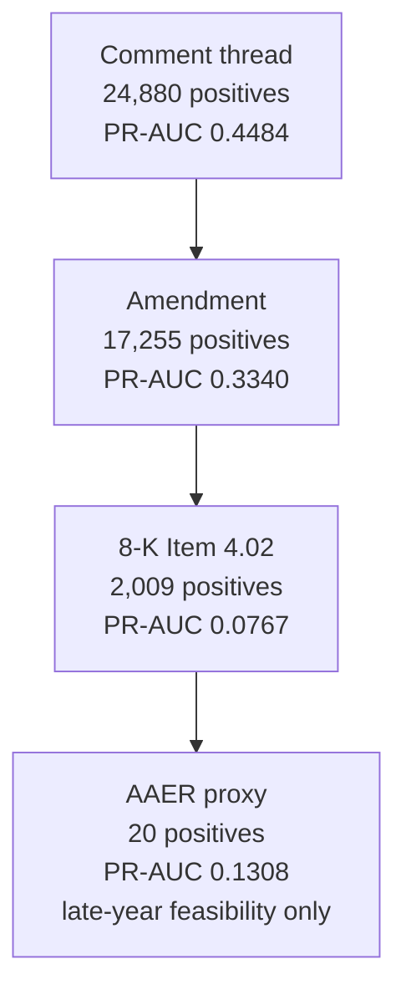
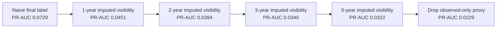
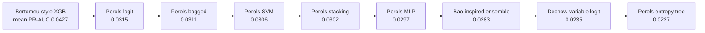
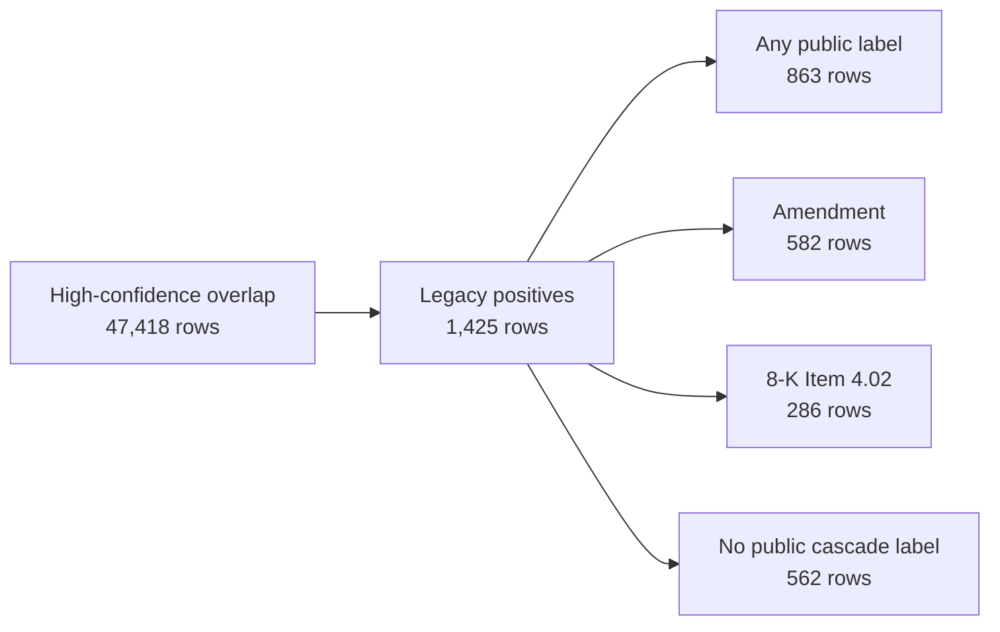

---
hide:
  - navigation
---

# Results Snapshot

## Discussion

- **Bottom line.** The current evidence supports a reproducible
  measurement-and-ranking paper on public review-and-correction risk; it does not support causal claims, claims about unobserved fraud occurrence, or same-estimand performance claims
  over prior fraud-prediction papers on their original estimands.

- **What is the empirical value of the task?** The useful object is not another
  static `misstatement = 1` classifier; it is a filing-origin estimand for
  whether an issuer later enters an observable public review or correction
  channel. That makes the task closer to the information environment faced by
  investors, auditors, researchers, and regulators at the filing date.

- **What is the main research-design decision?** The legacy
  `gvkey x data_year` benchmark is retained as a diagnostic layer, not treated
  as the sole reference construct. The public cascade is the main empirical object:
  `comment_thread` for public scrutiny, `amendment` for correction/friction,
  `8k_402` for severe material correction, and `aaer_proxy` only for sparse
  high-severity enforcement support.

- **What data are used?** The workflow combines four data layers. First, the
  legacy detected-misstatement benchmark provides 82,908 `gvkey x data_year`
  observations from 2001-2019 for timing, drift, missingness, and peer-model
  diagnostics. Second, the public SEC/PCAOB lake normalizes EDGAR filing
  metadata, FSDS/XBRL numeric facts, Notes summaries, Form AP, PCAOB inspection
  records, comment-letter correspondence, amended filings, 8-K Item 4.02 events,
  and AAER support data. Third, the gold public panels create a 205,831-row
  issuer-year modeling table and a 21.7 million-row filing provenance table;
  the main domestic public-cascade sample has 90,445 issuer-year rows from
  2011-2023. Fourth, farr support files supply the candidate `gvkey-CIK-year`
  bridge plus AAER/date support used for construct-overlap and high-severity
  checks.

- **What data matter most?** The most useful evidence comes from the public
  SEC/PCAOB issuer-year panel, especially comment threads, amendments, 8-K Item
  4.02 events, XBRL ratios, filing metadata, and auditor/oversight features. The
  farr `gvkey-CIK-year` bridge is valuable for candidate construct-overlap
  evidence; AAER support data are useful only as a sparse high-severity enforcement
  descriptor.

- **Are the legacy and public tasks the same X with different Y?** No. The
  legacy benchmark uses a `gvkey x data_year` feature table and detected
  misstatement labels; the public cascade uses a public SEC/PCAOB
  `issuer_cik x fiscal_year x origin_date` panel and later public
  review-and-correction labels. The project aligns model-family language and metrics
  across the two tasks, but it does not assume the same predictors or the same
  outcome.

- **Why not force the same X onto both Y definitions?** A same-X design is only
  defensible in the bridge-overlap subset because the grains, time origins, and
  information sets differ. Legacy variables are not always filing-origin public
  information, while public features are defined at `origin_date` and must satisfy
  pre-origin leakage guards. The paper therefore treats same-X/same-Y alignment
  as a construct-overlap validation problem, not the main supervised-learning
  design.

- **What is held constant across the legacy and public prediction exercises?**
  The project holds constant the model-family language and the evaluation
  metrics, not the feature table or the outcome. In the legacy benchmark, the
  peer suite fits Dechow-, Perols-, Bao-, and Bertomeu-style families to
  detected-misstatement labels. In the public cascade, the public peer suite fits
  the same families to filing-origin public review-and-correction labels. The
  evaluation uses a common metric vocabulary: PR-AUC, ROC-AUC, Brier/BSS, ECE,
  top-k precision, lift, and Bao-style top-fraction metrics. For accounting
  readers, this means the public estimand is translated into familiar
  fraud-prediction model and ranking language. For ML readers, this means the
  algorithm families and scoring rules are aligned while the estimand, feature
  surface, and sample remain explicitly different.

- **How should those aligned metrics be compared?** Model comparisons are valid
  within the same task, split, feature family, and label definition. They are
  not direct cross-estimand performance comparisons. A public-cascade PR-AUC
  can show that public SEC/PCAOB features rank future review-and-correction
  events; a legacy PR-AUC can show how well a model ranks detected-misstatement
  labels. The bridge and construct-overlap tables then ask whether the two
  ranking problems are empirically related.

- **Why use Parquet and the public lake?** The storage choice is part of the
  research design. Large public filing, XBRL, Notes summary, and gold-panel
  tables use Parquet so the workflow can rerun at realistic scale with typed
  columns, projection pushdown, and lower repeated I/O cost. Small diagnostics
  remain CSV/JSON/Markdown for inspection.

- **What setup choices are being compared?** The public cascade fixes the task
  definitions and varies two modeling dimensions. The task dimension covers
  `comment_thread`, `amendment`, and `8k_402` as headline labels; `aaer_proxy`
  is retained as sparse high-severity status. The feature-family dimension
  compares `metadata` (filing and issuer-origin descriptors), `xbrl` (financial
  ratios and XBRL coverage), `auditor` (Form AP and engagement features),
  `oversight` (PCAOB-style oversight exposure), and `all` (their union). The
  temporal dimension compares annual `rolling_5y`, `rolling_7y`, `rolling_10y`,
  and `expanding` train windows.

- **Are these model hyperparameters?** Mostly no. The main comparisons are
  experimental design factors: outcome definition, feature-family scope, and
  temporal training window. They determine the empirical estimand and evaluation
  design. Algorithmic hyperparameters, such as XGBoost `n_estimators=250`,
  `max_depth=4`, and `learning_rate=0.05`, are held fixed in the core
  public-cascade model so the results are interpretable as design comparisons
  rather than a tuning exercise.

- **Which design factors are studied?** The legacy benchmark varies label timing
  assumptions (`naive`, `proxy_drop_observed`, and `proxy_imputed_lag` with
  1-, 2-, 3-, and 5-year lags) and train windows (`rolling_5y`, `rolling_7y`,
  `rolling_10y`, `expanding`). The public cascade varies public-label tasks,
  feature families, and the same train-window logic. The peer suites vary model
  family and imbalance handling, while preserving the same out-of-time split
  design.

- **Why this setup design?** The split design follows the filing-origin question.
  The model trains on past fiscal years and tests on later fiscal years, so the
  evaluation reflects out-of-time prediction rather than random within-panel
  interpolation. The feature-family design separates the value of filing
  metadata, XBRL, auditor, and oversight information, while the train-window
  design asks whether recent history or longer accumulated history is more
  useful. This prevents the public-data claim from collapsing into an
  undifferentiated `all features` result.

- **Which empirical specification is strongest?** The strongest core public-cascade specification is
  `all + rolling_5y`, with equal-task mean PR-AUC `0.2475`. In the public peer
  transfer, the `all` feature family is also strongest on average
  (mean PR-AUC `0.2510`), with metadata remaining a strong baseline. The
  appropriate reading is feature-fusion gain, not XBRL dominance.

- **What models are included, and why these models?** The model set is designed
  for peer-compatible evidence rather than novelty. It includes Dechow-family
  logit/F-score language, Perols-style logit/SVM/tree/bagging/stacking/MLP
  families, Bao-inspired tree ensembles, and Bertomeu-style XGBoost. These cover
  the main model families used in accounting ML research without claiming an
  exact replication of the original papers' samples and specifications.

- **Which models perform best?** In the legacy benchmark peer suite,
  `bertomeu_style_xgb` is the strongest mean PR-AUC model (`0.0427`). In the
  public-label peer suite, `bao_inspired_tree_ensemble` and
  `bertomeu_style_xgb` lead on mean public-label PR-AUC (`0.2244` and `0.2243`).
  High single-fold `8k_402` rows are useful diagnostics, but they are not the
  stable headline result.

- **How should peer comparisons be read?** They are model-family transfer and
  metric-language alignment, not exact numeric replication of prior papers.
  Dechow fixed F-score is skipped unless mapping quality is sufficient; Bao is
  reported as `bao_inspired_tree_ensemble` because the repo panel is not the
  same raw accounting-number input used in the original setting.

- **What metrics are reported?** The snapshot reports PR-AUC, ROC-AUC, Brier,
  Brier skill, equal-width and quantile ECE, fixed top-k precision, top-decile
  lift, and Bao-style top-fraction precision, sensitivity, specificity, balanced
  accuracy, and NDCG. The goal is to show discrimination, ranking, screening,
  and calibration diagnostics while keeping their empirical questions separate.

- **Which metric is most reasonable for the headline?** PR-AUC is the primary
  headline ranking metric because the tasks are imbalanced and prevalence differs
  sharply by label. It is also more aligned with the practical question:
  whether high-scored issuer-years concentrate later public review or correction
  events.

- **Which metrics are most informative beyond PR-AUC?** Top-decile lift and
  Bao-style top-fraction metrics translate ranking into screening language.
  ROC-AUC is useful as a secondary discrimination metric. Brier and ECE are
  calibration diagnostics, especially fragile for undersampled Perols-style
  models.

- **Why not random cross-validation?** The benchmark and public-cascade
  prediction results use annual out-of-time rolling or expanding splits. That
  choice is deliberate: random folds would be a weaker design for a filing-origin
  prediction question with changing disclosure, review, and reporting regimes.

- **What is the economic interpretation?** Public reporting-risk states are
  observable and rankable at the filing origin. Comment-letter scrutiny captures
  broad public review, amendments capture correction/friction, and 8-K Item 4.02
  captures a rarer material-correction channel. Legacy misstatement positives
  overlap most strongly with serious public correction outcomes, especially
  8-K Item 4.02, but the constructs are related rather than identical.

- **What should accounting readers take away?** The paper's contribution is a
  measurement redesign: move from treating detected misstatement as the only
  target toward a filing-origin public cascade that separates public scrutiny,
  correction, severe correction, and sparse enforcement-tail evidence. The
  current bridge evidence is candidate-level under farr; WRDS-quality validation
  remains preferred before final manuscript-level integrated claims.

- **Which limitation matters most for manuscript claims?** The strongest open gate is bridge
  quality. farr provides high-coverage candidate evidence, but a WRDS or
  equivalent institutional `gvkey-CIK-year` bridge is still preferred for final
  integrated claims. AAER also remains sparse and selective, so it should stay a
  high-severity descriptor rather than a headline prediction target.

## Run Metadata

| Field | Value |
| --- | --- |
| Study manifest timestamp | `2026-04-27T02:27:29+00:00` |
| Construct-overlap timestamp | `2026-04-27T02:56:13+00:00` |
| Runtime | `parallel_jobs=4`, `model_threads=2`, `seed_policy=task-isolated` |
| Benchmark input | `$DATA_DIR/raw_dataset_misstatement.parquet` |
| Public issuer panel | `$DATA_DIR/public_lake/gold/issuer_origin_panel.parquet` |
| Public filing panel | `$DATA_DIR/public_lake/gold/filing_origin_panel.parquet` |
| Bridge crosswalk | `$DATA_DIR/external/gvkey_cik_year.csv` |
| Construct overlap | `complete`, `validation_tier=candidate_farr` |
| Peer comparison | `full`, legacy peer suite plus public-label peer suite |

Key readings:

- This page is a static documentation snapshot, not a live recomputation of the
  workflow.
- The snapshot is based on the peer-enabled study directory,
  `artifacts/full_with_peer`.
- The run includes the legacy benchmark, public cascade, bridge probe,
  legacy-peer suite, public-label peer suite, and construct-overlap validation.
- Construct overlap is complete under the farr candidate bridge; this is not yet
  WRDS-verified manuscript-grade bridge evidence.

## Evidence Map

```mermaid
flowchart LR
    subgraph LEGACY["Legacy benchmark evidence: external benchmark, not SEC/PCAOB public lake"]
        L0["Legacy input<br/>$DATA_DIR/raw_dataset_misstatement.parquet<br/>82,908 gvkey x data_year rows<br/>9,156 firms, 2001-2019"]
        L1["Legacy X<br/>engineered accounting, audit, governance,<br/>market, industry, and missingness predictors<br/>exclude ids, labels, res_an*, post-outcome fields"]
        L2["Legacy Y<br/>detected misstatement firm-year<br/>naive, proxy_drop_observed,<br/>proxy_imputed_lag 1/2/3/5y<br/>external_timing not available in this run"]
        L3["Legacy model loops<br/>annual out-of-time test years<br/>rolling_5y, rolling_7y, rolling_10y, expanding<br/>core benchmark plus peer-compatible legacy suite<br/>Dechow / Perols / Bao / Bertomeu families"]
        L4["Legacy metrics<br/>PR-AUC relative to prevalence, ROC-AUC,<br/>Brier/BSS, ECE, top-50/100/200 precision,<br/>Bao top-fraction precision, sensitivity, BAC, NDCG"]
        L5["Legacy reading<br/>timing-sensitive diagnostic benchmark<br/>useful for fragility, drift, and peer compatibility<br/>not a final standard for unobserved fraud occurrence"]
        L0 --> L1
        L0 --> L2
        L1 --> L3
        L2 --> L3
        L3 --> L4
        L4 --> L5
    end

    subgraph PUBLIC["Public filing-origin cascade evidence: SEC/PCAOB public information set"]
        P0["Public inputs<br/>EDGAR filings, FSDS/XBRL, Notes summaries,<br/>comment letters, amendments, 8-K Item 4.02,<br/>PCAOB Form AP, PCAOB inspections, AAER support<br/>as-of 2026-04-23"]
        P1["Parquet public lake<br/>21,743,433 filing provenance rows<br/>205,831 issuer-year rows<br/>90,445 domestic U.S. GAAP main-sample rows<br/>public fiscal years 2011-2023"]
        P2["Public modeling grain<br/>issuer_cik x fiscal_year<br/>origin_date is selected annual filing date<br/>public_issuer_origin input"]
        P3["Public X<br/>metadata, XBRL ratios, auditor, oversight, all<br/>rolling public history requires event_date < origin_date<br/>exclude source_available_*, public_date_*, vintage_* fields"]
        P4["Public Y<br/>label_comment_thread_365: SEC comment-thread scrutiny<br/>label_amendment_365: amended filing or filing friction<br/>label_8k_402_365: Item 4.02 non-reliance<br/>label_aaer_proxy_730: sparse high-severity AAER proxy"]
        P5["Public cascade loops<br/>annual out-of-time fiscal-year tests<br/>rolling/expanding train windows<br/>feature-family ablation<br/>best equal-task setup: all + rolling_5y<br/>mean PR-AUC 0.2475"]
        P6["Peer-compatible public-label suite<br/>same Dechow / Perols / Bao / Bertomeu families<br/>run on public estimand and public_issuer_origin input<br/>Bao emitted as bao_inspired_tree_ensemble"]
        P7["Public metrics<br/>same metric vocabulary where defined<br/>PR-AUC vs prevalence, ROC-AUC, Brier/BSS, ECE,<br/>top-50/100/200 precision, top-decile lift,<br/>Bao-style top-fraction metrics"]
        P8["Public reading<br/>measurable filing-origin review-and-correction signal<br/>feature fusion helps over metadata baseline<br/>not a performance ranking on the legacy fraud-prediction estimand"]
        P9["Public opacity DML<br/>missingness_density_score to public labels<br/>cross-fitted nuisance models<br/>adjusted association, not causal effect"]
        P0 --> P1
        P1 --> P2
        P2 --> P3
        P2 --> P4
        P3 --> P5
        P4 --> P5
        P3 --> P6
        P4 --> P6
        P5 --> P7
        P6 --> P7
        P7 --> P8
        P3 --> P9
    end

    subgraph VALIDATION["Bridge and construct-overlap evidence"]
        V0["Bridge gate<br/>farr gvkey-CIK-year candidate crosswalk<br/>raw-row coverage 97.96%, firm coverage 99.12%<br/>WRDS preferred for final manuscript validation"]
        V1["Construct-overlap validation<br/>complete under validation_tier=candidate_farr<br/>47,418 high-confidence overlap rows<br/>contingency, lift, reciprocal alignment,<br/>event-time concentration, AAER high-severity support"]
        V2["Current integrated reading<br/>legacy positives are enriched in serious public labels<br/>public and legacy scores reciprocally rank severe outcomes<br/>constructs are related but non-identical"]
        V3["Claim boundary<br/>candidate bridge evidence strengthens construct validity<br/>but does not identify unobserved fraud occurrence,<br/>causal effects, or WRDS-grade final validation"]
        V0 --> V1
        V1 --> V2
        V2 --> V3
    end

    L5 --> V0
    P8 --> V0
    P9 --> V0
```

Key readings:

- The left branch diagnoses legacy detected-misstatement labels; the right branch
  builds the public filing-origin cascade.
- The map is workflow-level: each model node expands into task, feature-family,
  train-window, test-year, and model-family loops in the artifacts.
- Peer-compatible model families are evaluated on both the legacy and public
  estimands, but these are not same-label performance comparisons.
- The bridge gate is what lets the paper test whether old and public labels are
  related without treating them as identical.

## Table 1. Public Lake and Gold Panel Scale

| Layer | Artifact | Rows | Notes |
| --- | --- | ---: | --- |
| Bronze | public source cache | 206 files | SEC, PCAOB, FSDS, Notes, AAER |
| Silver | `filing_dim.parquet` | 21,743,433 | normalized public filing index |
| Silver | `issuer_dim.parquet` | 966,095 | normalized issuer dimension |
| Silver | `xbrl_core_fact/` | 18,010,256 | controlled XBRL core tags only |
| Silver | `xbrl_fact_summary.parquet` | 362,013 | accession-level fact coverage |
| Silver | `note_summary.parquet` | 345,490 | Notes summary mode, no raw text blobs |
| Silver | `comment_thread.csv.gz` | 125,266 | public SEC comment-thread signal |
| Silver | `correction_event.csv.gz` | 89,926 | amended-filing/correction signal |
| Gold | `issuer_origin_panel.parquet` | 205,831 | annual modeling panel with labels and features |
| Gold | `filing_origin_panel.parquet` | 21,743,433 | lightweight filing-origin provenance panel |

Key readings:

- The public lake is at realistic scale: more than 21.7 million normalized
  filing-origin rows support a compact annual issuer-year panel.
- The annual `issuer_origin_panel` is the modeling table; the full
  `filing_origin_panel` is a provenance and auditability layer.
- Notes are in summary mode, so the run avoids raw text blobs while retaining
  filing-level text-count signals.

## Table 2. Public Cascade Readiness

| Field | Value |
| --- | --- |
| Main sample rows | 90,445 |
| Fiscal-year span | 2011-2023 |
| Domestic US GAAP only | `True` |
| Zero-positive tasks | none |
| Task status counts | `fit=520`, `skipped_one_class_train=120` |
| Readiness level | `xbrl_ratio_baseline` |
| Best equal-task configuration | `all + rolling_5y` |
| Best equal-task mean PR-AUC | 0.2475 |

| Feature family | Features | XBRL ratio features | XBRL coverage features | Best window | Mean PR-AUC |
| --- | ---: | ---: | ---: | --- | ---: |
| all | 78 | 11 | 15 | rolling_5y | 0.2475 |
| metadata | 27 | 0 | 0 | rolling_5y | 0.2297 |
| xbrl | 42 | 11 | 15 | expanding | 0.1732 |
| auditor | 6 | 0 | 0 | rolling_5y | 0.1385 |
| oversight | 1 | 0 | 0 | expanding | 0.1225 |

Key readings:

- The full public-cascade panel is ready for modeling: there are no zero-positive
  public tasks in the headline run.
- The best equal-task configuration is `all + rolling_5y`, with mean PR-AUC
  `0.2475`.
- Feature fusion improves over metadata alone, but the margin is moderate; XBRL
  ratios clear the implementation gate without dominating the run.

## Figure 1. Public Cascade Signal Gradient

| Task | Positives | Mean fitted test prevalence | Mean PR-AUC | Mean ROC-AUC | Fitted years | Interpretation |
| --- | ---: | ---: | ---: | ---: | ---: | --- |
| `comment_thread` | 24,880 | 0.2615 | 0.4484 | 0.7105 | 8 | strongest public scrutiny signal |
| `amendment` | 17,255 | 0.1552 | 0.3340 | 0.7176 | 8 | clear correction/friction signal |
| `8k_402` | 2,009 | 0.0221 | 0.0767 | 0.7768 | 8 | rare but rankable severe correction signal |
| `aaer_proxy` | 20 | 0.0013 | 0.1308 | 0.7584 | 2 | feasibility signal only, not a stable claim |

Key readings:

- The public cascade supports a measurable public reporting-risk state; it does
  not recover latent true fraud.
- `comment_thread` and `amendment` provide the strongest and most stable public
  review-and-correction signals.
- `8k_402` is rare but rankable; `aaer_proxy` is too sparse for headline
  performance claims.
- The large gap between `8k_402` ROC-AUC and PR-AUC is expected in a rare-event
  task: ROC-AUC reflects pairwise ranking, while PR-AUC is anchored to the
  low positive rate.
- `Prevalence` is the fitted test-set positive rate and the PR-AUC random-ranking
  baseline, so PR-AUC must be read relative to each task's base rate.
- The reported `0.2475` is an equal-task mean across public labels, not a single
  fraud-model headline score.

## Table 3. Benchmark Timing Diagnostics

| Label mode | Best window | PR-AUC | Top-100 precision | Bao NDCG@1% | Mean retained positive share |
| --- | --- | ---: | ---: | ---: | ---: |
| `naive` | rolling_5y | 0.0729 | 0.0879 | 0.1606 | 1.000 |
| `proxy_imputed_lag_1y` | rolling_5y | 0.0451 | 0.0621 | 0.0952 | 0.897 |
| `proxy_imputed_lag_2y` | expanding | 0.0394 | 0.0543 | 0.0762 | 0.805 |
| `proxy_imputed_lag_3y` | expanding | 0.0340 | 0.0471 | 0.0543 | 0.696 |
| `proxy_imputed_lag_5y` | expanding | 0.0322 | 0.0379 | 0.0505 | 0.425 |
| `proxy_drop_observed` | rolling_7y | 0.0229 | 0.0243 | 0.0265 | 0.052 |

Benchmark panel:

| Field | Value |
| --- | ---: |
| Rows | 82,908 |
| Firms | 9,156 |
| Years | 2001-2019 |
| Positive rows | 2,460 |
| Positive rate | 0.0297 |
| Same-row positives with any `res_an*` | 151 |
| Same-row positives without any `res_an*` | 2,309 |

Key readings:

- The timing grid is a sensitivity design, not a recovery of true detection
  dates.
- The naive detected-misstatement label ranks best, but ranking weakens as the
  label is constrained by visibility assumptions.
- `proxy_drop_observed` is a severe attrition stress test; it should not be read
  as standalone proof of look-ahead bias.
- Benchmark and public-cascade prediction rows use annual out-of-time
  rolling/expanding splits, not random cross-validation.
- Double / Debiased Machine Learning (DML) opacity rows use cross-fitting for
  nuisance models and are adjusted associations, not headline prediction rows.

## Figure 2. Timing-Sensitivity Pattern

Key readings:

- The ordering is monotone in the expected direction: stricter timing visibility
  assumptions reduce apparent benchmark performance.
- The figure motivates the paper's timing concern, but it does not establish the
  true date of misstatement discovery.
- The strongest claim is label-timing fragility, not a definitive correction of
  the legacy benchmark.

## Peer-Compatible Literature Benchmarks

The legacy peer suite transfers model families and metric language from the
prior literature to the repo-native legacy benchmark folds. It is not an
exact replication of the original papers and not a same-estimand performance
comparison. Metrics below summarize all fitted task-fold rows in
`legacy_model_family_metrics.csv`.
The public-label peer transfer appears in the following section because it uses
the same model-family language under the filing-origin public-cascade estimand.

Metric coverage is complete for the implemented legacy peer-suite contract:

- Sample and prevalence fields: `n_train`, `n_test`, `n_pos_test`, `prevalence`.
- Discrimination: `roc_auc`, `pr_auc`.
- Calibration: `brier`, `brier_skill_score`, equal-width `ece`, equal-mass
  `ece_quantile`, and `ece_method`.
- Fixed top-k ranking: `top_50_precision`, `top_100_precision`,
  `top_200_precision`.
- Bao-style ranking at each of top 1%, 2%, 3%, 4%, and 5%:
  `k`, `precision`, `sensitivity`, `specificity`, `bac`, and `ndcg`.
- Design fields: `input_kind`, `imbalance_strategy`, `calibration_method`,
  `calibration_warning`, and `mapping_attrition_rate`.

## Table 4. Peer Suite Status and Mapping

| Model | Literature anchor | Total tasks | Fit tasks | Skipped tasks | Mapping quality | Imbalance strategy |
| --- | --- | ---: | ---: | ---: | --- | --- |
| `bertomeu_style_xgb` | Bertomeu-style interpretable ML | 336 | 336 | 0 | full | none |
| `perols_logit` | Perols logistic regression | 336 | 336 | 0 | full | undersample_equal |
| `perols_bagged` | Perols bagging family | 336 | 336 | 0 | full | undersample_equal |
| `perols_linear_svm` | Perols SVM family | 336 | 336 | 0 | full | undersample_equal |
| `perols_stacking` | Perols stacking family | 336 | 336 | 0 | full | undersample_equal |
| `perols_mlp` | Perols neural-network family | 336 | 336 | 0 | full | undersample_equal |
| `bao_inspired_tree_ensemble` | Bao-style ensemble language | 336 | 336 | 0 | insufficient | none |
| `dechow_variable_logit` | Dechow-family logit variables | 336 | 336 | 0 | insufficient | class_weight_balanced |
| `perols_entropy_tree` | Perols decision-tree family | 336 | 336 | 0 | full | undersample_equal |
| `dechow_fixed_fscore_model1` | Dechow fixed F-score model 1 | 336 | 0 | 336 | skipped | none |

Key readings:

- The implemented peer suite covers Dechow-, Perols-, Bao-, and Bertomeu-style
  model families on the repo's legacy benchmark folds.
- `dechow_fixed_fscore_model1` is deliberately skipped because fixed published
  coefficients require full mapping quality.
- `dechow_variable_logit` is a fold-local Dechow-family logit, not a faithful
  fixed-coefficient F-score replication.
- The Bao adapter is reported as `bao_inspired_tree_ensemble` because the legacy
  benchmark panel is mixed and engineered, not raw accounting-number input.

## Figure 3. Peer Model Mean PR-AUC Ranking

Key readings:

- `bertomeu_style_xgb` has the strongest mean legacy benchmark PR-AUC in this
  run.
- The Perols-style models cluster closely together; their ranking is informative
  but not a calibrated-probability claim.
- The Dechow and Bao rows should be read through their mapping labels, not as
  replications of original-paper estimates.

## Table 5. Peer Model Metrics

All entries are model-level means across fitted rows, except `max_pr_auc` and
`max_roc_auc`, which report the best single task-fold row for that model.

| Model | Rows | Mean train N | Mean test N | Mean test positives | Mean prevalence | ROC-AUC | PR-AUC | Brier | BSS | ECE | ECE quantile | Top-50 precision | Top-100 precision | Top-200 precision | Max PR-AUC | Max ROC-AUC |
| --- | ---: | ---: | ---: | ---: | ---: | ---: | ---: | ---: | ---: | ---: | ---: | ---: | ---: | ---: | ---: | ---: |
| `bertomeu_style_xgb` | 336 | 36,136.8 | 3,900.6 | 64.9 | 0.0164 | 0.6601 | 0.0427 | 0.0162 | -0.0053 | 0.0097 | 0.0110 | 0.0658 | 0.0548 | 0.0469 | 0.1710 | 0.8371 |
| `perols_logit` | 336 | 36,136.8 | 3,900.6 | 64.9 | 0.0164 | 0.6156 | 0.0315 | 0.1775 | -10.8599 | 0.3058 | 0.3073 | 0.0452 | 0.0419 | 0.0378 | 0.0759 | 0.7619 |
| `perols_bagged` | 336 | 36,136.8 | 3,900.6 | 64.9 | 0.0164 | 0.6271 | 0.0311 | 0.1809 | -11.2817 | 0.3665 | 0.3667 | 0.0429 | 0.0406 | 0.0365 | 0.0868 | 0.8468 |
| `perols_linear_svm` | 336 | 36,136.8 | 3,900.6 | 64.9 | 0.0164 | 0.6130 | 0.0306 | 0.1862 | -11.5721 | 0.3935 | 0.3934 | 0.0453 | 0.0426 | 0.0366 | 0.0745 | 0.7553 |
| `perols_stacking` | 336 | 36,136.8 | 3,900.6 | 64.9 | 0.0164 | 0.6075 | 0.0302 | 0.1967 | -12.2079 | 0.4112 | 0.4112 | 0.0432 | 0.0394 | 0.0358 | 0.0708 | 0.7743 |
| `perols_mlp` | 336 | 36,136.8 | 3,900.6 | 64.9 | 0.0164 | 0.5888 | 0.0297 | 0.2022 | -12.8796 | 0.3676 | 0.3677 | 0.0405 | 0.0371 | 0.0334 | 0.0716 | 0.7367 |
| `bao_inspired_tree_ensemble` | 336 | 36,136.8 | 3,900.6 | 64.9 | 0.0164 | 0.6251 | 0.0283 | 0.0165 | -0.0235 | 0.0118 | 0.0136 | 0.0332 | 0.0334 | 0.0327 | 0.0628 | 0.7887 |
| `dechow_variable_logit` | 336 | 36,136.8 | 3,900.6 | 64.9 | 0.0164 | 0.5225 | 0.0235 | 0.2466 | -15.5804 | 0.4732 | 0.4732 | 0.0332 | 0.0282 | 0.0231 | 0.0672 | 0.6058 |
| `perols_entropy_tree` | 336 | 36,136.8 | 3,900.6 | 64.9 | 0.0164 | 0.5810 | 0.0227 | 0.2245 | -14.1770 | 0.3565 | 0.3565 | 0.0298 | 0.0291 | 0.0287 | 0.0444 | 0.7981 |

Key readings:

- Legacy benchmark prevalence is very low, so absolute PR-AUC values are
  expected to be modest and should be compared within the same task/split
  design.
- Legacy peer-suite PR-AUC and public-cascade PR-AUC are not directly comparable:
  the estimand, label prevalence, and feature surface differ.
- `bertomeu_style_xgb` leads on mean PR-AUC, Brier, and calibration diagnostics
  among the fitted peer families.
- Perols-style full-mode models use equal positive/negative undersampling in
  training and untouched test folds in evaluation.
- Their Brier and ECE values are diagnostics, not evidence of calibrated
  probabilities.

## Table 6. Best Peer Task-Fold Rows

| Model | Label mode | Train window | Test year | Input kind | N train | N test | N positive test | Prevalence | ROC-AUC | PR-AUC | Brier | BSS | ECE | ECE quantile | ECE method | Top-50 | Top-100 | Top-200 | Imbalance | Calibration | Warning | Mapping attrition |
| --- | --- | --- | ---: | --- | ---: | ---: | ---: | ---: | ---: | ---: | ---: | ---: | ---: | ---: | --- | ---: | ---: | ---: | --- | --- | --- | ---: |
| `bertomeu_style_xgb` | naive | rolling_5y | 2014 | mixed | 18,702 | 3,782 | 61 | 0.0161 | 0.7537 | 0.1710 | 0.0148 | 0.0672 | 0.0057 | 0.0053 | uniform_width_and_quantile | 0.2800 | 0.1800 | 0.1050 | none | native_or_class_weighted | false | 0.0000 |
| `perols_logit` | naive | rolling_7y | 2017 | mixed | 26,477 | 3,876 | 42 | 0.0108 | 0.7400 | 0.0759 | 0.2290 | -20.3685 | 0.4059 | 0.4059 | uniform_width_and_quantile | 0.1200 | 0.0700 | 0.0600 | undersample_equal | none_after_undersampling | true | 0.0000 |
| `perols_bagged` | naive | expanding | 2019 | mixed | 79,206 | 3,702 | 33 | 0.0089 | 0.8293 | 0.0868 | 0.1615 | -17.2748 | 0.3692 | 0.3692 | uniform_width_and_quantile | 0.1600 | 0.1000 | 0.0600 | undersample_equal | none_after_undersampling | true | 0.0000 |
| `perols_linear_svm` | naive | rolling_5y | 2010 | mixed | 22,021 | 3,742 | 79 | 0.0211 | 0.6587 | 0.0745 | 0.2308 | -10.1658 | 0.4534 | 0.4533 | uniform_width_and_quantile | 0.1600 | 0.1200 | 0.0800 | undersample_equal | none_after_undersampling | true | 0.0000 |
| `perols_stacking` | naive | rolling_10y | 2009 | mixed | 41,140 | 3,831 | 74 | 0.0193 | 0.6517 | 0.0708 | 0.1988 | -9.4962 | 0.4189 | 0.4189 | uniform_width_and_quantile | 0.1000 | 0.0700 | 0.0550 | undersample_equal | none_after_undersampling | true | 0.0000 |
| `perols_mlp` | naive | rolling_7y | 2009 | mixed | 35,311 | 3,831 | 74 | 0.0193 | 0.6644 | 0.0716 | 0.1561 | -7.2427 | 0.3266 | 0.3266 | uniform_width_and_quantile | 0.1200 | 0.0700 | 0.0600 | undersample_equal | none_after_undersampling | true | 0.0000 |
| `bao_inspired_tree_ensemble` | naive | rolling_10y | 2006 | mixed | 28,299 | 5,093 | 143 | 0.0281 | 0.6856 | 0.0628 | 0.0279 | -0.0232 | 0.0250 | 0.0250 | uniform_width_and_quantile | 0.0600 | 0.0800 | 0.1000 | none | native_or_class_weighted | false | 0.0000 |
| `dechow_variable_logit` | proxy_imputed_lag_1y | rolling_5y | 2009 | ratios | 23,636 | 3,831 | 74 | 0.0193 | 0.5688 | 0.0672 | 0.2320 | -11.2476 | 0.4579 | 0.4579 | uniform_width_and_quantile | 0.1200 | 0.0800 | 0.0500 | class_weight_balanced | native_or_class_weighted | false | 0.0000 |
| `perols_entropy_tree` | proxy_imputed_lag_2y | expanding | 2015 | mixed | 63,624 | 3,912 | 58 | 0.0148 | 0.6852 | 0.0444 | 0.1600 | -9.9542 | 0.3237 | 0.3237 | uniform_width_and_quantile | 0.1200 | 0.0700 | 0.0600 | undersample_equal | none_after_undersampling | true | 0.0000 |

Key readings:

- The best individual rows can be materially stronger than model-family means,
  so they are useful diagnostics but not the headline comparison.
- The top row remains `bertomeu_style_xgb` on the naive legacy label in 2014.
- Several Perols-style rows rank well in specific folds, but their calibration
  warnings remain binding.

## Table 7. Bao-Style Top-Fraction Ranking Metrics

Rows are model-level means across all fitted task-fold rows. Each fraction
reports all Bao-style metrics implemented by the repo: cutoff `k`, precision,
sensitivity, specificity, balanced accuracy (`bac`), and NDCG.

| Model | Fraction | Mean k | Precision | Sensitivity | Specificity | BAC | NDCG |
| --- | --- | ---: | ---: | ---: | ---: | ---: | ---: |
| `bertomeu_style_xgb` | top_1pct | 39.0 | 0.0702 | 0.0433 | 0.9906 | 0.5169 | 0.0800 |
| `bertomeu_style_xgb` | top_2pct | 78.1 | 0.0583 | 0.0725 | 0.9808 | 0.5267 | 0.0793 |
| `bertomeu_style_xgb` | top_3pct | 116.9 | 0.0525 | 0.0991 | 0.9711 | 0.5351 | 0.0937 |
| `bertomeu_style_xgb` | top_4pct | 155.9 | 0.0495 | 0.1249 | 0.9614 | 0.5431 | 0.1085 |
| `bertomeu_style_xgb` | top_5pct | 195.1 | 0.0472 | 0.1492 | 0.9515 | 0.5504 | 0.1218 |
| `perols_logit` | top_1pct | 39.0 | 0.0463 | 0.0287 | 0.9903 | 0.5095 | 0.0489 |
| `perols_logit` | top_2pct | 78.1 | 0.0430 | 0.0535 | 0.9805 | 0.5170 | 0.0541 |
| `perols_logit` | top_3pct | 116.9 | 0.0415 | 0.0777 | 0.9708 | 0.5242 | 0.0679 |
| `perols_logit` | top_4pct | 155.9 | 0.0394 | 0.0988 | 0.9610 | 0.5299 | 0.0800 |
| `perols_logit` | top_5pct | 195.1 | 0.0380 | 0.1196 | 0.9511 | 0.5354 | 0.0914 |
| `perols_bagged` | top_1pct | 39.0 | 0.0426 | 0.0271 | 0.9903 | 0.5087 | 0.0433 |
| `perols_bagged` | top_2pct | 78.1 | 0.0406 | 0.0508 | 0.9805 | 0.5156 | 0.0491 |
| `perols_bagged` | top_3pct | 116.9 | 0.0397 | 0.0744 | 0.9708 | 0.5226 | 0.0624 |
| `perols_bagged` | top_4pct | 155.9 | 0.0381 | 0.0954 | 0.9609 | 0.5282 | 0.0746 |
| `perols_bagged` | top_5pct | 195.1 | 0.0367 | 0.1152 | 0.9510 | 0.5331 | 0.0854 |
| `perols_linear_svm` | top_1pct | 39.0 | 0.0463 | 0.0279 | 0.9903 | 0.5091 | 0.0476 |
| `perols_linear_svm` | top_2pct | 78.1 | 0.0427 | 0.0523 | 0.9805 | 0.5164 | 0.0517 |
| `perols_linear_svm` | top_3pct | 116.9 | 0.0411 | 0.0767 | 0.9708 | 0.5237 | 0.0654 |
| `perols_linear_svm` | top_4pct | 155.9 | 0.0386 | 0.0962 | 0.9609 | 0.5286 | 0.0767 |
| `perols_linear_svm` | top_5pct | 195.1 | 0.0366 | 0.1147 | 0.9510 | 0.5328 | 0.0867 |
| `perols_stacking` | top_1pct | 39.0 | 0.0424 | 0.0259 | 0.9903 | 0.5081 | 0.0454 |
| `perols_stacking` | top_2pct | 78.1 | 0.0413 | 0.0513 | 0.9805 | 0.5159 | 0.0508 |
| `perols_stacking` | top_3pct | 116.9 | 0.0395 | 0.0735 | 0.9707 | 0.5221 | 0.0635 |
| `perols_stacking` | top_4pct | 155.9 | 0.0374 | 0.0934 | 0.9609 | 0.5272 | 0.0749 |
| `perols_stacking` | top_5pct | 195.1 | 0.0360 | 0.1128 | 0.9510 | 0.5319 | 0.0855 |
| `perols_mlp` | top_1pct | 39.0 | 0.0426 | 0.0259 | 0.9903 | 0.5081 | 0.0491 |
| `perols_mlp` | top_2pct | 78.1 | 0.0389 | 0.0477 | 0.9804 | 0.5141 | 0.0516 |
| `perols_mlp` | top_3pct | 116.9 | 0.0363 | 0.0671 | 0.9707 | 0.5189 | 0.0623 |
| `perols_mlp` | top_4pct | 155.9 | 0.0348 | 0.0857 | 0.9608 | 0.5232 | 0.0731 |
| `perols_mlp` | top_5pct | 195.1 | 0.0333 | 0.1025 | 0.9508 | 0.5266 | 0.0824 |
| `bao_inspired_tree_ensemble` | top_1pct | 39.0 | 0.0330 | 0.0206 | 0.9902 | 0.5054 | 0.0317 |
| `bao_inspired_tree_ensemble` | top_2pct | 78.1 | 0.0339 | 0.0425 | 0.9803 | 0.5114 | 0.0388 |
| `bao_inspired_tree_ensemble` | top_3pct | 116.9 | 0.0333 | 0.0627 | 0.9706 | 0.5166 | 0.0503 |
| `bao_inspired_tree_ensemble` | top_4pct | 155.9 | 0.0328 | 0.0828 | 0.9607 | 0.5218 | 0.0618 |
| `bao_inspired_tree_ensemble` | top_5pct | 195.1 | 0.0325 | 0.1028 | 0.9508 | 0.5268 | 0.0728 |
| `dechow_variable_logit` | top_1pct | 39.0 | 0.0341 | 0.0214 | 0.9902 | 0.5058 | 0.0394 |
| `dechow_variable_logit` | top_2pct | 78.1 | 0.0313 | 0.0387 | 0.9803 | 0.5095 | 0.0406 |
| `dechow_variable_logit` | top_3pct | 116.9 | 0.0270 | 0.0495 | 0.9704 | 0.5099 | 0.0465 |
| `dechow_variable_logit` | top_4pct | 155.9 | 0.0243 | 0.0592 | 0.9604 | 0.5098 | 0.0522 |
| `dechow_variable_logit` | top_5pct | 195.1 | 0.0230 | 0.0700 | 0.9503 | 0.5102 | 0.0582 |
| `perols_entropy_tree` | top_1pct | 39.0 | 0.0313 | 0.0194 | 0.9902 | 0.5048 | 0.0369 |
| `perols_entropy_tree` | top_2pct | 78.1 | 0.0298 | 0.0370 | 0.9803 | 0.5087 | 0.0392 |
| `perols_entropy_tree` | top_3pct | 116.9 | 0.0292 | 0.0539 | 0.9704 | 0.5122 | 0.0488 |
| `perols_entropy_tree` | top_4pct | 155.9 | 0.0291 | 0.0718 | 0.9605 | 0.5162 | 0.0592 |
| `perols_entropy_tree` | top_5pct | 195.1 | 0.0283 | 0.0877 | 0.9506 | 0.5191 | 0.0679 |

Key readings:

- Bao-style top-fraction metrics translate ranking into screening language:
  precision, sensitivity, specificity, BAC, and NDCG at top 1%-5%.
- `bertomeu_style_xgb` leads this table across the top-fraction cutoffs.
- Precision remains low in absolute terms because the legacy detected-misstatement
  base rate is low.

## Table 8. Peer Imbalance and Feature-Importance Diagnostics

| Model | Imbalance strategy | Rows | Mean train N before | Mean positives before | Mean train N after | Mean positives after | Mean test prevalence |
| --- | --- | ---: | ---: | ---: | ---: | ---: | ---: |
| `bertomeu_style_xgb` | none | 336 | 36,136.8 | 839.7 | 36,136.8 | 839.7 | 0.0164 |
| `perols_logit` | undersample_equal | 336 | 36,136.8 | 839.7 | 1,679.5 | 839.7 | 0.0164 |
| `perols_bagged` | undersample_equal | 336 | 36,136.8 | 839.7 | 1,679.5 | 839.7 | 0.0164 |
| `perols_linear_svm` | undersample_equal | 336 | 36,136.8 | 839.7 | 1,679.5 | 839.7 | 0.0164 |
| `perols_stacking` | undersample_equal | 336 | 36,136.8 | 839.7 | 1,679.5 | 839.7 | 0.0164 |
| `perols_mlp` | undersample_equal | 336 | 36,136.8 | 839.7 | 1,679.5 | 839.7 | 0.0164 |
| `bao_inspired_tree_ensemble` | none | 336 | 36,136.8 | 839.7 | 36,136.8 | 839.7 | 0.0164 |
| `dechow_variable_logit` | class_weight_balanced | 336 | 36,136.8 | 839.7 | 36,136.8 | 839.7 | 0.0164 |
| `perols_entropy_tree` | undersample_equal | 336 | 36,136.8 | 839.7 | 1,679.5 | 839.7 | 0.0164 |

| Model | Importance type | Importance rows |
| --- | --- | ---: |
| `bertomeu_style_xgb` | feature_importance | 34,560 |
| `perols_logit` | absolute_coefficient | 34,560 |
| `perols_bagged` | mean_bagged_feature_importance | 34,560 |
| `perols_stacking` | mean_bagged_feature_importance | 34,560 |
| `bao_inspired_tree_ensemble` | feature_importance | 6,384 |
| `dechow_variable_logit` | absolute_coefficient | 3,024 |
| `perols_entropy_tree` | feature_importance | 34,560 |

Key readings:

- The imbalance table makes the Perols design explicit: undersampled training
  folds are balanced, while test folds keep the original low prevalence.
- Feature importance is emitted only where the model family exposes a stable
  importance or coefficient surface.
- SVM and MLP adapters remain in the performance comparison but do not emit
  comparable feature-importance rows.

## Public-Label Peer Transfer

The public peer suite applies the same peer-compatible model-family language to
the filing-origin public-cascade tasks. It is not a comparison to prior
fraud-prediction papers on their original labels. It asks how transferred
Dechow/Perols/Bao/Bertomeu-style families perform on the repo's public
review-and-correction labels.

Status:

| Field | Value |
| --- | ---: |
| Fitted task-fold rows | 4,320 |
| Skipped status rows | 2,080 |
| Missing Dechow fixed-score mapping rows | 480 |
| AAER high-severity status rows | 1,600 |
| Headline public tasks | `comment_thread`, `amendment`, `8k_402` |
| High-severity task | `aaer_proxy`, status only |

Key readings:

- Public peer transfer is complete for the three headline public labels.
- `aaer_proxy` is intentionally status-only because sparse positives make stable
  public-peer training inappropriate.
- Public peer inputs are always `public_issuer_origin`, so Bao-family public
  transfer is reported as `bao_inspired_tree_ensemble`; `bao_style_ensemble` is
  not emitted on the public panel.
- Skipped rows are mostly design-imposed status rows, not silent failures.

Model-family means over fitted public-label task-fold rows:

| Model | Rows | Mean PR-AUC | Mean ROC-AUC | Max PR-AUC | Mean Brier | Mean ECE |
| --- | ---: | ---: | ---: | ---: | ---: | ---: |
| `bao_inspired_tree_ensemble` | 480 | 0.2244 | 0.6440 | 0.5108 | 0.1124 | 0.0315 |
| `bertomeu_style_xgb` | 480 | 0.2243 | 0.6436 | 0.5115 | 0.1124 | 0.0314 |
| `perols_bagged` | 480 | 0.2131 | 0.6312 | 0.4600 | 0.2237 | 0.3134 |
| `perols_stacking` | 480 | 0.2094 | 0.6206 | 0.6385 | 0.2228 | 0.3120 |
| `perols_logit` | 480 | 0.2077 | 0.6215 | 0.6542 | 0.2251 | 0.3025 |
| `perols_linear_svm` | 480 | 0.2056 | 0.6156 | 0.6621 | 0.2244 | 0.3119 |
| `perols_mlp` | 480 | 0.2020 | 0.6103 | 0.4407 | 0.2315 | 0.3093 |
| `perols_entropy_tree` | 480 | 0.2005 | 0.6139 | 0.4398 | 0.2276 | 0.3092 |
| `dechow_variable_logit` | 480 | 0.1586 | 0.4883 | 0.3058 | 0.2500 | 0.3537 |

Key readings:

- Bao-inspired and Bertomeu-style tree ensembles have the highest mean
  public-label PR-AUC.
- Perols-style models are competitive in some folds but show weaker calibration
  diagnostics under undersampling.
- Dechow-variable logit is the weakest transferred public-label family in this
  run, consistent with conservative public proxy mapping.

Task-level public peer performance:

| Task | Rows | Mean prevalence | Mean PR-AUC | Mean ROC-AUC | Max PR-AUC |
| --- | ---: | ---: | ---: | ---: | ---: |
| `comment_thread` | 1,440 | 0.2615 | 0.3292 | 0.5925 | 0.5115 |
| `amendment` | 1,440 | 0.1552 | 0.2331 | 0.6102 | 0.3870 |
| `8k_402` | 1,440 | 0.0221 | 0.0529 | 0.6270 | 0.6621 |

Key readings:

- `comment_thread` is the easiest public-label task on mean PR-AUC because it is
  more prevalent and better supported.
- `amendment` provides a clear correction/friction ranking task.
- `8k_402` has low mean PR-AUC because it is rare, but some folds show strong
  ranking performance.

Feature-family means:

| Feature set | Rows | Mean PR-AUC | Mean ROC-AUC | Max PR-AUC |
| --- | ---: | ---: | ---: | ---: |
| `all` | 864 | 0.2510 | 0.6845 | 0.6621 |
| `metadata` | 864 | 0.2389 | 0.6631 | 0.4695 |
| `xbrl` | 864 | 0.1937 | 0.6032 | 0.4525 |
| `auditor` | 864 | 0.1796 | 0.5647 | 0.6533 |
| `oversight` | 864 | 0.1621 | 0.5340 | 0.3403 |

Key readings:

- The `all` feature family is strongest on average, supporting feature fusion.
- Metadata remains a strong baseline; added public feature families help but do
  not erase the metadata signal.
- XBRL, auditor, and oversight families are useful ablations rather than
  standalone dominant feature groups in this run.

Best public-peer task-fold rows:

| Model | Task | Feature set | Window | Test year | Prevalence | ROC-AUC | PR-AUC |
| --- | --- | --- | --- | ---: | ---: | ---: | ---: |
| `perols_linear_svm` | `8k_402` | `all` | `expanding` | 2020 | 0.0631 | 0.9305 | 0.6621 |
| `perols_logit` | `8k_402` | `all` | `expanding` | 2020 | 0.0631 | 0.9345 | 0.6542 |
| `perols_logit` | `8k_402` | `auditor` | `rolling_7y` | 2020 | 0.0631 | 0.9184 | 0.6533 |
| `perols_stacking` | `8k_402` | `auditor` | `rolling_10y` | 2020 | 0.0631 | 0.8817 | 0.6385 |
| `perols_stacking` | `8k_402` | `auditor` | `rolling_5y` | 2020 | 0.0631 | 0.9314 | 0.6180 |
| `perols_linear_svm` | `8k_402` | `auditor` | `rolling_5y` | 2020 | 0.0631 | 0.9132 | 0.5996 |
| `perols_logit` | `8k_402` | `all` | `rolling_5y` | 2020 | 0.0631 | 0.9288 | 0.5509 |
| `perols_linear_svm` | `8k_402` | `auditor` | `expanding` | 2020 | 0.0631 | 0.7953 | 0.5492 |

Key readings:

- The highest single-row PR-AUC values are concentrated in the 2020 `8k_402`
  fold, where fitted prevalence is higher than the cross-year mean.
- These rows demonstrate local ranking strength but should not replace the
  model-family and feature-family averages as the stable summary.
- Public peer transfer confirms that prior model families can rank public
  review-and-correction outcomes under the repo's estimand.
- The paper's contribution remains the measurement design, not a new classifier.

## Table 9. Opacity and Missingness Diagnostics

| Layer | Outcome | N | Prevalence | Treatment | Coef. | SE | p-value | Interpretation |
| --- | --- | ---: | ---: | --- | ---: | ---: | ---: | --- |
| public cascade | `comment_thread` | 90,429 | 0.2751 | `missingness_density_score` | -0.0242 | 0.0955 | 0.8002 | no adjusted association in this run |
| public cascade | `amendment` | 90,429 | 0.1908 | `missingness_density_score` | -0.0467 | 0.0819 | 0.5688 | no adjusted association in this run |
| public cascade | `8k_402` | 90,429 | 0.0222 | `missingness_density_score` | -0.0114 | 0.0312 | 0.7141 | no adjusted association in this run |
| legacy benchmark | `misstatement firm-year` | 82,908 | 0.0297 | `missingness_density_score` | 0.0028 | 0.0053 | 0.5925 | legacy diagnostic only |

Key readings:

- These Double / Debiased Machine Learning (DML) estimates are high-dimensional
  adjusted associations, not causal effects.
- None of the public-label opacity estimates supports a strong strategic-silence
  claim in this run.
- The legacy opacity row remains a diagnostic benchmark comparison, not the main
  public-cascade estimand.

## Table 10. Bridge and Construct-Overlap Validation

| Field | Value |
| --- | ---: |
| Bridge probe status | `external_crosswalk_available` |
| Construct-overlap status | `complete` |
| Validation tier | `candidate_farr` |
| Raw benchmark rows | 82,908 |
| Raw benchmark firms | 9,156 |
| Candidate crosswalk rows | 81,825 |
| Matched raw rows | 81,218 |
| Row coverage rate | 0.9796 |
| Matched raw firms | 9,075 |
| Firm coverage rate | 0.9912 |
| Matched positive rows | 2,433 of 2,460 |
| Public issuer-year rows | 205,831 |
| Raw rows overlapping public issuer-years | 47,824 |
| Public-overlap rate among crosswalk candidates | 0.5888 |
| Ambiguous raw rows | 583 |

Key readings:

- The farr-derived `gvkey-CIK-year` file provides high raw-row and firm coverage
  for candidate construct-overlap validation.
- Public-panel overlap is naturally smaller because the public cascade starts in
  2011 while the legacy benchmark begins in 2001.
- The bridge is not WRDS-verified, so integrated old/public claims remain
  candidate-level rather than final manuscript-grade validation.

## Table 11. Candidate Construct-Overlap Evidence

| Evidence item | Result | Interpretation |
| --- | ---: | --- |
| High-confidence overlap rows | 47,418 | annual `gvkey x data_year` rows with one public issuer-year match |
| High-confidence legacy positives | 1,425 | matched legacy detected-misstatement positives |
| Ambiguous matched rows | 406 | retained only for sensitivity |
| Dropped rows | 35,084 | mostly outside public-panel coverage or bridge match |
| Balanced event-time rows | 22,628 | rows with full `[-3,+3]` public coverage |
| farr AAER firm-years in raw benchmark | 422 | external high-severity support rows |
| farr AAER and legacy-positive overlap | 243 | descriptive AAER support, not a headline target |

| Public label | High-confidence public positives | Both legacy and public positive | Lift of public label given legacy positive |
| --- | ---: | ---: | ---: |
| `comment_thread_365` | 14,518 | 443 | 1.02 |
| `amendment_365` | 10,184 | 582 | 1.90 |
| `8k_402_365` | 1,109 | 286 | 8.58 |
| `aaer_proxy_730` | 0 | 0 | n/a |

Key readings:

- This is the clearest current evidence for related but non-identical constructs.
- Legacy positives are much more likely to coincide with serious public
  correction signals, especially 8-K Item 4.02.
- Comment-letter scrutiny is broader and only weakly concentrated in legacy
  positives, consistent with public scrutiny rather than unobserved fraud occurrence.
- The AAER proxy is absent in the high-confidence overlap table and remains a
  high-severity support item, not a headline target.

## Figure 4. Construct-Overlap Signal

Key readings:

- A meaningful share of legacy positives also carries public review or correction
  labels in the matched sample.
- The split between amendment, 8-K Item 4.02, and no public cascade label is why
  the constructs should be described as related but non-identical.
- The figure summarizes overlap among legacy positives, not full population
  prevalence.

## Table 12. Risk-Score Alignment

| Direction | Best row | Target positives | ROC-AUC | PR-AUC | Top-decile lift | 95% CI |
| --- | --- | ---: | ---: | ---: | ---: | --- |
| Public cascade score -> legacy positives | `public_cascade`, `8k_402`, `all`, `rolling_10y` | 146 | 0.6784 | 0.0316 | 3.01 | [2.32, 3.78] |
| Legacy/peer score -> public labels | `bertomeu_style_xgb`, `label_8k_402_365`, `expanding`, `naive` | 549 | 0.7038 | 0.0436 | 3.06 | [2.69, 3.45] |

Key readings:

- Public-cascade scores can rank legacy positives on the matched candidate-bridge
  sample.
- Legacy benchmark-style scores can also rank the severe public correction label.
- The reciprocal alignment supports construct overlap without collapsing the two
  labels into the same estimand.

## Table 13. Event-Time Concentration

Balanced-window rows use full `[-3,+3]` public coverage around the legacy
`data_year`. These are descriptive rates only; no significance tests are
reported.

| Relative year | Public label | Legacy-positive rate | Legacy-negative rate | Raw difference |
| ---: | --- | ---: | ---: | ---: |
| -1 | `amendment_365` | 0.3024 | 0.1889 | 0.1135 |
| -1 | `8k_402_365` | 0.1003 | 0.0179 | 0.0824 |
| 0 | `amendment_365` | 0.4087 | 0.1821 | 0.2266 |
| 0 | `8k_402_365` | 0.2111 | 0.0166 | 0.1945 |
| +1 | `amendment_365` | 0.3728 | 0.1741 | 0.1987 |
| +1 | `8k_402_365` | 0.1916 | 0.0174 | 0.1743 |

Key readings:

- Public amendment and 8-K Item 4.02 labels are concentrated around legacy
  positive firm-years in the balanced event-time window.
- The strongest differences appear at relative year 0 and remain visible at +1.
- These are descriptive event-time rates only; the table intentionally reports
  no p-values or causal timing tests.

## Table 14. AAER and Opacity Refresh

| Component | Result | Interpretation |
| --- | ---: | --- |
| farr AAER raw benchmark firm-years | 422 | external high-severity support |
| farr AAER and legacy-positive overlap | 243 | legacy benchmark captures many farr AAER firm-years |
| farr AAER high-confidence public rows | 220 | bridgeable but sparse in public-score prediction years |
| farr AAER ranking status | `blocked_sparse` | do not report stable AAER ranking metrics |
| Public opacity DML rows | 3 fitted outcomes | copied from existing DML artifacts, not refit |
| Public opacity DML p-values | 0.8002, 0.5688, 0.7141 | no adjusted association in this run |

Key readings:

- farr AAER support data reinforce the high-severity interpretation of legacy
  positives but do not provide a complete enforcement universe.
- AAER public-score ranking remains blocked for sparsity, so no stable AAER
  ranking metric is reported.
- The opacity refresh confirms that DML artifacts exist and are summarized, but
  it does not change the non-causal interpretation of the opacity analysis.

## Selected Artifact Index

This index lists the high-signal artifacts referenced by this snapshot. It is not
an exhaustive file inventory; each component directory also contains manifests,
blockers, and schema-support files used by the tests.

- `artifacts/full_with_peer/study_summary.md`
- `artifacts/full_with_peer/study_run_manifest.json`
- `artifacts/full_with_peer/benchmark/benchmark_summary.md`
- `artifacts/full_with_peer/benchmark/rolling_metrics.csv`
- `artifacts/full_with_peer/peer_comparison/peer_comparison_summary.md`
- `artifacts/full_with_peer/peer_comparison/legacy_model_family_metrics.csv`
- `artifacts/full_with_peer/peer_comparison/legacy_model_family_predictions.parquet`
- `artifacts/full_with_peer/peer_comparison/peer_task_status.csv`
- `artifacts/full_with_peer/peer_comparison/feature_mapping_attrition.csv`
- `artifacts/full_with_peer/peer_comparison/imbalance_strategy_report.csv`
- `artifacts/full_with_peer/peer_comparison/legacy_feature_importance.csv`
- `artifacts/full_with_peer/public_peer_comparison/public_model_family_summary.md`
- `artifacts/full_with_peer/public_peer_comparison/public_model_family_metrics.csv`
- `artifacts/full_with_peer/public_peer_comparison/public_model_family_predictions.parquet`
- `artifacts/full_with_peer/public_peer_comparison/public_model_family_task_status.csv`
- `artifacts/full_with_peer/public_peer_comparison/public_model_family_feature_importance.csv`
- `artifacts/full_with_peer/public_peer_comparison/public_model_family_mapping_attrition.csv`
- `artifacts/full_with_peer/public_peer_comparison/public_model_family_imbalance_strategy_report.csv`
- `artifacts/full_with_peer/public_cascade/public_cascade_summary.md`
- `artifacts/full_with_peer/public_cascade/public_cascade_metrics.csv`
- `artifacts/full_with_peer/public_cascade/public_opacity_dml.csv`
- `artifacts/full_with_peer/bridge_probe/bridge_probe_summary.json`
- `artifacts/full_with_peer/bridge_probe/coverage_report.csv`
- `artifacts/full_with_peer/construct_overlap/construct_overlap_summary.md`
- `artifacts/full_with_peer/construct_overlap/construct_overlap_manifest.json`
- `artifacts/full_with_peer/construct_overlap/overlap_sample_flow.csv`
- `artifacts/full_with_peer/construct_overlap/bridge_confidence_tiers.csv`
- `artifacts/full_with_peer/construct_overlap/aggregation_sensitivity.csv`
- `artifacts/full_with_peer/construct_overlap/label_contingency_lift.csv`
- `artifacts/full_with_peer/construct_overlap/public_score_legacy_ranking.csv`
- `artifacts/full_with_peer/construct_overlap/reciprocal_alignment.csv`
- `artifacts/full_with_peer/construct_overlap/event_time_concentration.csv`
- `artifacts/full_with_peer/construct_overlap/farr_aaer_public_overlap.csv`
- `artifacts/full_with_peer/opacity_validation_refresh/opacity_diagnostics_summary.csv`
